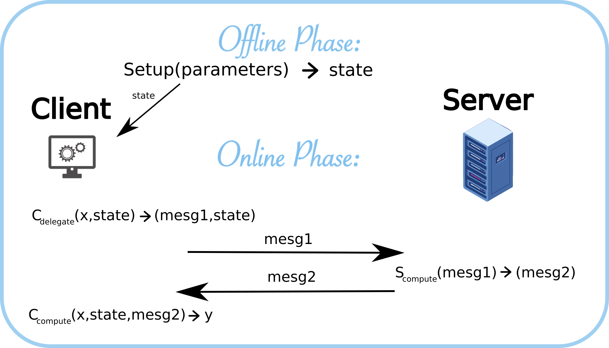

# Welcome {-}

In this website, you will have resources, examples and practice to master R. 


## What is R? {-}

All chapter sections start with a second-level (`##`) or higher heading followed by your section title, like the sections above and below here. You can have as many as you want within a chapter.

### An unnumbered section {-}

Chapters and sections are numbered by default. To un-number a heading, add a `{.unnumbered}` or the shorter `{-}` at the end of the heading, like in this section.

```{r, echo=FALSE, out.width="100%"}

```
