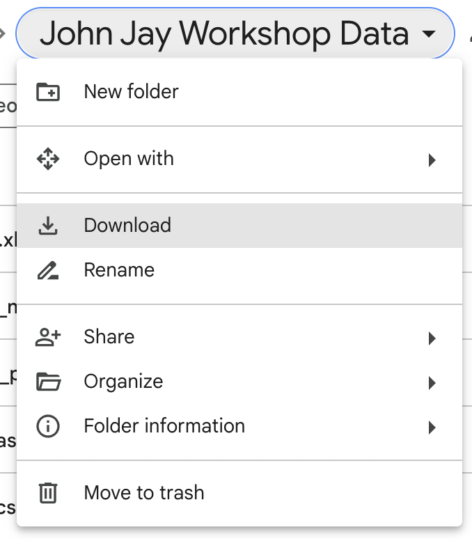

# Part III: Data Structures {-}

## Vectors: Creating, indexing, and operations {-}

```{r}
# Creating a vector
v <- c(1, 2, 3, 4, 5)
print(v)

# Indexing a vector
print(v[2])  # Access the second element

# Vector operations
v2 <- v * 2  # Multiply each element by 2
print(v2)

```

You can give names to the columns of the vector 

```{r}
my_vector <- c("Dilan Caro", "Instructor")
names(my_vector) <- c("Name", "Profession")
my_vector
```

### Exercise 1: {-}

1. Create a vector of your favorite numbers.
2. Access the third element in your vector.
3. Create a new vector that is the square of each element in the original vector.

```{r}
my_vector <- c("Dilan Caro", "Instructor")
names(my_vector) <- c("Name", "Profession")
my_vector
```
4. Inspect my_vector using: 
the attributes(), the length() and the str() function 

## Matrices {-}

Matrices are vectors with a dimension attribute. The dimension attribute is itself an integer vector of length 2 (number of rows, number of columns)

Matrices are constructed column-wise, so entries can be thought of starting in the “upper left” corner and running down the columns.

```{r}
m <- matrix(1:6, nrow = 2, ncol = 3) 
m
```

Another example

```{r}
my_matrix <- matrix(1:12, 3, 4, byrow = TRUE)
my_matrix
```

Matrices can be created by column-binding or row-binding with the `cbind()` and `rbind()` functions.

```{r}
x <- 1:3
y <- 10:12
cbind(x, y)
rbind(x, y)
```

## Seq and rep functions {-}

In R, seq and rep are two functions used to generate sequences and to replicate values, respectively.

### `seq` Function:

The seq function is used to create a sequence of numbers.

Usage:

- seq(from, to): Generates a sequence from the 'from' value to the 'to' value with a default increment of 1.

- seq(from, to, by): Generates a sequence from the 'from' value to the 'to' value, with the increment specified by 'by'.

- seq(from, to, length.out): Generates a sequence from the 'from' value to the 'to' value with a specified number of equally spaced points.

#### Example {-}

```{r}
seq(1, 5)         
seq(1, 10, by = 2)    
seq(1, 10, length.out = 4) 
```

### `rep` Function:
The rep function is used to replicate the values in a vector.

Usage:

- rep(x, times): Replicates each element in 'x' a specified number of 'times'.

- rep(x, each): Replicates each element in 'x' 'each' times before moving to the next element.

- rep(x, length.out): Replicates the values in 'x' up to the 'length.out' number of times in total.

```{r}
rep(1:3, times = 2)
rep(1:3, each = 2)       
rep(1:3, length.out = 7)   

```

## Lists {-}

Lists are a special type of vector that can contain elements of different classes. Lists are a very important data type in R and you should get to know them well. Lists, in combination with the various “apply” functions discussed later, make for a powerful combination.

Lists can be explicitly created using the list() function, which takes an arbitrary number of arguments.

```{r}
x <- list(1, "a", TRUE, 1 + 4i) 
x
```

### Example {-}

```{r}
my_list <- list(one = 1, two = c(1, 2), five = seq(1, 4, length=5),
          six = c("Dilan", "April"))
names(my_list)
```

```{r}
str(my_list)
```

## Factors {-}

Factors are used to represent categorical data and can be unordered or ordered. One can think of a factor as an integer vector where each integer has a label. Factors are important in statistical modeling and are treated specially by modelling functions like `lm()` and `glm()`.

Using factors with labels is better than using integers because factors are self-describing. Having a variable that has values “Male” and “Female” is better than a variable that has values 1 and 2.

Factor objects can be created with the factor() function.

```{r}
x <- factor(c("yes", "yes", "no", "yes", "no")) 
x
```

Level are put in alphabetical order, but you can also define the levels. 

```{r}
x <- factor(c("yes", "yes", "no", "yes", "no"),levels = c("yes", "no"))
x
```

## Data frames: Creating and exploring data frames {-}

Data frames are used to store tabular data in R.

Data frames are represented as a special type of list where every element of the list has to have the same length. Each element of the list can be thought of as a column and the length of each element of the list is the number of rows.

```{r}
# Creating a data frame
df <- data.frame(
  Name = c("Alice", "Bob", "Charlie"),
  Age = c(25, 30, 35),
  Salary = c(50000, 60000, 70000)
)
print(df)

# Exploring data frames
print(dim(df))  # Dimensions of the data frame
print(colnames(df))  # Column names
print(summary(df))  # Summary statistics

```

### Exercise 2 {-}

1. Create a data frame with at least three columns and four rows.
1. Print the number of rows and columns of your data frame.
1. Display summary statistics of your data frame.

## Part 2 {-}

### Exercise 3 {-}

1. Inspect a built-in data frame, inspect `mtcars` using `str()`, `head()`
2. Get summary from a variable in a dataframe, use `$` to extract a variable from the dataframe. 
3. Now inspect a tibble, inspect `diamonds` from the `ggplot2` library. Use `str()`, `head()`, `summary()`

```{r , results = "hide"}
mtcars
str(mtcars)
head(mtcars)
```

```{r, results = "hide"}
summary(mtcars$cyl) # use $ to extract variable from a data frame
```


```{r , results = "hide"}
library(ggplot2)
head(diamonds)
```

Can you list some differences?

## Importing and exporting data (CSV files) {-}

Exporting data to CSV

```{r}
write.csv(df, "my_data.csv", row.names = FALSE)
```

Importing data from CSV

```{r}
df_imported <- read.csv("my_data.csv")
print(df_imported)
```

### Exercise 4 {-}

1. Create a vector `fav_music` with the names of your favorite artists.
2. Create a vector `num_records` with the number of records you have in
your collection of each of those artists.
3. Create a vector `num_concerts` with the number of times you attended a concert of these artists.
4. Put everything together in a data frame, assign the name `my_music` to this data frame and change the labels of the information stored in the columns to `artist`, `records` and `concerts.`
5. Extract the variable `num_records` from the data frame `my_music.`
6. Calculate the total number of records in your collection (for the defined
set of artists).
7. Check the structure of the data frame, ask for a `summary.`


Previously, we exported the data and then imported it . Some of you may think, then what is the purpose if we already had the dataframe. The prior was just an example, in reality , you would not have the dataframe loaded in R . You would only have a csv or a data file that a coworker has shared with you or the data engineer has procured for you. 


First, we need to obtain the data that we need. For that, please head over to 

https://tinyurl.com/JJAY-R-workshop

alternatively,

https://drive.google.com/drive/folders/18W5f2AvKT7IVKnJ73McCzQOOqMdP0CwM?usp=sharing

<center>
```{r, echo=FALSE,out.width="40%",out.height="20%",fig.show='hold'}
#par(mar = c(4, 4, .1, .1))
knitr::include_graphics("images/data.png")
``` 
</center>

Download the data, for that, click on the arrow of the folder, and choose download. Find where it is located in your computer, obtain the `Path`

<center>
```{r, echo=FALSE,out.width="40%",out.height="20%",fig.show='hold'}
#par(mar = c(4, 4, .1, .1))

``` 
</center>

Some useful instructions regarding path names: get your working directory

- Get working directory

```{r}
getwd()
```

- specify a path name, with forward slash or double back slash

```{r}
path <- file.path("/Users/dilancaro/Library/Mobile Documents/com~apple~CloudDocs/Workshops/John Jay/R Workshop/R-workshop-John-Jay/John Jay Workshop Data")
```

- use a relative path

```{r}
path <- file.path("./John Jay Workshop Data")
```


## Importing a .txt file {-}

`read.table()` is one great way to import data.

```{r}

path.hotdogs <- file.path(path, "hotdogs.txt")
path.hotdogs    # inspect path name
hotdogs <- read.table(path.hotdogs, header = FALSE,
                      col.names = c("type", "calories", "sodium"))
str(hotdogs)    # inspect data imported

```

Or like this 

```{r}
hotdogs2 <- read.table(path.hotdogs, header = FALSE,
                       col.names = c("type", "calories", "sodium"),
                       colClasses = c("factor", "NULL", "numeric"))
str(hotdogs2)
```

What happened? 

```{r , echo = FALSE}
# Since we chose NULL , it skipped that column
```

### Import .csv file {-}

`read.csv()` is another importing function.

Here is an example:
- load a data set on swimming pools in Brisbane
- column names in the first row; a comma to separate values within rows

```{r}
path.pools <- file.path(path, "swimming_pools.csv")
pools <- read.csv(path.pools)
str(pools)
```

```{r , eval=FALSE, echo=FALSE}
#install.packages("leaflet")
library(leaflet)

map <- leaflet(data = pools) %>%
  addTiles() %>%
  addMarkers(~Longitude, ~Latitude, popup = ~Name)

# Print the map to view it in an RStudio Viewer or web browser
map
```

## Import .xlsx file {-}

The package to read excel data into R is `readxl`:

- No external dependencies, easy to download
- Desgined to work with tabular data

```{r}
library(readxl)
path.urbanpop <- file.path(path, "urbanpop.xlsx")
excel_sheets(path.urbanpop) # list sheet names with excel_sheets()
```

Specify a worksheet by name or number, e.g.

```{r}
pop_1 <- read_excel(path.urbanpop, sheet = 1)
pop_2 <- read_excel(path.urbanpop, sheet = 2)
```

inspect and re-combine

```{r}
str(pop_1)
pop_list <- list(pop_1, pop_2)
```

## Import other data formats {-}

The `haven` package enables R to read and write various data formats used by other statistical packages. 

It supports:

- SAS: `read_sas()` reads .sas7bdat and .sas7bcat files and `read_xpt()` reads SAS transport files. write_sas() writes .sas7bdat files.
- SPSS: `read_sav()` reads .sav files and `read_por()` reads the older .por files. write_sav() writes .sav files.
- Stata: `read_dta()` reads .dta files. `write_dta()` writes .dta files.

## Create and format dates

To create a Date object from a simple character string in R, you can use the as.Date() function. The character string has to obey a format that can be defined using a set of symbols (the examples correspond to 13 January, 1982):

`%Y`: 4-digit year (1982)
`%y`: 2-digit year (82)
`%m`: 2-digit month (01)
`%d`: 2-digit day of the month (13)
`%A`: weekday (Wednesday)
`%a`: abbreviated weekday (Wed)
`%B`: month (January)
`%b`: abbreviated month (Jan)


### Exercise 5 {-}

Load the following data sets, available in the course material: 
- the Danish fire insurance losses, stored in `danish.txt`
- the severity data set, stored in `severity.sas7bdat`.


