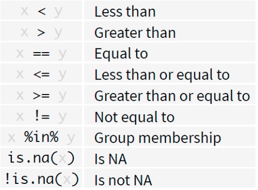

# Part II: Data Wrangling {.unnumbered}

Data wrangling, also known as data munging, is the process of
transforming and mapping data from one "raw" form into another format
with the intent of making it more appropriate and valuable for a variety
of downstream purposes, such as analytics.

In R, data wrangling is often performed using functions from the base R
language, as well as a collection of packages known as the tidyverse.
The tidyverse is a coherent system of packages for data manipulation,
exploration, and visualization that share a common design philosophy.

The tidyverse approach to data wrangling typically involves:

1.  Tidying Data: Transforming datasets into a consistent form that
    makes it easier to work with. This usually means converting data to
    a tidy format where each variable forms a column, each observation
    forms a row, and each type of observational unit forms a table.

2.  Transforming Data: Once the data is tidy, a series of functions are
    used for data manipulation tasks such as selecting specific columns
    (select()), filtering for certain rows (filter()), creating new
    columns or modifying existing ones (mutate() or transmute()),
    summarizing data (summarise()), and reshaping data (pivot_longer()
    and pivot_wider()).

3.  Working with Data Types and Structures: Functions from tidyverse
    allow for the easy manipulation of data types (like converting
    character vectors to factors with forcats) and data structures (like
    tibbles with the tibble package, which are a modern take on data
    frames).

4.  Joining Data: Combining different datasets in a variety of ways
    (like left_join(), right_join(), inner_join(), full_join(), and
    anti_join()) based on common keys or identifiers.

5.  Handling Strings and Dates: The tidyverse includes packages like
    stringr for string operations and lubridate for dealing with
    date-time objects, which are essential in many data wrangling tasks.

6.  Functional Programming: The package purrr introduces powerful
    functional programming tools to iterate over data structures and
    perform operations repeatedly.

The primary goal of data wrangling is to ensure that the data is in the
best possible format for analysis. The tidyverse provides tools that
make these tasks straightforward, efficient, and often more intuitive
than the base R equivalents. The philosophy of the tidyverse is to write
readable and transparent code that can be understood even if you come
back to it months or years later.

## Reshaping data using dplyr functions (filter, arrange, mutate, summarize) {.unnumbered}

The `dplyr` package was developed by Hadley Wickham of RStudio and is an
optimized and distilled version of his plyr package. The `dplyr` package
does not provide any "new" functionality to R per se, in the sense that
everything dplyr does could already be done with base R, but it greatly
simplifies existing functionality in R.

One important contribution of the `dplyr` package is that it provides a
"grammar" (in particular, verbs) for data manipulation and for operating
on data frames. With this grammar, you can sensibly communicate what it
is that you are doing to a data frame that other people can understand
(assuming they also know the grammar). This is useful because it
provides an abstraction for data manipulation that previously did not
exist. Another useful contribution is that the `dplyr` functions are
very fast, as many key operations are coded in C++.

The `dplyr` grammar

Some of the key "verbs" provided by the dplyr package are

-   select: return a subset of the columns of a data frame, using a
    flexible notation

-   filter: extract a subset of rows from a data frame based on logical
    conditions

-   arrange: reorder rows of a data frame

-   rename: rename variables in a data frame

-   mutate: add new variables/columns or transform existing variables

-   summarise / summarize: generate summary statistics of different
    variables in the data frame, possibly within strata

-   `%>%`: the "pipe" operator is used to connect multiple verb actions
    together into a pipeline.

These all combine naturally with group_by() which allows you to perform
any operation "by group".

### More on the pipe operator {.unnumbered}

-   It takes the output of one statement and makes it the input of the
    next statement.
-   When describing it, you can think of it as a "THEN". A first
    example:
    -   take the diamonds data (from the ggplot2 package)
    -   then subset

```{r}
library(dplyr)
library(ggplot2)
diamonds %>% filter(cut == "Ideal")
```

### Filter() {.unnumbered}

Extract rows that meet logical criteria. Here you go: - inspect the
diamonds data set - filter observations with cut equal to Ideal

```{r}
filter(diamonds, cut == "Ideal")
```

### Overview of logical tests {.unnumbered}

<center>

```{r, echo=FALSE,out.width="40%",out.height="20%",fig.show='hold'}

```

</center>

## Mutate() {.unnumbered}

Create new columns. Here you go: - inspect the diamonds data set -
create a new variable price_per_carat

```{r}
mutate(diamonds, price_per_carat = price/carat)
```

## Multistep operations {.unnumbered}

Use the %\>% for multistep operations. Passes result on left into first
argument of function on right. Here you go:

```{r}
diamonds %>% 
  mutate(price_per_carat = price/carat)  %>%
  filter(price_per_carat > 1500)
```

## Summarize() {.unnumbered}

Compute table of summaries. Here you go:

-   inspect the diamonds data set
-   calculate mean and standard deviation of price

```{r}
diamonds %>% summarize(mean = mean(price), std_dev = sd(price))
```

## Group_by() {.unnumbered}

Groups cases by common values of one or more columns. Here you go:
inspect the diamonds data set calculate mean and standard deviation of
price by level of cut

```{r}
diamonds %>% 
        group_by(cut) %>% 
        summarize(price = mean(price), carat = mean(carat))
```

### Exercise 1 {.unnumbered}

1.  Load the data Parade2005.txt.
2.  Determine the mean earnings in California.
3.  Determine the number of individuals residing in Idaho.
4.  Determine the mean and the median earnings of celebrities.

## Transforming a dataframe into tibbles {.unnumbered}

Transform the mtcars into a tibble and inspect.

```{r}
str(mtcars)
```

```{r}
#library(tidyverse)
library(tibble)
as_tibble(mtcars)
```

## Part II : Data Cleaning and Transformation {.unnumbered}

Data cleaning is a fundamental step in the data analysis process, aimed
at improving data quality and ensuring its appropriateness for specific
analytical tasks. The process involves identifying and rectifying errors
or inconsistencies in data to enhance its accuracy, completeness, and
reliability.

Key aspects of data cleaning include:

-   **Removing Duplicates**: This involves detecting and eliminating
    duplicate records that could skew analysis results.

-   **Handling Missing Dat**a: Missing values can be dealt with by
    imputing data (filling in missing values using statistical methods
    or domain knowledge), or in some cases, deleting rows or columns
    with too many missing values.

-   **Correcting Errors**: This involves identifying outliers or
    incorrect entries (due to data entry errors, measurement errors,
    etc.) and correcting them based on context or predefined rules.

-   **Standardizing Formats**: Ensuring that data across different
    sources or fields conforms to a consistent format, such as
    converting all dates to the same format, standardizing text entries
    (capitalization, removing leading/trailing spaces), or ensuring
    consistent measurement units.

-   **Filtering Irrelevant Information**: Removing data that is not
    relevant to the specific analysis task to focus on more significant
    data.

-   **Validating Accuracy**: Checking data against known standards or
    validation rules to ensure it correctly represents the real-world
    constructs it is supposed to reflect.

-   **Consolidating Data Sources**: Combining data from multiple sources
    and ensuring that the combined dataset is coherent and correctly
    integrated.

The aim of data cleaning is not only to correct errors but also to bring
structure and order to the data, facilitating more effective and
accurate analysis. By cleaning data, analysts can ensure that their
insights and conclusions are based on reliable and valid data, which is
crucial for making informed decisions.

## The Policy data set {.unnumbered}

-   PolicyData.csv available in the course material
-   Data stored in a .csv file.
-   Individual records separated by a semicolon.

```{r}
policy_data <- read.csv(file = './John Jay Workshop Data/PolicyData.csv', sep = ';')
```

### Exercise 1 {.unnumbered}

Use the skills you obtained in the first R workshop and Part 1

1.  Inspect the top rows of the data set.
2.  How many observations does the data set contain?
3.  Calculate the total exposure (exposition) in each region
    (type_territoire).

## The Gapminder package {.unnumbered}

-   Describes the evolution of a number of population characteristics
    (GDP, life expectancy, ...) over time.

```{r}
#install.packages("gapminder")
library(gapminder)
```

### Exercise 2 {.unnumbered}

Use the skills obtained in Part I:

1.  Inspect the top rows of the data.
2.  Select the data for countries in Asia.
3.  Which type of variable is `country`?

## Revisit factor() {.unnumbered}

### What is a factor variable ? {.unnumbered}

-   Representation for categorical data.
-   Predefined list of outcomes (levels).
-   Protecting data quality.

Example , sex a categorical value with two possible outcomes, `m` and
`f`

```{r}
sex <- factor(c('m', 'f', 'm', 'f'),
              levels = c('m', 'f'))
sex
```

-   The `factor` command creates a new factor variable. The first input
    is the categorical variable.

-   `levels` specifies the possible outcomes of the variable.

Assigning an unrecognized level to a factor variable results in a
warning

```{r warning=TRUE}
sex[1] <- 'male'
```

This protects the quality of the data

```{r}
sex
```

The value NA is assigned to the invalid observation.

## levels() {.unnumbered}

levels print the allowed outcomes for a factor variable

```{r}
levels(sex)
```

Assigning a vector to levels() renames the allowed outcomes.

```{r}
levels(sex) <- c('male', 'female')
sex
```

### Exercise 4 {.unnumbered}

The variable country in the gapminder data set is a factor variable.

1.  What are the possible levels for country in the subset asia.
2.  Is this the result you expected?

To add a level

```{r}
levels(sex) <- c(levels(sex), 'x')
```

## cut() {.unnumbered}

```{r}
gapminder
```

```{r}
head(cut(gapminder$pop,
    breaks = c(0, 10^7, 5*10^7, 10^8, Inf)))
```

```{r}
gapminder$pop_category = cut(gapminder$pop,
                             breaks = c(0, 10^7, 5*10^7, 10^8, Inf),
                             labels = c("<= 10M", "10M-50M", "50M-100M", "> 100M"))
```

```{r}
gapminder
```

## Exercise 5 {.unnumbered}

Bin the life expectancy in 2007 in a factor variable. 

1. Select the observations for year 2007. 

2. Bin the life expectancy in four bins of
roughly equal size (hint: quantile). 

3. How many observations are there
in each bin?

## Handling missing data {.unnumbered}

### Some history {.unnumbered}

The practice of imputing missing values has evolved significantly over
the years as statisticians and data scientists have sought to deal with
the unavoidable problem of incomplete data. The history of imputation
reflects broader trends in statistical methods and computational
capabilities, as well as growing awareness of the impacts of different
imputation strategies on the integrity of statistical analysis.

#### Missing Data Mechanisms {.unnumbered}

Rubin (1976) classified missing data into 3 categories: - Missing
Completely at Random (MCAR) - Missing at Random (MAR) - Not Missing at
Random (NMAR), also called Missing Not at Random (MNAR) - Aka the most
confusing statistical terms ever invented

#### Early Approaches and Simple Imputation {.unnumbered}

Early approaches to handling missing data were often quite simple,
including methods like listwise deletion (removing any record with a
missing value) and pairwise deletion (excluding missing values on a
case-by-case basis for each analysis). These methods, while
straightforward, can lead to biased results and reduced statistical
power if the missingness is not completely random.

Simple imputation techniques, such as filling in missing values with the
mean, median, or mode of a variable, were developed as a way to retain
as much data as possible. These methods are easy to understand and
implement, which contributed to their widespread use, especially in the
era before advanced computational methods became widely accessible.

#### Limitations of Mean and Median Imputation {.unnumbered}

Imputing missing values with the mean or median is intuitive and can be
effective in certain contexts, but these methods have significant
limitations:

**Bias in Estimation:** Mean and median imputation do not account for
the inherent uncertainty associated with missing data. They can lead to
an underestimation of variances and covariances because they
artificially reduce the variability of the imputed variable.

**Distortion of Data Distribution:** These methods can distort the
original distribution of data, especially if the missingness is not
random (Missing Not at Random - MNAR) or if the proportion of missing
data is high. This distortion can affect subsequent analyses, such as
regression models, by providing misleading results.

**Ignores Relationships Between Variables:** Mean and median imputation
treat each variable in isolation, ignoring the potential relationships
between variables. This can be particularly problematic in multivariate
datasets where variables may be correlated.

#### Modern Imputation Techniques {.unnumbered}

As awareness of the limitations of simple imputation methods grew,
researchers developed more sophisticated techniques designed to address
these shortcomings:

**Multiple Imputation:** Developed in the late 20th century, multiple
imputation involves creating several imputed datasets by drawing from a
distribution that reflects the uncertainty around the true values of
missing data. These datasets are then analyzed separately, and the
results are combined to produce estimates that account for the
uncertainty due to missingness. This method addresses the issue of
underestimating variability and provides more reliable statistical
inferences.

**Model-Based Imputation:** Techniques like Expectation-Maximization
(EM) algorithms and imputation using random forests or other machine
learning models take into account the relationships between variables in
a dataset. These methods can more accurately reflect the complex
structures in data and produce imputations that preserve statistical
relationships.

**Conclusion**

The evolution of imputation methods from simple mean or median filling
to sophisticated model-based and multiple imputation techniques reflects
a broader shift in statistical practice. This shift is characterized by
increased computational power, more complex datasets, and a deeper
understanding of the impact of missing data on statistical inference.
While mean and median imputation can still be useful in specific,
well-considered circumstances, modern techniques offer more robust and
principled approaches to handling missing data.

## Missing Values in R {.unnumbered}

Missing values are denoted by NA or NaN for q undefined mathematical
operations.

-   is.na() is used to test objects if they are NA
-   is.nan() is used to test for NaN
-   NA values have a class also, so there are integer NA, character NA,
    etc.
-   A NaN value is also NA but the converse is not true

### Difference Between NA and NaN in R

In R, `NA` and `NaN` represent two different kinds of missing or
undefined values, but they are used in distinct contexts:

#### NA (Not Available)

-   `NA` stands for **Not Available**.
-   It is used to represent **missing or undefined data**, typically in
    cases where data is expected but not present.
-   `NA` can be used in any logical or statistical operation, but unless
    handled specifically, operations involving `NA` will generally
    result in `NA`.
-   `NA` has a flexible context and can be used with **any data type**
    in R, such as numeric, character, or logical.
-   You can test for `NA` using the `is.na()` function.

#### NaN (Not a Number)

-   `NaN` stands for **Not a Number**.
-   It is a special value used to represent **undefined or
    unrepresentable numerical results**, such as the result of `0/0`.
-   `NaN` is a specific type of `NA` but specifically for numeric
    calculations that result in undefined or indeterminate values.
-   Operations that result in `NaN` are typically those that are
    mathematically indeterminate or outside the domain of mathematical
    functions (e.g., square root of a negative number in the realm of
    real numbers).
-   You can test for `NaN` using the `is.nan()` function. Note that
    `is.na()` also returns `TRUE` for `NaN` values, reflecting their
    status as a kind of missing value, but `is.nan()` does not return
    `TRUE` for all `NA` values.

#### Key Differences {.unnumbered}

-   **Context of Use**: `NA` is used more broadly for missing data
    across all data types, while `NaN` is specific to numerical
    operations that do not produce a defined, real number.
-   **Nature of Undefinedness**: `NA` indicates the absence of data,
    whereas `NaN` indicates that a calculation has failed to produce a
    meaningful result.

In summary, the use of `NA` vs. `NaN` helps distinguish between data
that is missing (`NA`) and numerical operations that result in undefined
or unrepresentable values (`NaN`).

```{r}
coffee_data <- data.frame(
  Age = c(25, 32, NA, 45, 22, 33, NA, 28),
  Gender = c("Female", "Male", "Male", "Female", "Female", "Male", "Female", NA),
  Cups_Per_Day = c(1, 3, 2, NA, 2, 3, 1, 2)
)
coffee_data
```

### Identifying Missing Values {.unnumbered}

You can use the `is.na()` function to check for missing values. To count
them in a specific column:

```{r}
sum(is.na(coffee_data$Age))
```

### Removing NA Values {.unnumbered}

A common task in data analysis is removing missing values (NAs).

```{r}
x <- c(1, 2, NA, 4, NA, 5)
bad <- is.na(x)
print(bad)
```

We can remove them by

```{r}
x[!bad]
```

A faster way ,

```{r}
x[!is.na(x)]
```

#### In a Data frame {.unnumbered}

Also, using our coffee example,

```{r}
coffee_data_clean <- na.omit(coffee_data)
coffee_data_clean
```

To remove rows with missing values in a specific column:

```{r}

coffee_data_clean2 <- coffee_data[!is.na(coffee_data$Age), ]
coffee_data_clean2
row.names(coffee_data_clean2) <- NULL
coffee_data_clean2
```

What if there are multiple R objects and you want to take the subset
with no missing values in any of those objects?

```{r}
x <- c(1, 2, NA, 4, NA, 5)
y <- c("a", "b", NA, "d", NA, "f")
good <- complete.cases(x, y)
good
x[good]
y[good]
```

You can use complete.cases on data frames too.

```{r}
head(airquality)
```

```{r}
good <- complete.cases(airquality)
head(airquality[good, ])
```

```{r}
sd(airquality$Ozone)
sd(airquality$Ozone, na.rm = TRUE)
```

### Imputing Missing Values {.unnumbered}

Replacing missing values with a specific value, like the mean or median:

```{r}
coffee_data2<-coffee_data

coffee_data2$Age[is.na(coffee_data$Age)] <- mean(coffee_data2$Age, na.rm = TRUE)
coffee_data2
```

```{r}
# Assuming 'median' is the mode of the column
median(coffee_data$Age, na.rm = TRUE)
coffee_data2$Age[is.na(coffee_data$Age)] <- median(coffee_data$Age, na.rm = TRUE)
coffee_data2
```

## Using Packages for Advanced Imputation {.unnumbered}

```{r}
# install.packages("mice")
library(mice)
# Display the first few rows of the airquality dataset
head(airquality)

# Perform multiple imputation
imputed_data <- mice(airquality, m=5, method='pmm', seed = 123)

# Extract the first completed dataset
completed_data <- complete(imputed_data, 1)

# Display the first few rows of the completed data
head(completed_data)

```

## Exercise 1: Explore Missingness {.unnumbered}

**Dataset:** ChickWeight

**Task:** Determine if the ChickWeight dataset contains any missing
values. Print a message stating whether the dataset has missing values
or not.

*Hint* Use the any() function combined with is.na() applied to the
dataset.

## Exercise 2: Calculate Summary Statistics Before Handling NA {.unnumbered}

```{r}
data(mtcars)
mean_mpg <- mean(mtcars$mpg)
mean_mpg
sd_mpg <- sd(mtcars$mpg)
sd_mpg
```

**Dataset:** mtcars

**Task:** The mtcars dataset is almost complete but let's pretend some
values are missing in the mpg (miles per gallon) column. First,
artificially introduce missing values into the mpg column (e.g., set the
first three values of mpg to NA). Then, calculate and print the mean and
standard deviation of mpg without removing or imputing the missing
values.

*Hint:* Modify the mtcars\$mpg directly to introduce NAs. Use mean() and
sd() functions with na.rm = FALSE to calculate statistics without
handling NA.

## Exercise 3: Impute Missing Values with Column Median {.unnumbered}

**Dataset:** mtcars with modified mpg

**Task:** First Calculate the mean and standard deviation handling the
missing values.

Then,Impute the artificially introduced missing values in the mpg column
with the column's median (excluding the missing values). Print the first
6 rows of the modified mtcars dataset.

Now, calculate the mean and standard deviation with the imputed values.

*Hint:* First, calculate the median of mpg excluding NAs. Then, use
indexing to replace NAs with this median.

## Exercise 4: Identifying Complete Rows {.unnumbered}

**Dataset:** airquality

**Task:** Before any analysis, you want to ensure that only complete
cases are used. Create a new dataset from airquality that includes only
the rows without any missing values. Print the number of rows in the
original versus the cleaned dataset.

*Hint* Use complete.cases() on the dataset and then subset it.

## Exercise 5: Advanced Imputation on a Subset {.unnumbered}

**Dataset:** mtcars

**Task:** Create a subset of mtcars containing only the mpg, hp
(horsepower), and wt (weight) columns. Introduce missing values in hp
and wt columns (e.g., set first two values of each to NA). Perform
multiple imputation using the mice package on this subset with 3
imputations, and extract the third completed dataset. Print the first 6
rows of this completed dataset.

*Hint:* Subset mtcars first, then modify to add NAs. Use mice() for
imputation and complete() to extract the desired imputed dataset.
