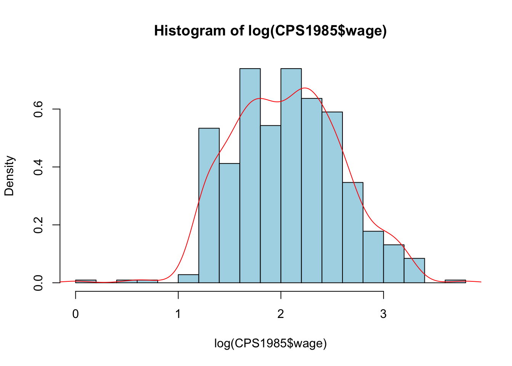
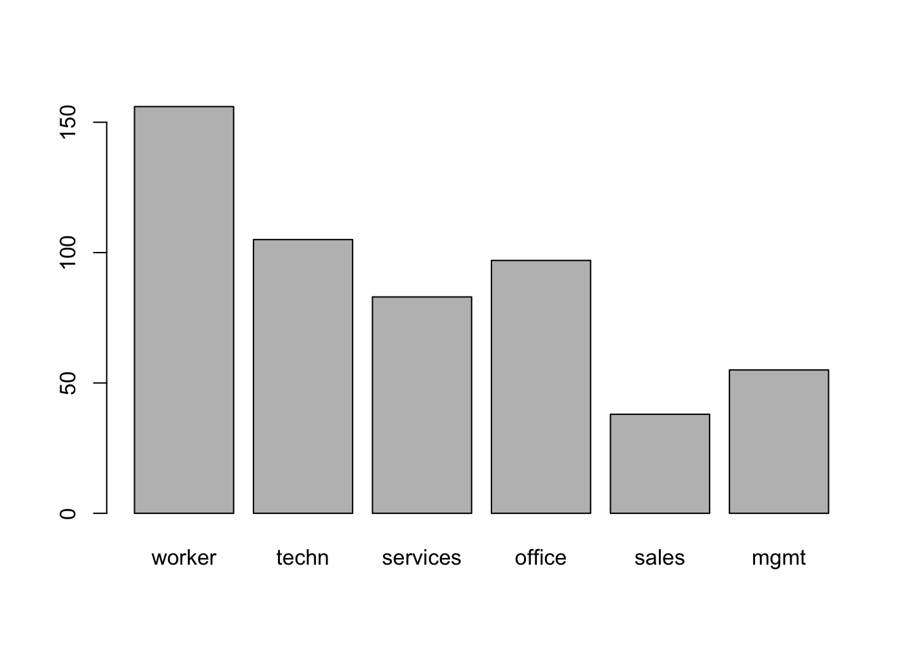
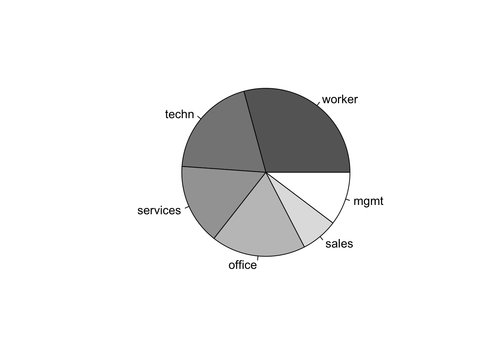
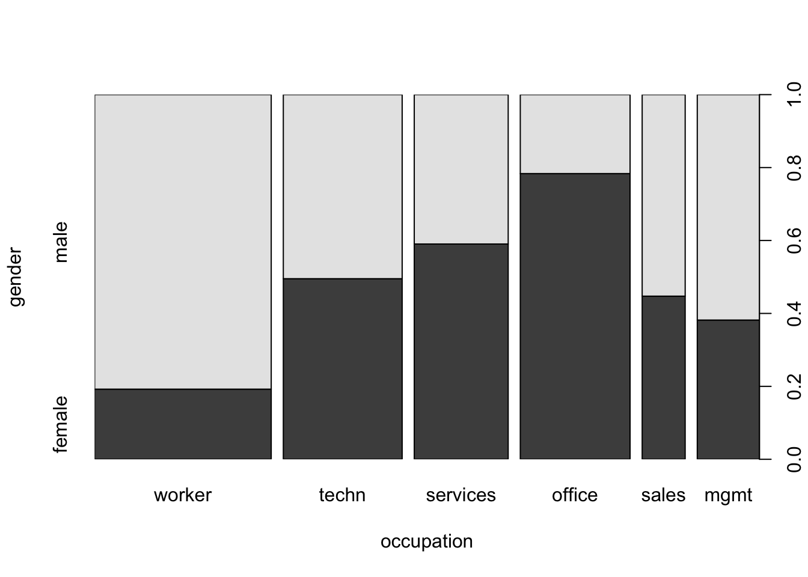
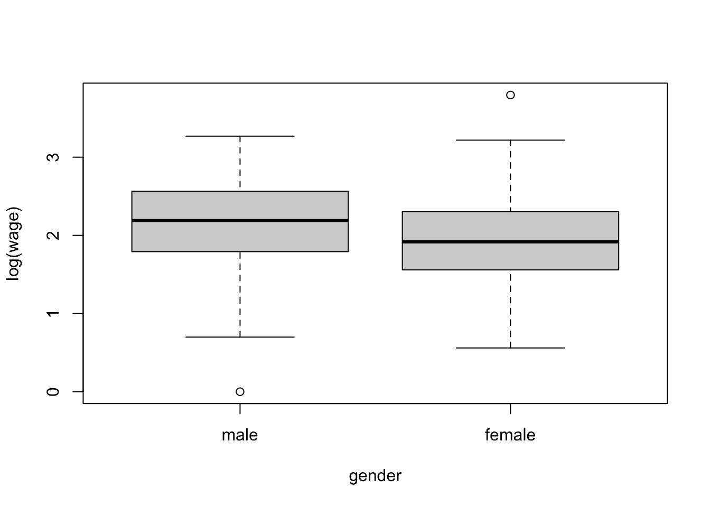
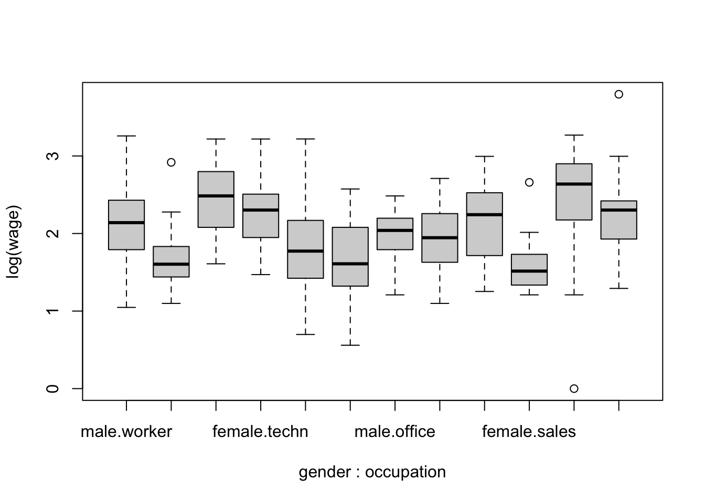

# Part IV: Data Manipulation (30 minutes) {-}

## Subsetting and filtering data {-}

Subsetting and filtering data involve selecting specific elements, rows, or columns from a dataset based on certain conditions or criteria. In R, subsetting can be achieved using square brackets `[]`, the `subset()` function, or dplyr package functions like `filter()` for rows and `select()` for columns. Filtering refers more specifically to choosing rows that meet certain conditions, such as values within a range or matching specific characteristics.


```r
# Creating a sample data frame
data <- data.frame(
  id = 1:5,
  name = c("Alice", "Bob", "Charlie", "David", "Eva"),
  age = c(25, 30, 22, 28, 24)
)
# Subsetting by a specific column
ages <- data$age
print(ages)
#> [1] 25 30 22 28 24

# Filtering data based on a condition
young_adults <- subset(data, age < 30)
print(young_adults)
#>   id    name age
#> 1  1   Alice  25
#> 3  3 Charlie  22
#> 4  4   David  28
#> 5  5     Eva  24
```

### Using the dplyr package {-}

The `%>%` symbol in R is known as the pipe operator, and it's used to pass the result of one expression as the first argument to the next expression

1. Filtering data using dplyr for individuals younger than 30


```r
library(dplyr)
#> 
#> Attaching package: 'dplyr'
#> The following objects are masked from 'package:stats':
#> 
#>     filter, lag
#> The following objects are masked from 'package:base':
#> 
#>     intersect, setdiff, setequal, union
young_adults <- data %>% filter(age < 30)
print(young_adults)
#>   id    name age
#> 1  1   Alice  25
#> 2  3 Charlie  22
#> 3  4   David  28
#> 4  5     Eva  24
```
2. Subsetting columns using dplyr


```r
ages <- data %>% select(age)
print(ages)
#>   age
#> 1  25
#> 2  30
#> 3  22
#> 4  28
#> 5  24
```


## Adding, removing, and renaming columns {-}

1. Adding a new column 'salary'


```r
data$salary <- c(55000, 50000, 60000, 52000, 58000)
print(data)
#>   id    name age salary
#> 1  1   Alice  25  55000
#> 2  2     Bob  30  50000
#> 3  3 Charlie  22  60000
#> 4  4   David  28  52000
#> 5  5     Eva  24  58000
```

2. Removing the 'salary' column


```r
data$salary <- NULL
print(data)
#>   id    name age
#> 1  1   Alice  25
#> 2  2     Bob  30
#> 3  3 Charlie  22
#> 4  4   David  28
#> 5  5     Eva  24
```

3. Renaming the 'name' column to 'first_name'


```r
names(data)[names(data) == "name"] <- "first_name"
print(data)
#>   id first_name age
#> 1  1      Alice  25
#> 2  2        Bob  30
#> 3  3    Charlie  22
#> 4  4      David  28
#> 5  5        Eva  24
```


## Using the dplyr package {-}


1. Adding a new column 'salary' using mutate


```r
data <- data %>%
  mutate(salary = c(55000, 50000, 60000, 52000, 58000))
print(data)
#>   id    name age salary
#> 1  1   Alice  25  55000
#> 2  2     Bob  30  50000
#> 3  3 Charlie  22  60000
#> 4  4   David  28  52000
#> 5  5     Eva  24  58000
```

2. Removing the 'salary' column using select


```r
data <- data %>%
  select(-salary)
print(data)
#>   id    name age
#> 1  1   Alice  25
#> 2  2     Bob  30
#> 3  3 Charlie  22
#> 4  4   David  28
#> 5  5     Eva  24
```

3. Renaming the 'name' column to 'first_name' using rename


```r
data <- data %>%
  rename(first_name = name)
print(data)
#>   id first_name age
#> 1  1      Alice  25
#> 2  2        Bob  30
#> 3  3    Charlie  22
#> 4  4      David  28
#> 5  5        Eva  24
```

## Why use dyplr

One might think that using pipe operator `(%>%)` from the `magrittr` package, prominently used in dplyr and the wider tidyverse is unnecessarily more complex. While it may seem more complex at first, especially to those accustomed to base R functions and syntax, it offers several benefits that can greatly enhance the readability, efficiency, and overall workflow of data analysis. Some reasons to use it are:

1. Improved Readability and Clarity
2. Easier Debugging and Modification
3. Enhanced Workflow
4. Consistency and Community Adoption
5. Efficiency in Writing Code

An example of the benefits is seen in more complex operations making them more readable

Let's just add salary column again.


```r
data$salary <- c(55000, 50000, 60000, 52000, 58000)
subsetting_data <- rename(select(
                          filter(data, age < 30), -salary),
                          first_name = name)
subsetting_data
#>   id first_name age
#> 1  1      Alice  25
#> 2  3    Charlie  22
#> 3  4      David  28
#> 4  5        Eva  24
```

Now, doing it using dplyr


```r

data <- data %>%
  mutate(salary = c(55000, 50000, 60000, 52000, 58000))

data <- data %>%
  filter(age < 30) %>%
  select(-salary) %>%
  rename(first_name = name)
data
#>   id first_name age
#> 1  1      Alice  25
#> 2  3    Charlie  22
#> 3  4      David  28
#> 4  5        Eva  24
```


## Basic data summary and exploration {-}

A very brief summary and data exploration is given below.

1. Summary statistics of the data frame


```r
summary(data)
#>        id        first_name             age       
#>  Min.   :1.00   Length:4           Min.   :22.00  
#>  1st Qu.:2.50   Class :character   1st Qu.:23.50  
#>  Median :3.50   Mode  :character   Median :24.50  
#>  Mean   :3.25                      Mean   :24.75  
#>  3rd Qu.:4.25                      3rd Qu.:25.75  
#>  Max.   :5.00                      Max.   :28.00
```

2. Structure of the data frame


```r
str(data)
#> 'data.frame':	4 obs. of  3 variables:
#>  $ id        : int  1 3 4 5
#>  $ first_name: chr  "Alice" "Charlie" "David" "Eva"
#>  $ age       : num  25 22 28 24
```

3. Average age of the individuals in the data frame


```r
average_age <- mean(data$age)
print(average_age)
#> [1] 24.75
```

4. Count of unique names in the data frame


```r
unique_names_count <- length(unique(data$first_name))
print(unique_names_count)
#> [1] 4
```


## Exploratory data analysis 

Exploratory Data Analysis (EDA) is a critical initial step in the data analysis process, where the main characteristics of a dataset are examined to understand its structure, uncover patterns, identify anomalies, and test hypotheses. The goal is to use statistical summaries and visualizations to get a sense of the data, which guides further analysis and modeling decisions. EDA is not about making formal predictions or testing hypotheses but rather about asking questions and seeking insights in a more open-ended, exploratory manner.

**Key Components of EDA include:**

- **Understanding the Distribution** of various variables in the dataset. This involves looking at measures like mean, median, mode, range, variance, and standard deviation, and using visual tools like histograms, box plots, and density plots to understand how the data is spread out.

- **Identifying Patterns** and Relationships between variables using scatter plots, pair plots, and correlation matrices. This helps in understanding how variables are related to each other and can guide more complex analyses like regression or classification.

- **Detecting Anomalies** such as outliers or unexpected values which might indicate errors in data collection or provide insights into unusual occurrences in the data.

- **Cleaning Data** by addressing missing values, duplicate data, and making decisions about how to correct inconsistencies based on the insights gained.

- **Transforming Variables** when necessary to make the data more suitable for analysis. This could involve normalizing the data, creating categorical variables from continuous ones, or engineering new variables from existing ones.

**Tools and Techniques**

Statistical Summary Functions in R (`summary()`, `mean()`, `sd()`, etc.) provide quick insights into the basic properties of the data.

Visualization Libraries like `ggplot2` in R for creating a wide range of plots and charts that reveal the underlying patterns and structures in the data.

**Importance of EDA**

- **Data Understanding:** It ensures that the analyst has a thorough understanding of the dataset's features, values, and relationships between variables.

- **Guiding Hypotheses:** Insights gained during EDA can help form hypotheses for statistical testing and predictive modeling.

- **Modeling Strategy:** Identifying the key variables and their relationships helps in choosing appropriate models and techniques for further analysis.

In summary, EDA is an essential practice in data science for making sense of data, discovering patterns, identifying potential problems, and informing subsequent steps in the analytical process. It blends statistical techniques with visual explorations to create a foundation for any data-driven task.


Now we will explore a dataset from the library `AER` , and a numeric variable first

## Numeric Variable {-}


```r
#install.packages("AER")
library(AER)
#> Loading required package: car
#> Loading required package: carData
#> 
#> Attaching package: 'car'
#> The following object is masked from 'package:dplyr':
#> 
#>     recode
#> Loading required package: lmtest
#> Loading required package: zoo
#> 
#> Attaching package: 'zoo'
#> The following objects are masked from 'package:base':
#> 
#>     as.Date, as.Date.numeric
#> Loading required package: sandwich
#> Loading required package: survival
data("CPS1985")
str(CPS1985)
#> 'data.frame':	534 obs. of  11 variables:
#>  $ wage      : num  5.1 4.95 6.67 4 7.5 ...
#>  $ education : num  8 9 12 12 12 13 10 12 16 12 ...
#>  $ experience: num  21 42 1 4 17 9 27 9 11 9 ...
#>  $ age       : num  35 57 19 22 35 28 43 27 33 27 ...
#>  $ ethnicity : Factor w/ 3 levels "cauc","hispanic",..: 2 1 1 1 1 1 1 1 1 1 ...
#>  $ region    : Factor w/ 2 levels "south","other": 2 2 2 2 2 2 1 2 2 2 ...
#>  $ gender    : Factor w/ 2 levels "male","female": 2 2 1 1 1 1 1 1 1 1 ...
#>  $ occupation: Factor w/ 6 levels "worker","technical",..: 1 1 1 1 1 1 1 1 1 1 ...
#>  $ sector    : Factor w/ 3 levels "manufacturing",..: 1 1 1 3 3 3 3 3 1 3 ...
#>  $ union     : Factor w/ 2 levels "no","yes": 1 1 1 1 1 2 1 1 1 1 ...
#>  $ married   : Factor w/ 2 levels "no","yes": 2 2 1 1 2 1 1 1 2 1 ...
```


```r
head(CPS1985)
#>       wage education experience age ethnicity region gender
#> 1     5.10         8         21  35  hispanic  other female
#> 1100  4.95         9         42  57      cauc  other female
#> 2     6.67        12          1  19      cauc  other   male
#> 3     4.00        12          4  22      cauc  other   male
#> 4     7.50        12         17  35      cauc  other   male
#> 5    13.07        13          9  28      cauc  other   male
#>      occupation        sector union married
#> 1        worker manufacturing    no     yes
#> 1100     worker manufacturing    no     yes
#> 2        worker manufacturing    no      no
#> 3        worker         other    no      no
#> 4        worker         other    no     yes
#> 5        worker         other   yes      no
```

Obtain the summary statistics of the data frame, check whether it is numeric, get the mean , and variance.


```r
summary(CPS1985$wage)
#>    Min. 1st Qu.  Median    Mean 3rd Qu.    Max. 
#>   1.000   5.250   7.780   9.024  11.250  44.500
is.numeric(CPS1985$wage)
#> [1] TRUE
mean(CPS1985$wage)
#> [1] 9.024064
var(CPS1985$wage)
#> [1] 26.41032
```

Now, visualize the `wage` distribution


```r
hist(log(CPS1985$wage), freq = FALSE, nclass = 20, col = "light blue")
lines(density(log(CPS1985$wage)), col = "red")
```



## A factor variable {-}

You now explore the occupation variable 


```r
summary(CPS1985$occupation)
#>     worker  technical   services     office      sales 
#>        156        105         83         97         38 
#> management 
#>         55
```

change the names of some of the levels


```r
levels(CPS1985$occupation)[c(2, 6)] <- c("techn", "mgmt")
summary(CPS1985$occupation)
#>   worker    techn services   office    sales     mgmt 
#>      156      105       83       97       38       55
```

visualize the distribution


```r
tab <- table(CPS1985$occupation)
prop.table(tab)
#> 
#>     worker      techn   services     office      sales 
#> 0.29213483 0.19662921 0.15543071 0.18164794 0.07116105 
#>       mgmt 
#> 0.10299625
barplot(tab)
```



```r
pie(tab, col = gray(seq(0.4, 1.0, length = 6)))
```



## Two factor variables {-}

You now explore the factor variables `gender` and `occupation.` 

Use `prop.table()`

The `prop.table()` function in R is used to compute the proportion of table elements over the margin specified (if any). When applied to a contingency table created by the table() function, it transforms the table's counts into proportions, making it easier to analyze the relative distribution of frequencies across different categories.


```r
attach(CPS1985) # attach the data set to avoid use the operator $
table(gender, occupation) # no name_df$name_var necessary
#>         occupation
#> gender   worker techn services office sales mgmt
#>   male      126    53       34     21    21   34
#>   female     30    52       49     76    17   21
```


```r
prop.table(table(gender, occupation))
#>         occupation
#> gender       worker      techn   services     office
#>   male   0.23595506 0.09925094 0.06367041 0.03932584
#>   female 0.05617978 0.09737828 0.09176030 0.14232210
#>         occupation
#> gender        sales       mgmt
#>   male   0.03932584 0.06367041
#>   female 0.03183521 0.03932584
```

Now try `prop.table(table(gender, occupation), 2)`


```r
prop.table(table(gender, occupation), 2) # 1 for row , 2 for columns
#>         occupation
#> gender      worker     techn  services    office     sales
#>   male   0.8076923 0.5047619 0.4096386 0.2164948 0.5526316
#>   female 0.1923077 0.4952381 0.5903614 0.7835052 0.4473684
#>         occupation
#> gender        mgmt
#>   male   0.6181818
#>   female 0.3818182
```
 


You now explore the factor variables gender and occupation. 

Do a mosaic plot


A mosaic plot, also known as a Marimekko diagram or a mosaic chart, is a graphical representation of data that allows for the visualization of the proportions or frequencies of categorical variables in a dataset. It's a type of plot that provides a visual summary of the contingency table associated with two or more categorical variables. Each rectangle (tile) in the mosaic plot represents a combination of category levels from the variables, with the area of the rectangle proportional to the frequency or proportion of observations in that category combination.


```r
plot(gender ~ occupation, data = CPS1985)
```


 
Now explore the factor gender and the numeric variable wage.
 
 The `tapply()` function in R is used to apply a function to subsets of a vector, where subsets are defined by some other vector, usually a factor. The basic syntax of tapply() is:
 
- X is the object to be split and operated on.
- INDEX is the factor or list of factors according to which X is split.
- FUN is the function to be applied to each subset of X.
- ... are optional arguments to FUN.
- simplify, when TRUE, tries to simplify the result to a vector, matrix, or higher-dimensional array; when FALSE, the result is a list.


```r
tapply(wage, gender, mean)
#>     male   female 
#> 9.994913 7.878857
```
 

```r
tapply(log(wage), list(gender, occupation), mean)
#>          worker    techn services   office    sales
#> male   2.100418 2.446640 1.829568 1.955284 2.141071
#> female 1.667887 2.307509 1.701674 1.931128 1.579409
#>            mgmt
#> male   2.447476
#> female 2.229256
```
 
## A factor and a numeric variable {-}

Explore a factor variable and a numeric variable. 
Visualize the distribution of `wage` per `gender`


```r
boxplot(log(wage) ~ gender, data = CPS1985)
```



 Now try with
 

```r
boxplot(log(wage) ~ gender + occupation, data = CPS1985)
```


 

```r
detach(CPS1985) # now detach when work is done
```

