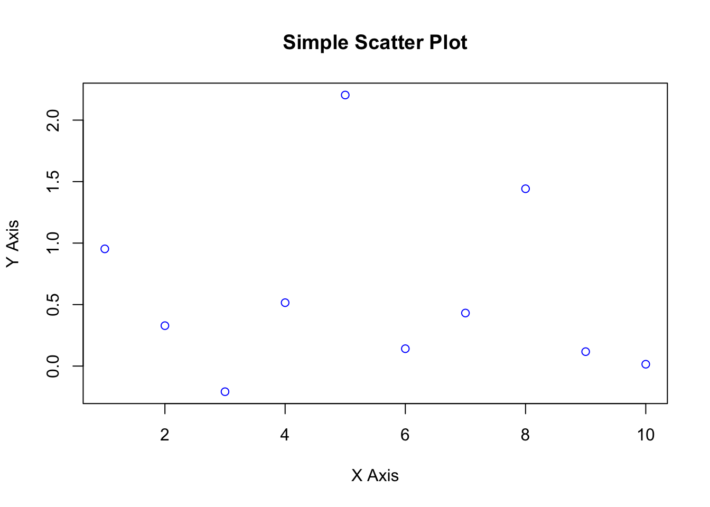
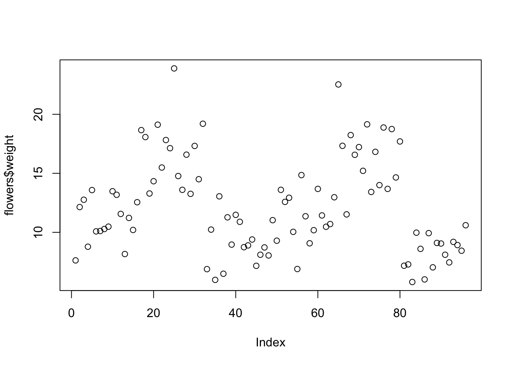

# Part V: Basic Data Visualization (20 minutes) {-}

## Creating simple plots using plot() {-}

Example: Simple scatter plot


```r

x <- 1:10
y <- rnorm(10)
plot(x, y, main = "Simple Scatter Plot", xlab = "X Axis", ylab = "Y Axis", col = "blue")
```




## Example 1 {-}

To create a basic scatter plot, you can use the mtcars dataset, which comes built into R. This dataset contains various characteristics of 32 automobiles.


```r

data(mtcars)

# 
plot(mtcars$hp, mtcars$mpg, main="MPG vs. Horsepower",
     xlab="Horsepower", ylab="Miles Per Gallon",
     pch=19, col="blue")
```


## Example 2 {-}

Using the pressure dataset, which is also built into R, you can create a simple line plot. The pressure dataset shows the temperature and resulting vapor pressure of mercury.


```r

data(pressure)

# Create a line plot
plot(pressure$temperature, pressure$pressure, type="l",
     main="Vapor Pressure of Mercury",
     xlab="Temperature", ylab="Pressure",
     col="red", lwd=2)
```


## Example 3 {-}


```r

data(iris)

# Plot Sepal.Length vs. Sepal.Width colored by Species
plot(iris$Sepal.Length, iris$Sepal.Width, col=iris$Species,
     main="Iris Sepal Measurements",
     xlab="Sepal Length", ylab="Sepal Width",
     pch=19)
legend("topright", legend=levels(iris$Species), col=1:3, pch=19)
```


## Exercise {-}
Now, try creating your own visualization using the iris dataset. Here's what you can do:

1. Create a scatter plot using Petal.Length and Petal.Width from the iris dataset.
2. Color the points based on the Species column to differentiate between the species.
3. Add a title, x-axis label, and y-axis label to your plot.
Include a legend that indicates which color corresponds to which iris species.


```r
# Load the mtcars dataset
data(mtcars)

# Plot without converting cyl to factor
plot(mtcars$disp, mtcars$mpg, col=mtcars$cyl,
     main="MPG vs. Displacement Colored by Cylinders (Not Factor)",
     xlab="Displacement", ylab="Miles Per Gallon",
     pch=19)
legend("topright", legend=unique(mtcars$cyl), col=unique(mtcars$cyl), pch=19, title="Cylinders")
```


```r
# Plot with cyl converted to factor
plot(mtcars$disp, mtcars$mpg, col=as.factor(mtcars$cyl),
     main="MPG vs. Displacement Colored by Cylinders (Factor)",
     xlab="Displacement", ylab="Miles Per Gallon",
     pch=19)
legend("topright", legend=levels(as.factor(mtcars$cyl)), col=1:length(levels(as.factor(mtcars$cyl))), pch=19, title="Cylinders")
```


For later 

## Creating more complex plots ggplot() {-}


```r
# install.packages("ggplot2")
library(ggplot2)

# Example: Complex scatter plot with ggplot2
ggplot(data.frame(x, y), aes(x, y)) + geom_point() + 
  ggtitle("Complex Scatter Plot with ggplot2") +
  xlab("X Axis") + ylab("Y Axis")
```


```r
ggplot(data = mpg, aes(x = displ, y = hwy, color = class)) +geom_point()
```



## Creating plots with other library {-}

```r

# install.packages("lattice")
library(lattice)

# Example: Lattice plot
xyplot(y ~ x, data = data.frame(x, y), main = "Lattice Plot", type = "p")
```


## Creating demographic, map, 3d plots {-}

Installing and loading plotly for 3D plots


```r
#install.packages("plotly")
library(plotly)
#> 
#> Attaching package: 'plotly'
#> The following object is masked from 'package:ggplot2':
#> 
#>     last_plot
#> The following object is masked from 'package:stats':
#> 
#>     filter
#> The following object is masked from 'package:graphics':
#> 
#>     layout

# Example: 3D Scatter Plot with plotly
plot_ly(data.frame(x, y, z = rnorm(10)), x = ~x, y = ~y, z = ~z, type = "scatter3d", mode = "markers")
```


```{=html}
<div class="plotly html-widget html-fill-item" id="htmlwidget-cb21ad7b05b508ebce90" style="width:672px;height:480px;"></div>
<script type="application/json" data-for="htmlwidget-cb21ad7b05b508ebce90">{"x":{"visdat":{"91534fa4870":["function () ","plotlyVisDat"]},"cur_data":"91534fa4870","attrs":{"91534fa4870":{"x":{},"y":{},"z":{},"mode":"markers","alpha_stroke":1,"sizes":[10,100],"spans":[1,20],"type":"scatter3d"}},"layout":{"margin":{"b":40,"l":60,"t":25,"r":10},"scene":{"xaxis":{"title":"x"},"yaxis":{"title":"y"},"zaxis":{"title":"z"}},"hovermode":"closest","showlegend":false},"source":"A","config":{"modeBarButtonsToAdd":["hoverclosest","hovercompare"],"showSendToCloud":false},"data":[{"x":[1,2,3,4,5,6,7,8,9,10],"y":[1.8952531866404738,-0.068259477950272651,-0.84437824208007184,1.1297270599702789,0.25908160192027108,0.3721246263180345,0.14472115677053821,-0.91538083567786455,0.66377775914490622,-1.3675667011110721],"z":[-0.54706542998487595,0.7530761777640671,-0.058180752181278154,0.27793855502756809,-2.1742169669086571,-0.31063935929858727,0.96939144152412315,0.063014501433226289,1.7552888717793469,-1.6229771376187234],"mode":"markers","type":"scatter3d","marker":{"color":"rgba(31,119,180,1)","line":{"color":"rgba(31,119,180,1)"}},"error_y":{"color":"rgba(31,119,180,1)"},"error_x":{"color":"rgba(31,119,180,1)"},"line":{"color":"rgba(31,119,180,1)"},"frame":null}],"highlight":{"on":"plotly_click","persistent":false,"dynamic":false,"selectize":false,"opacityDim":0.20000000000000001,"selected":{"opacity":1},"debounce":0},"shinyEvents":["plotly_hover","plotly_click","plotly_selected","plotly_relayout","plotly_brushed","plotly_brushing","plotly_clickannotation","plotly_doubleclick","plotly_deselect","plotly_afterplot","plotly_sunburstclick"],"base_url":"https://plot.ly"},"evals":[],"jsHooks":[]}</script>
```


```r

# Installing and loading maps package for map plots
#install.packages("maps")
library(maps)

# Example: Map plot
map("world", fill = TRUE, col = "#D3D3D3", border = "white", xlim = c(-130, -60), ylim = c(20, 50))
```


Creating a 3D surface plot with plotly


```r

# install.packages("plotly")
library(plotly)

# Simulating a surface for a function (e.g., Rosenbrock function)
rosenbrock <- function(x, y) { (1 - x)^2 + 100 * (y - x^2)^2 }
x <- seq(-2, 2, length.out = 50)
y <- seq(-1, 3, length.out = 50)
z <- outer(x, y, rosenbrock)

# Example: 3D Surface Plot
plot_ly(x = ~x, y = ~y, z = ~z, type = "surface", 
        contours = list(z = list(show = TRUE, usecolormap = TRUE, highlightcolor = "#ff0000", project = list(z = TRUE))))
```


```{=html}
<div class="plotly html-widget html-fill-item" id="htmlwidget-4fc681da631935958b63" style="width:672px;height:480px;"></div>
<script type="application/json" data-for="htmlwidget-4fc681da631935958b63">{"x":{"visdat":{"9153724f2f39":["function () ","plotlyVisDat"]},"cur_data":"9153724f2f39","attrs":{"9153724f2f39":{"x":{},"y":{},"z":{},"contours":{"z":{"show":true,"usecolormap":true,"highlightcolor":"#ff0000","project":{"z":true}}},"alpha_stroke":1,"sizes":[10,100],"spans":[1,20],"type":"surface"}},"layout":{"margin":{"b":40,"l":60,"t":25,"r":10},"scene":{"xaxis":{"title":"x"},"yaxis":{"title":"y"},"zaxis":{"title":"z"}},"hovermode":"closest","showlegend":false,"legend":{"yanchor":"top","y":0.5}},"source":"A","config":{"modeBarButtonsToAdd":["hoverclosest","hovercompare"],"showSendToCloud":false},"data":[{"colorbar":{"title":"z","ticklen":2,"len":0.5,"lenmode":"fraction","y":1,"yanchor":"top"},"colorscale":[["0","rgba(68,1,84,1)"],["0.0416666666666667","rgba(70,19,97,1)"],["0.0833333333333333","rgba(72,32,111,1)"],["0.125","rgba(71,45,122,1)"],["0.166666666666667","rgba(68,58,128,1)"],["0.208333333333333","rgba(64,70,135,1)"],["0.25","rgba(60,82,138,1)"],["0.291666666666667","rgba(56,93,140,1)"],["0.333333333333333","rgba(49,104,142,1)"],["0.375","rgba(46,114,142,1)"],["0.416666666666667","rgba(42,123,142,1)"],["0.458333333333333","rgba(38,133,141,1)"],["0.5","rgba(37,144,140,1)"],["0.541666666666667","rgba(33,154,138,1)"],["0.583333333333333","rgba(39,164,133,1)"],["0.625","rgba(47,174,127,1)"],["0.666666666666667","rgba(53,183,121,1)"],["0.708333333333333","rgba(79,191,110,1)"],["0.75","rgba(98,199,98,1)"],["0.791666666666667","rgba(119,207,85,1)"],["0.833333333333333","rgba(147,214,70,1)"],["0.875","rgba(172,220,52,1)"],["0.916666666666667","rgba(199,225,42,1)"],["0.958333333333333","rgba(226,228,40,1)"],["1","rgba(253,231,37,1)"]],"showscale":true,"x":[-2,-1.9183673469387754,-1.8367346938775511,-1.7551020408163265,-1.6734693877551021,-1.5918367346938775,-1.510204081632653,-1.4285714285714286,-1.3469387755102042,-1.2653061224489797,-1.1836734693877551,-1.1020408163265307,-1.0204081632653061,-0.93877551020408179,-0.85714285714285721,-0.77551020408163285,-0.69387755102040827,-0.61224489795918369,-0.53061224489795933,-0.44897959183673475,-0.36734693877551039,-0.28571428571428581,-0.20408163265306145,-0.12244897959183687,-0.04081632653061229,0.04081632653061229,0.12244897959183643,0.20408163265306101,0.28571428571428559,0.36734693877551017,0.4489795918367343,0.53061224489795888,0.61224489795918347,0.69387755102040805,0.77551020408163263,0.85714285714285676,0.93877551020408134,1.0204081632653059,1.1020408163265305,1.1836734693877546,1.2653061224489792,1.3469387755102038,1.4285714285714284,1.510204081632653,1.5918367346938771,1.6734693877551017,1.7551020408163263,1.8367346938775508,1.9183673469387754,2],"y":[-1,-0.91836734693877553,-0.83673469387755106,-0.75510204081632648,-0.67346938775510212,-0.59183673469387754,-0.51020408163265307,-0.4285714285714286,-0.34693877551020413,-0.26530612244897966,-0.18367346938775519,-0.10204081632653073,-0.020408163265306145,0.061224489795918213,0.14285714285714279,0.22448979591836715,0.30612244897959173,0.38775510204081631,0.46938775510204067,0.55102040816326525,0.63265306122448961,0.71428571428571419,0.79591836734693855,0.87755102040816313,0.95918367346938771,1.0408163265306123,1.1224489795918364,1.204081632653061,1.2857142857142856,1.3673469387755102,1.4489795918367343,1.5306122448979589,1.6122448979591835,1.693877551020408,1.7755102040816326,1.8571428571428568,1.9387755102040813,2.0204081632653059,2.1020408163265305,2.1836734693877546,2.2653061224489792,2.3469387755102038,2.4285714285714284,2.510204081632653,2.5918367346938771,2.6734693877551017,2.7551020408163263,2.8367346938775508,2.9183673469387754,3],"z":[[2509,2428.0337359433565,2348.4002498958766,2270.099541857559,2193.1316118284044,2117.4964598084134,2043.1940857975846,1970.2244897959185,1898.5876718034153,1828.283631820075,1759.3123698458974,1691.6738858808828,1625.368179925031,1560.3952519783425,1496.7551020408164,1434.4477301124534,1373.4731361932531,1313.8313202832155,1255.5222823823408,1198.546022490629,1142.9025406080798,1088.5918367346937,1035.6139108704708,983.96876301541033,933.65639316951263,884.67680133277793,837.02998750520635,790.71595168679721,745.73469387755108,702.08621407746773,659.7705122865475,618.78758850478982,579.13744273219493,540.82007496876315,503.83548521449399,468.18367346938788,433.86463973344451,400.87838400666396,369.22490628904626,338.90420658059156,309.91628488129959,282.2611411911704,255.93877551020415,230.94918783840069,207.29237817576023,184.96834652228247,163.97709287796758,144.31861724281552,125.99291961682634,109],[2198.8816177696335,2123.1376675448118,2048.7264953291533,1975.6481011226576,1903.9024849253251,1833.4896467371555,1764.4095865581485,1696.6623043883042,1630.247800227623,1565.1660740761042,1501.4171259337486,1439.0009558005556,1377.9175636765258,1318.1669495616588,1259.7491134559546,1202.6640553594134,1146.9117752720347,1092.4922731938191,1039.4055491247661,987.65160306487599,937.23043501414861,888.14204497258436,840.386432940183,793.96359891694442,748.87354290286862,705.1162648979556,662.6917649022057,621.60004291561847,581.84109893819402,543.41493296993247,506.32154501083397,470.56093506089815,436.13310312012504,403.03804918851495,371.27577326606763,340.84627535278332,311.74955544866168,283.98561355370293,257.55444966790702,232.45606379127403,208.69045592380382,186.25762606549648,165.15757421635197,145.39030037637031,126.95580454555159,109.85408672389563,94.085146911402518,79.648985108072253,66.545601313904854,54.774995528900284],[1920.8798050444414,1850.1405722417828,1780.7341174482867,1712.6604406639535,1645.9195418887832,1580.511421122776,1516.4360783659317,1453.6935136182503,1392.2837268797314,1332.2067181503753,1273.4624874301821,1216.0510347191519,1159.9723600172842,1105.22646332458,1051.8133446410382,999.73300396665934,948.9854413014433,899.57065664539005,851.48864999849957,804.7394213607721,759.32297073220741,715.23929811280573,672.48840350256694,631.07028690149082,590.98494830957748,552.23238772682703,514.8126051532397,478.72560058881498,443.9713740335531,410.549925487454,378.46125495051803,347.70536242274466,318.28224790413418,290.19191139468654,263.4343528944018,238.00957240328,213.91756992132093,191.1583454485247,169.7318989848913,149.63823053042088,130.87734008511319,113.44922764896837,97.353893221986397,82.59133680416727,69.161558395511065,57.064557996017626,46.300335605687053,36.868891224519331,28.770224852514446,22.004336489672426],[1672.543271658466,1606.5911598683108,1541.9718260873185,1478.6852703154887,1416.7314925528217,1356.1104927993174,1296.8222710549762,1238.8668273197977,1182.2441615937826,1126.9542738769298,1072.9971641692398,1020.3728324707131,969.08127878134906,919.12250310114757,870.49650543010921,823.20328576823351,777.24284411552082,732.61518047197092,689.32029483758402,647.35818721235978,606.72885759629867,567.43230598940011,529.46853239166444,492.83753680309167,457.53931922368167,423.57387965343457,390.94121809235048,359.641334540429,329.67422899767041,301.03990146407472,273.73835193964197,247.76958042437195,223.13358691826477,199.83037142132042,177.85993393353897,157.22227445492047,137.91739298546469,119.94528952517177,103.3059640740417,87.999416632074556,74.025647199270182,61.384655775628659,50.076442361149986,40.101006955834166,31.458349559681249,24.148470172691127,18.171368794863852,13.527045426199436,10.215500066697867,8.2367327163591515],[1451.5273052790551,1390.1447180917435,1330.094908913595,1271.3778777446091,1213.9936245847864,1157.9421494341263,1103.2234522926292,1049.8375331602952,997.78439203712367,947.06402892311485,897.67644381826904,849.621636722586,802.89960763606598,757.51035655870885,713.4538834905145,670.73018843148316,629.33927138161437,589.28113234090858,550.55577130936547,513.16318828698536,477.10338327376797,442.37635626971354,408.98210727482206,376.92063628909324,346.19194331252731,316.79602834512423,288.73289138688415,262.00253243780679,236.60495149789224,212.54014856714059,189.80812364555189,168.40887673312591,148.34240782986276,129.60871693576252,112.20780405082508,96.139669175050585,81.404312308438861,68.001733450989988,55.931932602703959,45.194909763580846,35.790664933620512,27.719198112823037,20.980509301188409,15.574598498716636,11.501465705407732,8.7611109212616558,7.3535341462784292,7.2787353804580555,8.5367146238005329,11.127471876305863],[1255.5937714068534,1198.5631124127267,1142.8652314277631,1088.5001284519622,1035.4678034853241,983.76825652784873,933.40148757953648,884.36749664038689,836.66628371040031,790.29784878957651,745.26219187791548,701.55931297541758,659.18921208208235,618.1518891979099,578.44734432290022,540.07557745705344,503.03658860036967,467.33037775284856,432.95694491449052,399.9162900852952,368.20841326526278,337.83331445439313,308.79099365268638,281.08145086014247,254.70468607676131,229.66069930254307,205.9494905374878,183.57105978159524,162.52540703486554,142.81253229729867,124.43243556889479,107.38511684965363,91.670576139575331,77.288813438659872,64.239828746907278,52.5236220643176,42.140193390890694,33.089542726626647,25.371670071525447,18.98657542558713,13.934258788811627,10.214720161198976,7.827959542749177,6.7739769334622304,7.0527723333381296,8.664345742376879,11.60869716057848,15.885826587942933,21.495734024470234,28.438419470160394],[1082.6111133758127,1029.7147861652118,978.15123696377339,927.92046577149802,879.02247258838577,831.45725741443619,785.22482024964927,740.32516109402559,696.75827994756446,654.52417681026623,613.62285168213077,574.05430456315821,535.81853545334843,498.91554435270177,463.34533126121778,429.10789617889679,396.20323910573836,364.63136004174288,334.39225898691035,305.48593594124054,277.91239090473374,251.67162387738964,226.76363485920845,203.18842385019011,180.94599085033457,160.03633585964189,140.45945887811217,122.21535990574522,105.30403894254108,89.725495988499802,75.479731043621456,62.56674410790589,50.986535181353169,40.739104263963299,31.824451355736279,24.242576456672147,17.993479566770823,13.077160686032348,9.4936198144567285,7.2428569520439678,6.3248720987940432,6.7396652547069706,8.4872364197827501,11.567585594021381,15.980712777422836,21.72661796998716,28.805301171714341,37.216762382604372,46.961001602657255,58.038018831872996],[930.55435235318612,881.57476051645142,833.92794668887984,787.6139108704707,742.63265306122457,698.98417326114122,656.66847147022065,615.68554768846309,576.03540191586842,537.71803415243664,500.73344439816748,465.08163265306138,430.762598917118,397.77634319033746,366.12286547271975,335.802165764265,306.81424406497297,279.15910037484389,252.83673469387762,227.84714702207415,204.19033735943364,181.86630570595588,160.87505206164104,141.21657642648898,122.89087880049981,105.89795918367346,90.237817576010045,75.910453977509405,62.915868388171624,51.25406080799668,40.925031236984644,31.928779675135395,24.265306122449001,17.934610578925458,12.93669304456477,9.2715535193669467,6.9391920033319527,5.9396084964598108,6.2728029987505201,7.938775510204068,10.937526030820475,15.269054560599731,20.933361099541841,27.930445647646803,36.260308204914566,45.922948771345219,56.918367346938737,69.246563931695093,82.907538525614299,97.901291128696371],[797.50508733952847,752.2246344670009,708.27695960363621,665.66206274943431,624.37994390439519,584.43060306851896,545.81404024180551,508.53025542425496,472.57924861586747,437.96101981664265,404.6755690265806,372.72289624568151,342.1030014739452,312.81588471137184,284.8615459579612,258.23998521371357,232.95120247862866,208.99519775270659,186.37197103594744,165.08152232835107,145.12385162991762,126.49895894064696,109.2068442605392,93.247507589594264,78.620948927812151,65.327168275192889,53.366165631736564,42.737940997443012,33.442494372312304,25.479825756344447,18.849935149539476,13.552822551897322,9.5884879634180162,6.9569313841015639,5.6581528139479618,5.6921522529572082,7.0589297011293031,9.75848515846425,13.790818624962048,19.155930100622665,25.853819585446161,33.884487079432503,43.247932582581704,53.944156094893756,65.973157616368582,79.334937147006329,94.029494686806927,110.05683023577039,127.41694379389668,146.10983536118584],[681.65149516869701,639.85258485071745,599.38645254190044,560.25309824224632,522.45252195175533,485.98472367042694,450.84970339826134,417.04746113525869,384.57799688141887,353.44131063674195,323.63740240122786,295.16627217487655,268.02791995768814,242.22234574966254,217.74954955079983,194.60953136109995,172.80229118056292,152.32782900918872,133.18614484697741,115.37723869392893,98.901110550043313,83.757760415320519,69.947188289760618,57.469394173363511,46.32437806612927,36.51213996805788,28.032679879149381,20.885997799403679,15.072093728820835,10.59096766740084,7.4426196151437107,5.6270495720494136,5.1442575381179676,5.9942435133493728,8.1770074977436309,11.692549491300717,16.540869494020672,22.721967505903478,30.235843526949136,39.082497557157588,49.261929596528937,60.774139645063144,73.61912770276021,87.796893769620112,103.30743784564278,120.15075993082839,138.32686002517684,157.83573812868818,178.67739424136232,200.85182836319933],[581.28833050785283,542.75336633476172,505.55118017083333,469.68177201606784,435.14514187046518,401.94128973402553,370.07021560674866,339.53191948863457,310.32640137968332,282.45366127989507,255.91369918926958,230.70651510780689,206.83210903550702,184.29048097237012,163.08163091839597,143.20555887358475,124.66226483793632,107.45174881145073,91.574010794128043,77.029050785968167,63.816868786971163,51.937464797136975,41.390838816465674,32.176990844957196,24.295920882611561,17.747628929428782,12.53211498540888,8.6493790505517971,6.0994211248575656,4.8822412083261852,4.9978393009576534,6.4462154027519691,9.2273695137091387,13.341301633829158,18.788011763112028,25.56749990155771,33.679766049166282,43.124810205937699,53.902632371871974,66.013232546969036,79.456610731229006,94.232766924651813,110.3417011272375,127.78341333898601,146.55790355989726,166.66517178997148,188.10521802920857,210.87804227760847,234.98364453517127,260.4220248018969],[494.8169258574581,459.3283114195965,425.17247499089746,392.34941657136136,360.85913616098816,330.70163375977779,301.87690936773026,274.38496298484552,248.22579461112369,223.39940424656473,199.90579189116866,177.74495754493532,156.91690120786484,137.42162287995728,119.25912256121254,102.42940025163065,86.932455951211594,72.768289659955371,59.936901377862036,48.438291104931515,38.272458841163882,29.439404586559064,21.939128341117112,15.771630104837996,10.936909877721732,7.4349676597683185,5.2658034509777654,4.4294172513500474,4.9258090608851823,6.7549788795831684,9.9169267074439844,14.411652544467669,20.239156390654202,27.399438246003591,35.892498110515824,45.718335984190858,56.876951867028794,69.36834575902958,83.192517660193218,98.349467570519622,114.83919549000895,132.66170141866115,151.81698535647618,172.30504730345407,194.12588725959469,217.27950522489826,241.76590119936472,267.58507518299399,294.73702717578612,323.2217571777411],[420.7451915512782,388.08533043898649,356.75824733585773,326.76394224189181,298.10241515708873,270.77366608144848,244.77769501497102,220.11450195765653,196.78408690950482,174.78644987051595,154.12159084068992,134.78950982002678,116.79020680852646,100.12368180618903,84.789934813014384,70.788965829002649,58.120774854153701,46.785361888467619,36.782726931944417,28.112869984584037,20.77579104638653,14.771490117351849,10.09996719748003,6.7612222867710496,4.7552553852249204,4.0820664928416432,4.7416556096212101,6.7340227355636291,10.059167870668899,14.717091014937022,20.707792168367959,28.031271330961779,36.687528502718443,46.676563683637973,57.998376873720339,70.652968072965507,84.640337281373576,99.960484498944496,116.61340972567828,134.5991129615748,153.91759420663425,174.56885346085659,196.55289072424176,219.8697059967898,244.51929927850054,270.50167056937426,297.81681986941084,326.46474717861025,356.44545249697251,387.75893582449766],[357.68761575638098,327.63891156000017,298.92298537278225,271.53983719472717,245.48946702583507,220.77187486610566,197.38706071553909,175.33502457413542,154.61576644189464,135.22928631881666,117.17558420490153,100.45466010014925,85.066514004559821,71.011145918133252,58.288555840869499,46.898743772768633,36.841709713830582,28.117453664055393,20.72597562344307,14.667275591993574,9.9413535697069424,6.5482095565831475,4.4878435526222082,3.7602555578241135,4.3654455721888699,6.3034135957164787,9.5741596284069175,14.177683670260222,20.113985721276379,27.383065781455389,35.984923850797195,45.919559929301904,57.186974016969458,69.787166113799856,83.720136219793119,98.985884334949162,115.5844104592681,133.5157145927499,152.77979673539457,173.37665688720196,195.3062950481723,218.56871121830551,243.16390539760158,269.09187758606043,296.35262778368207,324.94615599046665,354.87246220641413,386.13154643152444,418.72340866579759,452.64804890923358],[304.36526447313622,276.71012078300714,250.3877551020409,225.39816743023744,201.74135776759692,179.41732611411916,158.42607246980432,138.76759683465227,120.44189920866307,103.44897959183677,87.788837984173313,73.461474385672673,60.466888796334885,48.805081216159977,38.476051645147876,29.47980008329866,21.816326530612265,15.485630987088722,10.487713452728045,6.822573927530204,4.4902124114952171,3.4906289046230747,3.8238234069137813,5.4897959183673386,8.4885464389837466,12.820074968763009,18.484381507705088,25.481466055810046,33.811328613077855,43.473969179508508,54.469387755101963,66.797584339858318,80.458558933777525,95.452311536859597,111.77884214910451,129.43815077051218,148.43023740108279,168.75510204081627,190.41274468971258,213.40316534777156,237.72636401499358,263.38234069137843,290.37109537692618,318.6926280716367,348.34693877551001,379.33402748854627,411.65389421074548,445.30653894210747,480.29196168263229,516.61016243231984],[259.60578153521703,234.12660194168024,209.98020035730644,187.1665767820954,165.68573121604729,145.53766365916195,126.72237411143946,109.23986257287986,93.090129043483103,78.273173523249184,64.788996012178103,52.637596510269887,41.818975017524501,32.333131533941987,24.1800660595223,17.359778594265478,11.87226913817149,7.7175376912403539,4.8955842534720748,3.4064088248666389,3.2500114054240532,4.426391995144316,6.9355505940274229,10.777487202073386,15.952201819282202,22.45969444565387,30.299965081188343,39.473013725885707,49.978840379745918,61.817445042768988,74.988827714954823,89.492988396303588,105.3299270868152,122.49964378648968,141.00213849532699,160.83741121332704,182.00546194049005,204.50629067681592,228.33989742230463,253.50628217695606,280.00544494077047,307.83738571374772,337.00210449588786,367.49960128719084,399.32987608765649,432.49292889728514,466.98875971607669,502.81736854403101,539.97875538114829,578.4729202274284],[222.34338860959824,198.82257670299464,176.63454280555393,155.77928691727604,136.25680903816115,118.06710916820899,101.21018730741967,85.686043455793211,71.494677613329614,58.636089780028861,47.11027995589096,36.917248140915909,28.056994335103692,20.529518538454344,14.334820750967829,9.4729009726441742,5.9437592034833564,3.7473954434853902,2.8838096926502765,3.3530019509780105,5.1549722184685898,8.2897204951220242,12.757246780938296,18.557551075917427,25.690633380059413,34.156493693364254,43.955132015831886,55.086548347462411,67.550742688255809,81.347715038212044,96.477465397331045,112.93999376561295,130.73530014305771,149.86338452966535,170.32424692543583,192.11788733036909,215.24430574446524,239.70350216772428,265.49547660014622,292.62022904173079,321.07775949247838,350.8680679523888,381.99115442146211,414.44701889969821,448.23566138709708,483.35708188365891,519.81128038938357,557.59825690427112,596.71801142832146,637.1705439615348],[191.6188851965575,169.83884456722794,149.39158194706113,130.27709733605721,112.49539073421616,96.04646214153793,80.930311558022552,67.14693898367004,54.696344418480358,43.578527862453541,33.793489315589568,25.341228777888443,18.221746249350154,12.43504172997473,7.9811152197621418,4.8599667187124123,3.0715962268255241,2.6160037441014881,3.4931892705402987,5.7031528061419632,9.2458943509064664,14.12141390483383,20.329711467924028,27.870787040177092,36.744640621593,46.951272212171773,58.490681811913319,71.362869420817773,85.567835038885107,101.10557866611526,117.9761003025082,136.17939994806403,155.71547760278276,176.58433326666432,198.78596693970874,222.32037862191589,247.18756831328602,273.38753601381899,300.92028172351479,329.78580544237332,359.98410717039479,391.51518690757922,424.37904465392654,458.57568040943659,494.10509417410907,530.9672859479449,569.16225573094346,608.69000352310502,649.55052932442936,691.74383313491649],[166.57964862967521,146.32278286796026,127.39869511540819,109.80738537201894,93.548853637792575,78.623099912729018,65.030124196828325,52.769926490090491,41.842506792515508,32.247865104103361,23.986001424854066,17.056915754767619,11.460608093844016,7.1970784420832725,4.2663267994853662,2.6683531660503159,2.4031575417781106,3.4707399266687577,5.8711003207222472,9.6042387239385931,14.670155136317778,21.068849557859821,28.800321988564697,37.864572428432446,48.261600877463046,59.991407335656504,73.053991803012721,87.44935427953186,103.17749476521386,120.23841326005872,138.63210976406631,158.35858427723687,179.41783679957027,201.8098673310665,225.53467587172563,250.59226242154742,276.98262698053219,304.70576954867983,333.76169012599036,364.1503887124635,395.87186530809976,428.9261199128988,463.31315252686062,499.03296314998545,536.08555178227289,574.47091842372333,614.18906307433656,655.23998573411279,697.62368640305181,741.3401650811536],[146.4796340758337,127.52834677207419,109.90983747747757,93.62410619204374,78.671152915772822,65.050977648664713,52.763580390719476,41.808961141937083,32.187119902317541,23.898056671860843,16.941771450566996,11.318264238435992,7.027535035467837,4.0695838416625367,2.4444106570200792,2.152015481540472,3.1923983152237141,5.5655591580698083,9.2714980100787425,14.310214871250537,20.681709741585166,28.385982621082658,37.423033509742979,47.792862407566176,59.495469314552217,72.530854230701109,86.899017156012775,102.59995809048735,119.6336770341248,138.00017398692509,157.69944894888815,178.73150192001413,201.09633290030297,224.79394188975468,249.82432888836922,276.18749389614646,303.88343691308671,332.9121579391898,363.27365697445572,394.96793401888436,427.99498907247607,462.35482213523056,498.04743320714783,535.07282228822794,573.43098937847083,613.12193447787672,654.14565758644551,696.50215870417708,740.19143783107154,785.2134949671289],[130.67937453521816,112.8160692797549,96.285542033454433,81.087792796316833,67.222821568342113,54.690628349530208,43.491213139881168,33.624575939394973,25.090716748071632,17.889635565911135,12.021332392913489,7.4858072290786914,4.2830600744067375,2.4130909288976374,1.8758997925513823,2.6714866653679752,4.7998515473474201,8.2609944384897176,13.054915338794853,19.18161424826285,26.641091166893677,35.433346094687373,45.558379031643895,57.016189977763283,69.806778933045535,83.930145897490632,99.386290871098495,116.17521385386931,134.29691484580295,153.75139384689942,174.53865085715867,196.65868587658088,220.11149890516592,244.89708994291382,271.01545898982459,298.466606045898,327.25053111113448,357.36723418553379,388.81671526909588,421.59897436182075,455.71401146370863,491.16182657475929,527.94241969497295,566.05579082434929,605.5019399628884,646.28086711059041,688.39257226745531,731.83705543348321,776.6143166086739,822.72435579302737],[118.64598084131613,101.65306122448979,85.992919616826342,71.665556018325702,58.67097042898795,47.009162848813006,36.680133277800927,27.683881715951699,20.020408163265312,13.689712619741783,8.6917950853810986,5.0266555601832632,2.6942940441482732,1.694710537276136,2.0279050395668463,3.6938775510204018,6.6926280716368129,11.024156601416074,16.68846314035817,23.685547688463132,32.015410245730912,41.678050812161572,52.673469387755063,65.001665972511418,78.662640566430625,93.656393169512697,109.98292378175752,127.64223240316527,146.63431903373589,166.95918367346934,188.61682632236554,211.60724698042472,235.93044564764674,261.58642232403162,288.57517700957931,316.89670970428978,346.55102040816314,377.5381091211994,409.85797584339855,443.51062057476025,478.49604331528514,514.81424406497274,552.46522282382318,591.44897959183663,631.76551436901252,673.41482715535165,716.39691795085355,760.71178675551835,806.35943356934604,853.33985839233651],[109.95314166091771,93.61301127306912,78.605658894383367,64.931084524860438,52.58928816450041,41.580269813303197,31.904029471268835,23.560567138397328,16.549882814688669,10.871976500142861,6.5268481947598982,3.514497898539783,1.8349256114825145,1.4881313335880975,2.4741150648565293,4.7928768052878041,8.4444165548819363,13.428734313638921,19.74583008155874,27.395703858641422,36.378355644886931,46.693785440295315,58.341993244866515,71.322979058600609,85.63674288149754,101.28328471355732,118.26260455477987,136.57470240516534,156.21957826471368,177.19723213342488,199.5076640112988,223.15087389833567,248.12686179453542,274.43562769989796,302.07717161442343,331.05149353811157,361.35859347096266,392.9984714129767,425.97112736415352,460.276561324493,495.91477329399555,532.88576327266094,571.18953126048916,610.82607725748016,651.79540126363395,694.09750327895074,737.73238330343031,782.70004133707289,829.00047737987825,876.6336914318465],[104.28112349411542,88.376185925585304,73.804026366218025,60.564644816013605,48.658041274972042,38.084215743093303,28.843168220377432,20.934898706824406,14.359407202434225,9.1166937072068972,5.2067582211424179,2.6296007442407854,1.3852212765019996,1.473619817926064,2.8947963685129787,5.6487509282627357,9.7354834971753519,15.154994075250817,21.907282662489116,29.992349258890282,39.410193864454264,50.160816479181136,62.24421710307081,75.660395736123377,90.409352378338795,106.49108702971705,123.90559969025809,142.65289035996207,162.73295903882888,184.14580572685855,206.89143042405092,230.9698331304063,256.38101384592449,283.12497257060556,311.20170930444948,340.61122404745606,371.35351679962571,403.42858756095819,436.83643633145351,471.5770631111115,507.65046789993249,545.05665069791633,583.79561150506311,623.86735032137267,665.2718671468449,708.00916198148013,752.07923482527826,797.48208567823917,844.21771454036309,892.28612141164967],[101.4167706743043,85.729429515433424,71.374866365725396,58.35308122518019,46.664074093797879,36.307844971578383,27.284393858521749,19.593720754627959,13.235825659897024,8.2107085743289367,4.5183694979236959,2.1588084306813045,1.1320253726017606,1.4380203236850657,3.076793283931222,6.0483442533402192,10.352673231912075,15.989780219646782,22.95966521654432,31.262328222604726,40.897769237827958,51.865988262214067,64.166985295762984,77.800760338474788,92.767313390349443,109.06664445138696,126.69875352158722,145.6636406009504,165.96130568947646,187.59174878716539,210.55496989401701,234.8509690100316,260.4797461352091,287.4413012695494,315.73563441305259,345.36274556571846,376.32263472754727,408.61530189853897,442.24074707869357,477.19897026801078,513.48997146649106,551.11375067413405,590.07030789094006,630.35964311690884,671.98175635204029,714.93664759633486,759.22431684979222,804.84476411241235,851.79798938419549,900.08399266514141],[101.25350536818185,85.566164209310969,71.211601059602941,58.189815919057736,46.500808787675425,36.144579665455929,27.121128552399302,19.430455448505512,13.072560353774573,8.0474432682064858,4.3551041918012467,1.9955431245588553,0.96876006647931134,1.2747550175626166,2.9135279778087728,5.88507894721777,10.189407925789627,15.826514913524335,22.796399910421872,31.099062916482278,40.734503931705504,51.702722956091613,64.003719989640544,77.637495032352334,92.604048084226989,108.90337914526451,126.53548821546477,145.50037529482796,165.79804038335402,187.42848348104295,210.39170458789457,234.68770370390916,260.31648082908663,287.27803596342693,315.57236910693013,345.19948025959599,376.1593694214248,408.4520365924165,442.0774817725711,477.03570496188831,513.32670616036864,550.95048536801164,589.90704258481765,630.19637781078643,671.81849104591788,714.77338229021245,759.06105154366981,804.68149880628994,851.63472407807308,899.920727359019],[103.79132757574804,87.88639000721794,73.314230447850676,60.074848897646234,48.168245356604679,37.594419824725946,28.353372302010072,20.445102788457049,13.869611284066874,8.6268977888395479,4.716962302775066,2.1398048258734357,0.89542535813465218,0.9838238995587183,2.4050004501456348,5.1589550098953927,9.245687578808008,14.665198156883477,21.417486744121774,29.502553340522944,38.920397946086936,49.671020560813801,61.754421184703489,75.170599817756056,89.919556459971474,106.00129111134976,123.41580377189081,142.16309444159478,162.24316312046159,183.65600980849126,206.40163450568366,230.48003721203904,255.89121792755725,282.63517665223833,310.71191338608224,340.12142812908883,370.86372088125842,402.93879164259084,436.34664041308616,471.08726719274415,507.16067198156514,544.56685477954898,583.30581558669576,623.37755440300532,664.78207122847755,707.51936606311278,751.58943890691091,796.99228975987182,843.72791862199574,891.79632549328232],[109.13681513030542,92.796684742456847,77.789332363771109,64.11475799424818,51.772961633888151,40.763943282690931,31.08770294065658,22.74424060778507,15.73355628407641,10.055649969530604,5.7105216641476435,2.6981713679275323,1.0185990808702674,0.6718048029758531,1.657788534244288,3.9765502746755668,7.6280900242697012,12.612407783026688,18.92950355094651,26.579377328029189,35.562029114274701,45.877458909683085,57.525666714254292,70.506652527988365,84.82041635088531,100.46695818294511,117.44627802416768,135.75837587455314,155.4032517341015,176.38090560281267,198.69133748068657,222.33454736772345,247.31053526392321,273.61930116928585,301.26084508381126,330.2351670074994,360.54226694035054,392.18214488236453,425.15480083354129,459.46023479388077,495.09844676338332,532.06943674204877,570.37320472987699,610.00975072686799,650.97907473302178,693.28117674833857,736.91605677281814,781.88371480646072,828.18415084926608,875.81736490123433],[117.50312369845895,100.51020408163265,84.85006247396916,70.522698875468521,57.528113286130768,45.866305705955831,35.537276134943774,26.541024573094536,18.877551020408163,12.54685547688463,7.5489379425239491,3.883798417326116,1.5514369012911278,0.55185339441899262,0.88504789670970463,2.5510204081632626,5.5497709287796742,9.8812994585589369,15.545605997501035,22.542690545606,30.872553102873795,40.535193669304455,51.530612244897945,63.858808829654301,77.519783423573514,92.513536026655586,108.84006663890042,126.4993752603082,145.49146189087881,165.81632653061226,187.47396917950849,210.46438983756761,234.78758850478962,260.44356518117451,287.43231986672225,315.75385256143261,345.40816326530609,376.39525197834234,408.71511870054138,442.36776343190309,477.35318617242797,513.67138692211563,551.32236568096607,590.30612244897952,630.62265722615541,672.27197001249453,715.25406080799644,759.56892961266124,805.21657642648893,852.1970012494794],[129.20998678011605,111.34668152465279,94.816154278352371,79.618405041214771,65.753433813240051,53.221240594428146,42.021825384779113,32.155188184292925,23.62132899296958,16.420247810809087,10.55194463781144,6.0164194739766428,2.8136723193046911,0.94370317379559343,0.40651203744934122,1.2020989102659367,3.3304637922453848,6.7916066833876823,11.585527583692818,17.712226493160816,25.171703411791647,33.963958339585346,44.088991276541869,55.54680222266127,68.337391177943502,82.460758142388613,97.916903115996476,114.7058260987673,132.82752709070095,152.28200609179748,173.06926310205671,195.18929812147891,218.64211115006398,243.42770218781183,269.5460712347226,296.99721829079607,325.78114335603249,355.8978464304318,387.34732751399395,420.1295866067187,454.24462370860658,489.69243881965724,526.47303193987091,564.58640306924724,604.03255220778635,644.81147935548836,686.92318451235326,730.36766767838117,775.14492885357186,821.25496803792532],[144.68371570848663,125.73242840472714,108.11391911013054,91.828187824696755,76.875234548425837,63.25505928131772,50.967662023372469,40.013042774590097,30.391201534970552,22.102138304513868,15.145853083220025,9.5223458710890299,5.2316166681208793,2.2736654743155866,0.64849228967313577,0.35609711419353535,1.3964799478767842,3.7696407907228844,7.4755796427318248,12.514296503903624,18.885791374238259,26.590064253735751,35.627115142396072,45.996944040219276,57.699550947205324,70.734935863354238,85.103098788665918,100.80403972314051,117.83775866677796,136.20425561957825,155.9035305815413,176.93558355266731,199.30041453295615,222.99802352240786,248.02841052102241,274.39157552879971,302.08751854573995,331.11623957184304,361.47773860710902,393.17201565153761,426.19907070512932,460.55890376788381,496.25151483980113,533.2769039208813,571.63507101112418,611.32601611053008,652.34973921909886,694.70624033683043,738.3955194637249,783.41757659978214],[164.45719965008325,144.20033388836831,125.27624613581627,107.68493639242702,91.426404658200653,76.500650933137109,62.90767521723641,50.647477510498597,39.720057812923599,30.125416124511474,21.863552445262179,14.934466775175745,9.3381591142521483,5.074629462491413,2.143877819893516,0.54590418645847327,0.28070856218627627,1.3482909470769311,3.7486513411304299,7.4817897443467833,12.547706156725974,18.946400578268026,26.677873008972909,35.742123448840658,46.139151897871272,57.868958356064731,70.931542823420955,85.326905299940123,101.05504578562211,118.11596428046697,136.50966078447459,156.23613529764515,177.29538781997854,199.6874183514748,223.4122268921339,248.46981344195569,274.86017800094055,302.58332056908819,331.63924114639866,362.02793973287186,393.74941632850812,426.80367093330716,461.19070354726909,496.91051417039381,533.96310280268119,572.34846944413164,612.06661409474498,653.1175367545211,695.50123742346011,739.21771610156202],[189.16990560472075,167.38986497539111,146.94260235522438,127.82811774422042,110.04641114237938,93.597482549701155,78.481331966185763,64.697959391833265,52.247364826643583,41.12954827061678,31.344509723752797,22.892249186051679,15.772766657513397,9.9860621381379779,5.5321356279253946,2.4109871268756695,0.62261663498878561,0.16702415226475381,1.0442096787035693,3.2541732143052373,6.796914759069745,11.672434312997114,17.880731876087314,25.421807448340378,34.295661029756296,44.502292620335069,56.041702220076616,68.913889828981084,83.118855447048404,98.656599074278574,115.52712071067151,133.7304203562274,153.26649801094612,174.13535367482768,196.33698734787211,219.87139903007926,244.73858872144936,270.9385564219823,298.4713021316781,327.33682585053663,357.53512757855816,389.06620731574253,421.9300650620898,456.12670081759984,491.65611458227255,528.51830635610838,566.71327613910705,606.24102393126839,647.10154973259273,689.29485354307997],[219.56787840551647,196.0470664989129,173.85903260147222,153.00377671319438,133.48129883407941,115.29159896412726,98.434677103337961,82.910533251711527,68.71916740924793,55.860579575947185,44.334769751809283,34.14173793683424,25.28148413102203,17.754008334372685,11.559310546886172,6.6973907685625234,3.1682489994017113,0.97188523940375071,0.10829948856864267,0.57749174689638216,2.3794620143869665,5.5142102910404063,9.981736576856683,15.782040871835822,22.915123175977815,31.380983489282659,41.179621811750287,52.311038143380834,64.775232484174225,78.57220483413046,93.701955193249475,110.16448356153141,127.9597899389762,147.08787432558384,167.54873672135435,189.34237712628757,212.46879554038375,236.9279919636428,262.71996639606471,289.84471883764934,318.30224928839692,348.09255774830734,379.21564421738066,411.67150869561675,445.46015118301563,480.58157167957745,517.035770185302,554.82274670018967,593.94250122424,634.39503375745323],[256.50374071889036,231.0245611253537,206.87815954097988,184.06453596576884,162.58369039972064,142.43562284283533,123.62033329511289,106.13782175655328,89.988088227156496,75.171132706922592,61.686955195851525,49.535555693943309,38.71693420119793,29.23109071761542,21.078025243195736,14.257737777938923,8.7702283218449395,4.6154968749138083,1.7935434371455352,0.30436800854010437,0.14797058909752375,1.3243511788177926,3.8335097777009044,7.6754463857468727,12.850161002955693,19.357653629327366,27.197924264861843,36.370972909559214,46.876799563419439,58.715404226442509,71.886786898628344,86.390947579977109,102.22788627048877,119.39760297016323,137.90009767900057,157.73537039700065,178.90342112416369,201.40424986048956,225.23785660597824,250.4042413606297,276.90340412444414,304.73534489742138,333.90006367956153,364.39756047086451,396.22783527133015,429.3908880809588,463.88671889975035,499.71532772770473,536.8767145648219,575.37087941110201],[300.93669304456455,273.28154935443547,246.95918367346914,221.96959600166574,198.31278633902528,175.98875468554755,154.99750104123268,135.33902540608062,117.01332778009152,100.02040816326519,84.360266555601726,70.032902957101115,57.038317367763341,45.376509787588446,35.047480216576361,26.051228654727154,18.387755102040767,12.057059558517244,7.059142024156575,3.3940024989587467,1.0616409829237727,0.062057476051643079,0.39525197834236242,2.0612244897959329,5.0599750104123542,9.3915035401916285,15.055810079133719,22.05289462723869,30.382757184506509,40.045397750937184,51.040816326530653,63.369012911287015,77.029987505206236,92.023740108288308,108.35027072053322,126.00957934194089,145.00166597251149,165.32653061224497,186.98417326114131,209.97459391920034,234.29779258642236,259.95376926280721,286.94252394835496,315.26405664306554,344.91836734693879,375.90545605997511,408.2253227821742,441.87796751353619,476.86339025406102,513.18159100374874],[353.93251371556431,323.88380951918356,295.16788333196558,267.7847351539105,241.73436498501846,217.01677282528908,193.63195867472254,171.57992253331886,150.86066440107808,131.47418427800014,113.420482164085,96.699558059332745,81.311411963743311,67.25604387731677,54.533453800053046,43.143641731952194,33.086607673014157,24.362351623238975,16.970873582626666,10.912173551177188,6.1862515288905708,2.7931075157667906,0.73274151180586578,0.0051535170077854119,0.61034353137255681,2.54831155490018,5.8190575875906339,10.422581629443952,16.358883680460124,23.627963740639146,32.229821809980969,42.164457888485693,53.431871976153268,66.032064072983673,79.965034178976964,95.230782294132993,111.82930841845193,129.76061255193378,149.02469469457847,169.62155484638586,191.55119300735623,214.81360917748947,239.40880335678554,265.33677554524445,292.59752574286603,321.19105394965067,351.11736016559814,382.37644439070846,414.96830662498161,448.89294686841771],[416.66355889821682,384.00369778592511,352.67661468279641,322.68230958883044,294.02078250402735,266.69203342838711,240.69606236190967,216.03286930459515,192.70245425644347,170.7048172174546,150.03995818762857,130.70787716696546,112.70857415546512,96.042049153127707,80.708302159953078,66.707333175941329,54.039142201092417,42.70372923540635,32.701094278883147,24.031237331522771,16.694158393325267,10.689857464290595,6.018334544418785,2.6795896337098113,0.67362273216368929,0.00043383978041908937,0.66002295655999355,2.6523900825024196,5.9775352176076977,10.635458361875829,16.626159515306771,23.949638677900595,32.60589584965728,42.594931030576809,53.91674422065919,66.571335419904344,80.558704628312427,95.878851845883347,112.53177707261713,130.51748030851368,149.83596155357313,170.48722080779547,192.47125807118064,215.78807334372871,240.43766662543945,266.42003791631322,293.7351872163498,322.38311452554922,352.36381984391147,383.67730317143662],[490.40876259215185,454.92014815428996,420.7643117255912,387.94125330605505,356.45097289568184,326.29347049447142,297.46874610242389,269.97679971953926,243.81763134581746,218.99124098125844,195.49762862586229,173.33679427962903,152.50873794255858,133.01345961465103,114.85095929590625,98.021236986324396,82.524292685905337,68.360126394649129,55.528738112555807,44.030127839625308,33.864295575857682,25.031241321252871,17.530965075810936,11.36346683953183,6.528746612415576,3.026804394462173,0.85764018567163036,0.021253986043923936,0.51764579557906942,2.3468156142770664,5.5087634421378953,10.003489279161588,15.830993125348133,22.991274980697529,31.48433484520978,41.310172718884829,52.468788601722771,64.960182493723551,78.784354394887202,93.94130430521362,110.43103222470296,128.25353815335518,147.40882209117021,167.89688403814813,189.71772399428875,212.87134195959237,237.3577379340588,263.17691191768813,290.32886391048021,318.81359391243524],[576.5536366303013,538.01867245721007,500.81648629328191,464.94707813851636,430.41044799291382,397.20659585647405,365.33552172919713,334.79722561108315,305.59170750213201,277.71896740234359,251.1790053117181,225.9718212302555,202.09741515795568,179.55578709481881,158.34693704084467,138.47086499603347,119.92757096038505,102.71705493389948,86.83931691657682,72.294356908416944,59.082174909419983,47.202770919585809,36.656144938914522,27.442296967406055,19.561227005060442,13.012935051877681,7.7974211078577982,3.9146851730007324,1.3647272473065188,0.14754733077515719,0.26314542340664304,1.7115215252009774,4.4926756361581646,8.6066077562782013,14.053317885561091,20.832806024006793,28.945072171615379,38.390116328386817,49.167938494321113,61.278538669418182,74.721916853678167,89.498073047101002,105.60700724968669,123.04871946143523,141.82320968234652,161.93047791242077,183.37052415165783,206.14334840005782,230.24895065762055,255.68733092434621],[676.59027067890065,634.79136036092086,594.32522805210397,555.19187375244985,517.39129746195886,480.92349918063042,445.78847890846487,411.98623664546238,379.51677239162257,348.38008614694553,318.57617791143144,290.10504768508019,262.96669546789178,237.16112125986632,212.68832506100355,189.54830687130374,167.74106669076673,147.26660451939253,128.12492035718128,110.31601420413277,93.839886060247181,78.696535925524415,64.885963799964514,52.408169683567436,41.26315357633321,31.450915478261837,22.971455389353356,15.824773309607673,10.010869239024847,5.5297431776048702,2.3813951253477588,0.56582508225347916,0.083033048322051287,0.9330190235534751,3.1157830079477504,6.6313250015048553,11.479645004224828,17.660743016107649,25.174619037153331,34.021273067361797,44.200705106733167,55.712915155267396,68.557903212964476,82.735669279824393,98.24621335584709,115.08953544103271,133.26563553538119,152.77451363889253,173.6161697515667,195.79060387340374],[792.11733223748695,746.8368793649596,702.88920450159469,660.27430764739279,618.99218880235389,579.04284796647767,540.42628513976433,503.14250032221383,467.19149351382606,432.57326471460124,399.28781392453942,367.33514114364027,336.71524637190402,307.42812960933065,279.47379085592007,252.85223011167238,227.56344737658748,203.60744265066546,180.98421593390634,159.69376722630997,139.73609652787653,121.1112038386059,103.81908915849817,87.859752487553237,73.233193825771153,59.939413173151912,47.978410529695594,37.350185895402049,28.054739270271366,20.092070654303527,13.462180047498579,8.1650674498564424,4.200732861377154,1.5691762820607191,0.27039771190713574,0.30439715091640035,1.6711745990885132,4.3707300564234783,8.4030635229212951,13.768174998581928,20.466064483405439,28.496731977391811,37.860177480541026,48.556400992853085,60.585402514327946,73.947182044965714,88.641739584766327,104.66907513372979,122.02918869185612,140.72208025914529],[924.84006663890023,875.86047480216541,828.21366097459361,781.89962515618458,736.91836734693857,693.26988754685522,650.95418575593476,609.97126197417731,570.32111620158253,532.00374843815052,495.01915868388159,459.36734693877531,425.04831320283193,392.06205747605156,360.40857975843386,330.08788004997911,301.09995835068713,273.444814660558,247.12244897959175,222.13286130778832,198.47605164514778,176.15201999167004,155.16076634735523,135.50229071220318,117.17659308621401,100.18367346938767,84.523531861724265,70.196168263223626,57.201582673885838,45.539775093710901,35.210745522698879,26.214493960849637,18.55102040816325,12.220324864639712,7.2224073302790313,3.5572678050812154,1.2249062890462283,0.22532278217409316,0.55851728446480975,2.2244897959183656,5.2232403165347785,9.5547688463140421,15.219075385256158,22.216159933361126,30.546022490628896,40.20866305705956,51.204081632653086,63.532278217409456,77.193252811328676,92.187005414410734],[1076.5702970492819,1023.673969838681,972.11042063724278,921.87964944496741,872.98165626185516,825.41644108790558,779.18400392311867,734.28434476749499,690.71746362103386,648.48336048373562,607.58203535560017,568.01348823662761,529.77771912681783,492.87472802617117,457.30451493468718,423.06707985236619,390.16242277920776,358.59054371521228,328.35144266037975,299.44511961470994,271.87157457820314,245.63080755085903,220.72281853267785,197.1476075236595,174.90517452380396,153.99551953311129,134.41864255158157,116.17454357921461,99.263222616010481,83.684679661969199,69.438914717090853,56.525927781375273,44.945718854822559,34.698287937432681,25.783635029205666,18.201760130141533,11.952663240240209,7.0363443595017365,3.4528034879261158,1.2020406255133556,0.28405577226343126,0.69884892817635869,2.4464200932521378,5.5267692674907689,9.9398964508922241,15.68580164345655,22.76448484518373,31.175946056073762,40.920185276126645,51.997202505342386],[1249.2264244680769,1192.1957654739504,1136.4978844889865,1082.1327815131856,1029.1004565465478,977.40090958907251,927.03414064076003,878.00014970161078,830.29893677162408,783.93050185080028,738.89484493913926,695.19196603664113,652.8218651433059,611.78454225913367,572.07999738412411,533.70823051827756,496.66924166159367,460.96303081407268,426.58959797571447,393.54894314651915,361.84106632648673,331.46596751561708,302.42364671391044,274.71410392136647,248.3373391379854,223.29335236376716,199.58214359871192,177.20371284281936,156.15806009608968,136.44518535852285,118.06508863011901,101.01776991087786,85.303229200799592,70.921466499884161,57.872481808131575,46.156275125541903,35.772846452115026,26.722195787850996,19.004323132749821,12.619228486811526,7.5669118500360453,3.8473732224234154,1.4606126039736385,0.40662999468671301,0.68542539456263418,2.2969988036014048,5.2413502218030272,9.518479649167503,15.128387085694827,22.071072531385006],[1444.833427728033,1383.4508405407216,1323.4010313625731,1264.6840001935873,1207.2997470337648,1151.2482718831047,1096.5295747416076,1043.1436556092735,991.09051448610205,940.37015137209335,890.98256626724765,842.92775917156473,796.20573008504459,750.81647900768758,706.76000593949323,664.03631088046188,622.64539383059309,582.58725478988731,543.86189375834419,506.46931073596409,470.40950572274676,435.68247871869232,402.2882297238009,370.22675873807219,339.49806576150627,310.10215079410318,282.03901383586316,255.30865488678583,229.91107394687131,205.84627101611972,183.11424609453101,161.71499918210506,141.64853027884195,122.9148393847417,105.51392649980431,89.445791624029837,74.710434757418142,61.307855899969304,49.238055051683311,38.501032212560212,29.096787382599913,21.025320561802467,14.286631750167869,8.8807209476961226,4.8075881543872487,2.0672333702412007,0.65965659525800413,0.5848578294376594,1.8428370727801664,4.433594325285525],[1665.5228634952007,1599.570751705045,1534.9514179240525,1471.6648621522227,1409.7110843895559,1349.0900846360519,1289.8018628917107,1231.8464191565324,1175.2237534305168,1119.9338657136641,1065.9767560059743,1013.3524243074473,962.06087061808307,912.10209493788216,863.47609726684368,816.18287760496821,770.22243595225552,725.59477230870561,682.29988667431849,640.33777904909425,599.70844943303291,560.41189782613446,522.44812422839902,485.81712863982602,450.51891106041614,416.55347149016899,383.92080992908495,352.62092637716353,322.65382083440494,294.01949330080924,266.7179437763765,240.74917226110651,216.11317875499935,192.80996325805503,170.83952577027355,150.20186629165505,130.8969848221993,112.92488136190637,96.28555591077631,80.97900846880917,67.005239036004809,54.3642476123633,43.056034197884628,33.080598792568814,24.437941396415901,17.128062009425783,11.150960631598521,6.5066372629341087,3.1950919034325485,1.2163245530938396],[1913.5328662689303,1842.7936334662718,1773.3871786727757,1705.3135018884425,1638.5726031132729,1573.164482347265,1509.0891395904207,1446.3465748427391,1384.9367881042203,1324.8597793748643,1266.1155486546711,1208.7040959436408,1152.6254212417734,1097.8795245490689,1044.4664058655271,992.38606519114853,941.63850252593249,892.22371786987935,844.14171122298899,797.3924825852614,751.97603195669683,707.89235933729492,665.14146472705625,623.72334812598012,583.6380095340669,544.88544895131633,507.46566637772912,471.37866181330435,436.62443525804252,403.20298671194348,371.1143161750075,340.35842364723419,310.93530912862371,282.84497261917613,256.08741411889133,230.66263362776954,206.57063114581047,183.81140667301423,162.38496020938086,142.29129175491047,123.53040130960279,106.10228887345798,90.00695444647603,75.244398028656917,61.814619620000713,49.717619220507302,38.953396830176736,29.521952449009021,21.423286077004164,14.657397714162151],[2191.2081483818783,2115.4641981570567,2041.0530259413981,1967.9746317349025,1896.2290155375699,1825.8161773494003,1756.7361171703933,1688.988835000549,1622.5743308398678,1557.492604688349,1493.7436565459934,1431.3274864128005,1370.2440942887706,1310.4934801739037,1252.0756440681994,1194.9905859716582,1139.2383058842795,1084.8188038060639,1031.732079737011,979.97813367712081,929.55696562639343,880.46857558482918,832.71296355242782,786.29012952918924,741.20007351511344,697.44279551020043,655.01829551445053,613.9265735278633,574.16762955043885,535.74146358217729,498.64807562307885,462.88746567314303,428.45963373236992,395.36457980075983,363.60230387831251,333.1728059650282,304.07608606090656,276.31214416594781,249.8809802801519,224.78259440351894,201.01698653604873,178.58415667774139,157.48410482859688,137.71683098861521,119.28233515779648,102.18061733614053,86.411677523647413,71.975515720317148,58.872131926149748,47.101526141145186],[2501,2420.0337359433565,2340.4002498958766,2262.099541857559,2185.1316118284044,2109.4964598084134,2035.1940857975846,1962.2244897959185,1890.5876718034153,1820.283631820075,1751.3123698458974,1683.6738858808828,1617.368179925031,1552.3952519783425,1488.7551020408164,1426.4477301124534,1365.4731361932531,1305.8313202832155,1247.5222823823408,1190.546022490629,1134.9025406080798,1080.5918367346937,1027.6139108704708,975.96876301541033,925.65639316951263,876.67680133277793,829.02998750520635,782.71595168679721,737.73469387755108,694.08621407746773,651.7705122865475,610.78758850478982,571.13744273219493,532.82007496876315,495.83548521449399,460.18367346938788,425.86463973344451,392.87838400666396,361.22490628904626,330.90420658059156,301.91628488129959,274.2611411911704,247.93877551020415,222.94918783840069,199.29237817576023,176.96834652228247,155.97709287796758,136.31861724281552,117.99291961682634,101]],"contours":{"z":{"show":true,"usecolormap":true,"highlightcolor":"#ff0000","project":{"z":true}}},"type":"surface","frame":null}],"highlight":{"on":"plotly_click","persistent":false,"dynamic":false,"selectize":false,"opacityDim":0.20000000000000001,"selected":{"opacity":1},"debounce":0},"shinyEvents":["plotly_hover","plotly_click","plotly_selected","plotly_relayout","plotly_brushed","plotly_brushing","plotly_clickannotation","plotly_doubleclick","plotly_deselect","plotly_afterplot","plotly_sunburstclick"],"base_url":"https://plot.ly"},"evals":[],"jsHooks":[]}</script>
```


```r
# Assuming you've loaded ggplot2 and have it attached
data(diamonds)

# Without as.factor() - Not needed here since `cut` is already a factor
ggplot(diamonds, aes(x = carat, y = price, color = cut)) + 
  geom_point() + 
  theme_minimal() +
  labs(title = "Diamond Price by Carat and Cut", x = "Carat", y = "Price")
```


```r

# This plot should show distinct colors for each diamond cut
```

```r
# Create a numeric version of cut for demonstration
diamonds$cut_numeric <- as.numeric(diamonds$cut)

# Without converting cut_numeric to a factor
ggplot(diamonds, aes(x = carat, y = price, color = cut_numeric)) + 
  geom_point() + 
  theme_minimal() +
  labs(title = "Diamond Price by Carat (Numeric Cut Representation)", x = "Carat", y = "Price")
```


```r

# With converting cut_numeric to a factor
ggplot(diamonds, aes(x = carat, y = price, color = as.factor(cut_numeric))) + 
  geom_point() + 
  theme_minimal() +
  labs(title = "Diamond Price by Carat (Categorical Cut Representation)", x = "Carat", y = "Price")
```


