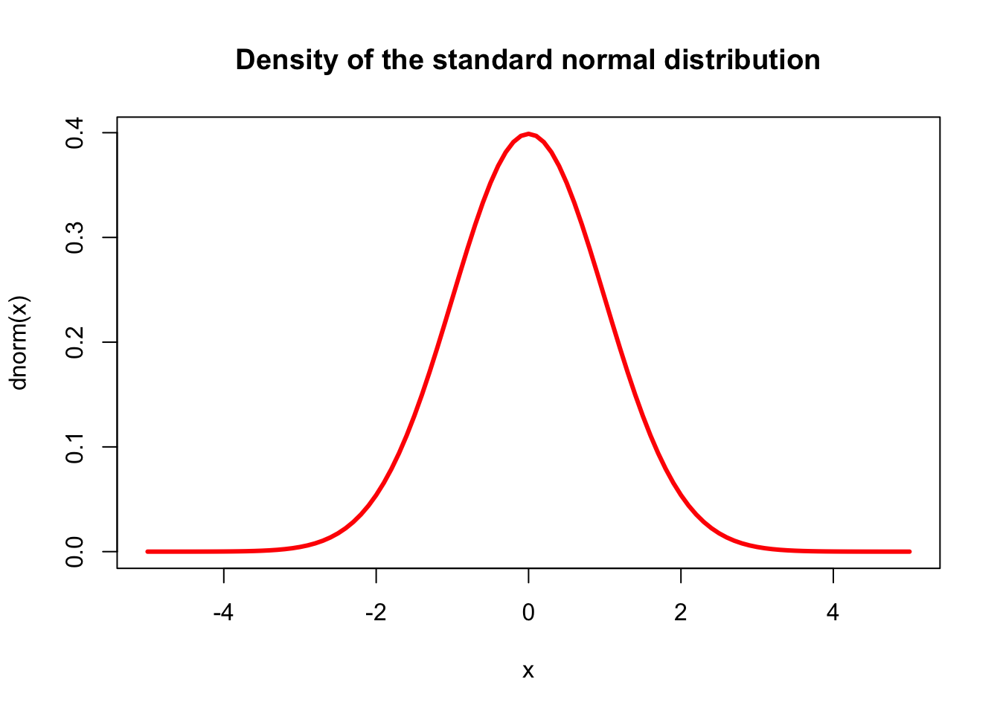

# Part V: Basic Data Visualization (20 minutes) {-}

## Creating simple plots using plot(), hist(), pie(),barplot(),boxplot() {-}

In R, the `plot()` function is a generic function used for making a variety of graphs. At its simplest, it is used to create scatter plots but can be customized to create line plots, add model lines, and much more.

### Basic Arguments: {-}

- `x`: The coordinates of points in the plot. For a simple scatter plot, this is typically a numeric vector.
- `y`: The coordinates of points in the plot on the y-axis. Should be the same length as x.
- `type`: What type of plot should be drawn. Possible types include "p" for points (the default), "l" for lines, "b" for both, and several others.
- `main`: The main title of the plot.
- `xlab`: The label for the x-axis.
- `ylab`: The label for the y-axis.
- `xlim`: Limits for the x-axis.
- `ylim`: Limits for the y-axis.
- `pch`: Plotting character, or symbol to use in the plot. Different numbers correspond to different symbols.
- `col`: Color for the points. Can also be a vector to color points differently based on a factor.

### Additional Customizations: {-}

- `cex`: A numerical value giving the amount by which plotting text and symbols should be magnified relative to the default.
- `lwd`: Line width for the plot, useful when the plot type includes lines.
- `bg`: Background color for the open plot symbols specified by pch.
Advanced Features:
- `abline`: A function to add straight lines to a plot, either vertical, horizontal, or regression lines.
- `lines`: A function to add lines to a plot, in the context of the existing plot; it doesn't start a new plot.
points: Add points to a plot.

### Adding a Legend: {-}

To add a legend, you use the `legend()` function. It provides a number of arguments to customize its appearance:

`legend`: A vector of text values or an expression describing the text to appear in the legend.
`x, y` or `position`: The location of the legend. `x` and `y` can be numeric positions, or you can use keyword positions like `"topright"`, `"bottomleft"`, `"bottomright"` , `"bottom"`, `"bottomleft"`, `"left"`, `"topleft"`, `"top"`, `"right"`, `"center"`.
`pch`: The plotting symbols for points appearing in the legend, matching those in the plot.
`col`: The colors for points or lines appearing in the legend, matching those in the plot.
`lwd`: The line widths for lines appearing in the legend, matching those in the plot.
`cex`: Character expansion size for the legend, determining how large the text in the legend should be.


## Example 1 : Simple scatter plot {-}


```r

x <- 1:10
y <- rnorm(10)
plot(x, y, main = "Simple Scatter Plot", xlab = "X Axis", ylab = "Y Axis", col = "blue")
```


## Example 2 {-}

To create a basic scatter plot, you can use the mtcars dataset, which comes built into R. This dataset contains various characteristics of 32 automobiles.


```r

data(mtcars)


plot(mtcars$hp, mtcars$mpg, main="MPG vs. Horsepower",
     xlab="Horsepower", ylab="Miles Per Gallon",
     pch=19, col="blue")
```


## Example 3 {-}

Using the pressure dataset, which is also built into R, you can create a simple line plot. The pressure dataset shows the temperature and resulting vapor pressure of mercury.


```r

data(pressure)

# Create a line plot
plot(pressure$temperature, pressure$pressure, type="l",
     main="Vapor Pressure of Mercury",
     xlab="Temperature", ylab="Pressure",
     col="red", lwd=2)
```


## Example 4 {-}


```r

data(iris)

# Plot Sepal.Length vs. Sepal.Width colored by Species
plot(iris$Sepal.Length, iris$Sepal.Width, col=iris$Species,
     main="Iris Sepal Measurements",
     xlab="Sepal Length", ylab="Sepal Width",
     pch=19)
legend("topright", legend=levels(iris$Species), col=1:3, pch=19)
```



Explanation:

`iris$Sepal.Length`: This selects the Sepal.Length column from the iris dataset as the x-coordinates for the plot.
`iris$Sepal.Width`: This selects the Sepal.Width column from the iris dataset as the y-coordinates for the plot.
`col=iris$Species`: This assigns colors to the points based on the Species column, which means that each species will have a different color in the plot.
`main`: Sets the title of the plot to "Iris Sepal Measurements".
`xlab`: Sets the label for the x-axis to "Sepal Length".
`ylab`: Sets the label for the y-axis to "Sepal Width".
`pch=19`: Sets the plotting character (or point symbol) to a solid circle.


## Example 5 {-}


```r
# Load the mtcars dataset
data(mtcars)

# Plot MPG vs. Displacement, colored by Cylinders
plot(mtcars$disp, mtcars$mpg, col=as.factor(mtcars$cyl),
     main="Scatter Plot of MPG vs. Displacement",
     xlab="Displacement (cu.in.)", ylab="MPG",
     pch=19, cex=1.5)

# Add a legend to the plot
legend("topright", 
       legend=paste("Cylinders:", unique(mtcars$cyl)), 
       col=unique(as.numeric(as.factor(mtcars$cyl))), 
       pch=19, cex=0.8)
```


- `plot()` is the generic function to create a scatter plot.
mtcars$disp and mtcars$mpg are the x and y coordinates for the plot, representing the engine displacement in cubic inches and miles per gallon, respectively.
- `col=as.factor(mtcars$cyl)` specifies the colors for the points on the plot. The cyl variable, which represents the number of cylinders in the car's engine, is converted into a factor. The levels of this factor (unique values of cyl) are automatically given different colors.
- `main` is the main title for the plot.
- `xlab` and `ylab` are labels for the x-axis and y-axis, respectively.
- `pch=19` specifies the plotting symbol (in this case, a solid circle).
- `cex=1.5` sets the size of the plot symbols; cex stands for character expansion factor, where 1.5 means 150% of the default size.

For the legend,

- `legend()` adds a legend to the plot.
- `"topright"` specifies the position of the legend (in this case, at the top right corner of the plotting area).
- `legend`= creates the text for the legend by pasting the word "Cylinders:" in front of each unique value of the cyl column. This indicates what each color in the scatter plot corresponds to.
- `col=` sets the colors used in the legend, which match the colors used for the points in the plot.
- `pch=19` again specifies the plotting symbols used in the legend.
- `cex=0.8` sets the size of the symbols in the legend.


## Exercise 1 {-}
Now, try creating your own visualization using the iris dataset. Here's what you can do:

1. Create a scatter plot using Petal.Length and Petal.Width from the iris dataset.
2. Color the points based on the Species column to differentiate between the species.
3. Add a title, x-axis label, and y-axis label to your plot.
Include a legend that indicates which color corresponds to which iris species.


