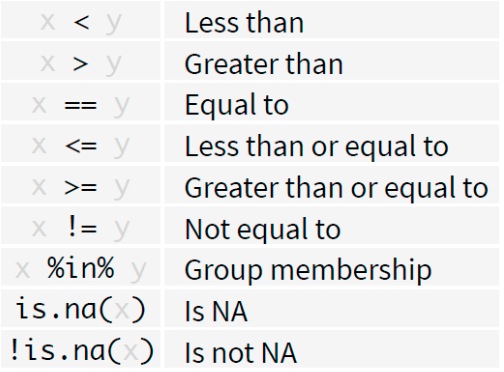

# Part II: Data Wrangling {-}

Data wrangling, also known as data munging, is the process of transforming and mapping data from one "raw" form into another format with the intent of making it more appropriate and valuable for a variety of downstream purposes, such as analytics.

In R, data wrangling is often performed using functions from the base R language, as well as a collection of packages known as the tidyverse. The tidyverse is a coherent system of packages for data manipulation, exploration, and visualization that share a common design philosophy.

The tidyverse approach to data wrangling typically involves:

1. Tidying Data: Transforming datasets into a consistent form that makes it easier to work with. This usually means converting data to a tidy format where each variable forms a column, each observation forms a row, and each type of observational unit forms a table.

1. Transforming Data: Once the data is tidy, a series of functions are used for data manipulation tasks such as selecting specific columns (select()), filtering for certain rows (filter()), creating new columns or modifying existing ones (mutate() or transmute()), summarizing data (summarise()), and reshaping data (pivot_longer() and pivot_wider()).

1. Working with Data Types and Structures: Functions from tidyverse allow for the easy manipulation of data types (like converting character vectors to factors with forcats) and data structures (like tibbles with the tibble package, which are a modern take on data frames).

1. Joining Data: Combining different datasets in a variety of ways (like left_join(), right_join(), inner_join(), full_join(), and anti_join()) based on common keys or identifiers.

1. Handling Strings and Dates: The tidyverse includes packages like stringr for string operations and lubridate for dealing with date-time objects, which are essential in many data wrangling tasks.

1. Functional Programming: The package purrr introduces powerful functional programming tools to iterate over data structures and perform operations repeatedly.

The primary goal of data wrangling is to ensure that the data is in the best possible format for analysis. The tidyverse provides tools that make these tasks straightforward, efficient, and often more intuitive than the base R equivalents. The philosophy of the tidyverse is to write readable and transparent code that can be understood even if you come back to it months or years later.

## Reshaping data using dplyr functions (filter, arrange, mutate, summarize) {-}

The `dplyr` package was developed by Hadley Wickham of RStudio and is an optimized and distilled version of his plyr package. The `dplyr` package does not provide any “new” functionality to R per se, in the sense that everything dplyr does could already be done with base R, but it greatly simplifies existing functionality in R.

One important contribution of the `dplyr` package is that it provides a “grammar” (in particular, verbs) for data manipulation and for operating on data frames. With this grammar, you can sensibly communicate what it is that you are doing to a data frame that other people can understand (assuming they also know the grammar). This is useful because it provides an abstraction for data manipulation that previously did not exist. Another useful contribution is that the `dplyr` functions are very fast, as many key operations are coded in C++.

The `dplyr` grammar

Some of the key “verbs” provided by the dplyr package are

- select: return a subset of the columns of a data frame, using a flexible notation

- filter: extract a subset of rows from a data frame based on logical conditions

- arrange: reorder rows of a data frame

- rename: rename variables in a data frame

- mutate: add new variables/columns or transform existing variables

- summarise / summarize: generate summary statistics of different variables in the data frame, possibly within strata

- `%>%`: the “pipe” operator is used to connect multiple verb actions together into a pipeline. 

These all combine naturally with group_by() which allows you to perform any operation “by group”. 

### More on the pipe operator {-}

- It takes the output of one statement and makes it the input of the next statement.
- When describing it, you can think of it as a “THEN”. A first example:
  - take the diamonds data (from the ggplot2 package) 
  - then subset
  

```r
library(dplyr)
#> 
#> Attaching package: 'dplyr'
#> The following objects are masked from 'package:stats':
#> 
#>     filter, lag
#> The following objects are masked from 'package:base':
#> 
#>     intersect, setdiff, setequal, union
library(ggplot2)
diamonds %>% filter(cut == "Ideal")
#> # A tibble: 21,551 × 10
#>    carat cut   color clarity depth table price     x     y
#>    <dbl> <ord> <ord> <ord>   <dbl> <dbl> <int> <dbl> <dbl>
#>  1  0.23 Ideal E     SI2      61.5    55   326  3.95  3.98
#>  2  0.23 Ideal J     VS1      62.8    56   340  3.93  3.9 
#>  3  0.31 Ideal J     SI2      62.2    54   344  4.35  4.37
#>  4  0.3  Ideal I     SI2      62      54   348  4.31  4.34
#>  5  0.33 Ideal I     SI2      61.8    55   403  4.49  4.51
#>  6  0.33 Ideal I     SI2      61.2    56   403  4.49  4.5 
#>  7  0.33 Ideal J     SI1      61.1    56   403  4.49  4.55
#>  8  0.23 Ideal G     VS1      61.9    54   404  3.93  3.95
#>  9  0.32 Ideal I     SI1      60.9    55   404  4.45  4.48
#> 10  0.3  Ideal I     SI2      61      59   405  4.3   4.33
#> # ℹ 21,541 more rows
#> # ℹ 1 more variable: z <dbl>
```

### Filter() {-}

Extract rows that meet logical criteria. Here you go:
- inspect the diamonds data set
- filter observations with cut equal to Ideal


```r
filter(diamonds, cut == "Ideal")
#> # A tibble: 21,551 × 10
#>    carat cut   color clarity depth table price     x     y
#>    <dbl> <ord> <ord> <ord>   <dbl> <dbl> <int> <dbl> <dbl>
#>  1  0.23 Ideal E     SI2      61.5    55   326  3.95  3.98
#>  2  0.23 Ideal J     VS1      62.8    56   340  3.93  3.9 
#>  3  0.31 Ideal J     SI2      62.2    54   344  4.35  4.37
#>  4  0.3  Ideal I     SI2      62      54   348  4.31  4.34
#>  5  0.33 Ideal I     SI2      61.8    55   403  4.49  4.51
#>  6  0.33 Ideal I     SI2      61.2    56   403  4.49  4.5 
#>  7  0.33 Ideal J     SI1      61.1    56   403  4.49  4.55
#>  8  0.23 Ideal G     VS1      61.9    54   404  3.93  3.95
#>  9  0.32 Ideal I     SI1      60.9    55   404  4.45  4.48
#> 10  0.3  Ideal I     SI2      61      59   405  4.3   4.33
#> # ℹ 21,541 more rows
#> # ℹ 1 more variable: z <dbl>
```

### Overview of logical tests {-}

<center>

</center>

## Mutate() {-}

Create new columns. Here you go:
- inspect the diamonds data set
- create a new variable price_per_carat


```r
mutate(diamonds, price_per_carat = price/carat)
#> # A tibble: 53,940 × 11
#>    carat cut     color clarity depth table price     x     y
#>    <dbl> <ord>   <ord> <ord>   <dbl> <dbl> <int> <dbl> <dbl>
#>  1  0.23 Ideal   E     SI2      61.5    55   326  3.95  3.98
#>  2  0.21 Premium E     SI1      59.8    61   326  3.89  3.84
#>  3  0.23 Good    E     VS1      56.9    65   327  4.05  4.07
#>  4  0.29 Premium I     VS2      62.4    58   334  4.2   4.23
#>  5  0.31 Good    J     SI2      63.3    58   335  4.34  4.35
#>  6  0.24 Very G… J     VVS2     62.8    57   336  3.94  3.96
#>  7  0.24 Very G… I     VVS1     62.3    57   336  3.95  3.98
#>  8  0.26 Very G… H     SI1      61.9    55   337  4.07  4.11
#>  9  0.22 Fair    E     VS2      65.1    61   337  3.87  3.78
#> 10  0.23 Very G… H     VS1      59.4    61   338  4     4.05
#> # ℹ 53,930 more rows
#> # ℹ 2 more variables: z <dbl>, price_per_carat <dbl>
```
##  Multistep operations {-}
Use the %>% for multistep operations.
Passes result on left into first argument of function on right. Here you go:


```r
diamonds %>% 
  mutate(price_per_carat = price/carat)  %>%
  filter(price_per_carat > 1500)
#> # A tibble: 52,821 × 11
#>    carat cut     color clarity depth table price     x     y
#>    <dbl> <ord>   <ord> <ord>   <dbl> <dbl> <int> <dbl> <dbl>
#>  1  0.21 Premium E     SI1      59.8    61   326  3.89  3.84
#>  2  0.22 Fair    E     VS2      65.1    61   337  3.87  3.78
#>  3  0.22 Premium F     SI1      60.4    61   342  3.88  3.84
#>  4  0.2  Premium E     SI2      60.2    62   345  3.79  3.75
#>  5  0.23 Very G… E     VS2      63.8    55   352  3.85  3.92
#>  6  0.23 Very G… H     VS1      61      57   353  3.94  3.96
#>  7  0.23 Very G… G     VVS2     60.4    58   354  3.97  4.01
#>  8  0.23 Very G… D     VS2      60.5    61   357  3.96  3.97
#>  9  0.23 Very G… F     VS1      60.9    57   357  3.96  3.99
#> 10  0.23 Very G… F     VS1      60      57   402  4     4.03
#> # ℹ 52,811 more rows
#> # ℹ 2 more variables: z <dbl>, price_per_carat <dbl>
```

## Summarize() {-}

Compute table of summaries. Here you go:

- inspect the diamonds data set
- calculate mean and standard deviation of price
 
 

```r
diamonds %>% summarize(mean = mean(price), std_dev = sd(price))
#> # A tibble: 1 × 2
#>    mean std_dev
#>   <dbl>   <dbl>
#> 1 3933.   3989.
```

## Group_by() {-}

Groups cases by common values of one or more columns. Here you go:
inspect the diamonds data set
calculate mean and standard deviation of price by level of cut
 
 

```r
diamonds %>% 
        group_by(cut) %>% 
        summarize(price = mean(price), carat = mean(carat))
#> # A tibble: 5 × 3
#>   cut       price carat
#>   <ord>     <dbl> <dbl>
#> 1 Fair      4359. 1.05 
#> 2 Good      3929. 0.849
#> 3 Very Good 3982. 0.806
#> 4 Premium   4584. 0.892
#> 5 Ideal     3458. 0.703
```
### Exercise 1 {-}

1. Load the data Parade2005.txt.
2. Determine the mean earnings in California.
3. Determine the number of individuals residing in Idaho.
4. Determine the mean and the median earnings of celebrities.

## Transforming a dataframe into tibbles {-}

Transform the mtcars into a tibble and inspect.


```r
str(mtcars)
#> 'data.frame':	32 obs. of  11 variables:
#>  $ mpg : num  21 21 22.8 21.4 18.7 18.1 14.3 24.4 22.8 19.2 ...
#>  $ cyl : num  6 6 4 6 8 6 8 4 4 6 ...
#>  $ disp: num  160 160 108 258 360 ...
#>  $ hp  : num  110 110 93 110 175 105 245 62 95 123 ...
#>  $ drat: num  3.9 3.9 3.85 3.08 3.15 2.76 3.21 3.69 3.92 3.92 ...
#>  $ wt  : num  2.62 2.88 2.32 3.21 3.44 ...
#>  $ qsec: num  16.5 17 18.6 19.4 17 ...
#>  $ vs  : num  0 0 1 1 0 1 0 1 1 1 ...
#>  $ am  : num  1 1 1 0 0 0 0 0 0 0 ...
#>  $ gear: num  4 4 4 3 3 3 3 4 4 4 ...
#>  $ carb: num  4 4 1 1 2 1 4 2 2 4 ...
```


```r
#library(tidyverse)
library(tibble)
as_tibble(mtcars)
#> # A tibble: 32 × 11
#>      mpg   cyl  disp    hp  drat    wt  qsec    vs    am
#>    <dbl> <dbl> <dbl> <dbl> <dbl> <dbl> <dbl> <dbl> <dbl>
#>  1  21       6  160    110  3.9   2.62  16.5     0     1
#>  2  21       6  160    110  3.9   2.88  17.0     0     1
#>  3  22.8     4  108     93  3.85  2.32  18.6     1     1
#>  4  21.4     6  258    110  3.08  3.22  19.4     1     0
#>  5  18.7     8  360    175  3.15  3.44  17.0     0     0
#>  6  18.1     6  225    105  2.76  3.46  20.2     1     0
#>  7  14.3     8  360    245  3.21  3.57  15.8     0     0
#>  8  24.4     4  147.    62  3.69  3.19  20       1     0
#>  9  22.8     4  141.    95  3.92  3.15  22.9     1     0
#> 10  19.2     6  168.   123  3.92  3.44  18.3     1     0
#> # ℹ 22 more rows
#> # ℹ 2 more variables: gear <dbl>, carb <dbl>
```


## Part II : Data Cleaning and Transformation {-}

Data cleaning info

## The Policy data set{-}

- PolicyData.csv available in the course material 
- Data stored in a .csv file.
- Individual records separated by a semicolon.


```r
policy_data <- read.csv(file = './John Jay Workshop Data/PolicyData.csv', sep = ';')
```

### Exercise 1 {-}

Use the skills you obtained in the first R workshop.

1. Inspect the top rows of the data set.
2. How many observations does the data set contain?
3. Calculate the total exposure (exposition) in each region (type_territoire).


## The Gapminder package {-}

- Describes the evolution of a number of population characteristics (GDP, life expectancy, ...) over time.


```r
#install.packages("gapminder")
library(gapminder)
```

###  Exercise 2 {-}

Use the skills obtained in Part I: 

1. Inspect the top rows of the data.
2. Select the data for countries in Asia.
3. Which type of variable is `country`?


## Revisit factor() {-}
### What is a factor variable ? {-}

- Representation for categorical data. 
- Predefined list of outcomes (levels). 
- Protecting data quality.

Example , sex a categorical value  with two possible outcomes, `m` and `f`

```r
sex <- factor(c('m', 'f', 'm', 'f'),
              levels = c('m', 'f'))
sex
#> [1] m f m f
#> Levels: m f
```

- The `factor` command creates a new factor variable. The first input is the categorical variable.

- `levels` specifies the possible outcomes of the variable.


Assigning an unrecognized level to a factor variable results in a warning 


```r
sex[1] <- 'male'
#> Warning in `[<-.factor`(`*tmp*`, 1, value = "male"):
#> invalid factor level, NA generated
```

This protects the quality of the data


```r
sex
#> [1] <NA> f    m    f   
#> Levels: m f
```

The value NA is assigned to the invalid observation.

## levels() {-}

levels print the allowed outcomes for a factor variable


```r
levels(sex)
#> [1] "m" "f"
```

Assigning a vector to levels() renames the allowed outcomes.


```r
levels(sex) <- c('male', 'female')
sex
#> [1] <NA>   female male   female
#> Levels: male female
```


### Exercise 4 {-}

The variable country in the gapminder data set is a factor variable. 

1. What are the possible levels for country in the subset asia.
2. Is this the result you expected?

To add a level 


```r
levels(sex) <- c(levels(sex), 'x')
```

## cut() {-}


```r
gapminder
#> # A tibble: 1,704 × 6
#>    country     continent  year lifeExp      pop gdpPercap
#>    <fct>       <fct>     <int>   <dbl>    <int>     <dbl>
#>  1 Afghanistan Asia       1952    28.8  8425333      779.
#>  2 Afghanistan Asia       1957    30.3  9240934      821.
#>  3 Afghanistan Asia       1962    32.0 10267083      853.
#>  4 Afghanistan Asia       1967    34.0 11537966      836.
#>  5 Afghanistan Asia       1972    36.1 13079460      740.
#>  6 Afghanistan Asia       1977    38.4 14880372      786.
#>  7 Afghanistan Asia       1982    39.9 12881816      978.
#>  8 Afghanistan Asia       1987    40.8 13867957      852.
#>  9 Afghanistan Asia       1992    41.7 16317921      649.
#> 10 Afghanistan Asia       1997    41.8 22227415      635.
#> # ℹ 1,694 more rows
```


```r
head(cut(gapminder$pop,
    breaks = c(0, 10^7, 5*10^7, 10^8, Inf)))
#> [1] (0,1e+07]     (0,1e+07]     (1e+07,5e+07] (1e+07,5e+07]
#> [5] (1e+07,5e+07] (1e+07,5e+07]
#> 4 Levels: (0,1e+07] (1e+07,5e+07] ... (1e+08,Inf]
```


```r
gapminder$pop_category = cut(gapminder$pop,
                             breaks = c(0, 10^7, 5*10^7, 10^8, Inf),
                             labels = c("<= 10M", "10M-50M", "50M-100M", "> 100M"))
```


```r
gapminder
#> # A tibble: 1,704 × 7
#>    country     continent  year lifeExp      pop gdpPercap
#>    <fct>       <fct>     <int>   <dbl>    <int>     <dbl>
#>  1 Afghanistan Asia       1952    28.8  8425333      779.
#>  2 Afghanistan Asia       1957    30.3  9240934      821.
#>  3 Afghanistan Asia       1962    32.0 10267083      853.
#>  4 Afghanistan Asia       1967    34.0 11537966      836.
#>  5 Afghanistan Asia       1972    36.1 13079460      740.
#>  6 Afghanistan Asia       1977    38.4 14880372      786.
#>  7 Afghanistan Asia       1982    39.9 12881816      978.
#>  8 Afghanistan Asia       1987    40.8 13867957      852.
#>  9 Afghanistan Asia       1992    41.7 16317921      649.
#> 10 Afghanistan Asia       1997    41.8 22227415      635.
#> # ℹ 1,694 more rows
#> # ℹ 1 more variable: pop_category <fct>
```

## Exercise  5 {-}

Bin the life expectancy in 2007 in a factor variable.
1. Select the observations for year 2007.
2. Bin the life expectancy in four bins of roughly equal size (hint: quantile). 
3. How many observations are there in each bin?

## Handling missing data {-}

### Some history {-}

The practice of imputing missing values has evolved significantly over the years as statisticians and data scientists have sought to deal with the unavoidable problem of incomplete data. The history of imputation reflects broader trends in statistical methods and computational capabilities, as well as growing awareness of the impacts of different imputation strategies on the integrity of statistical analysis.

#### Missing Data Mechanisms {-}
Rubin (1976) classified missing data into 3 categories:
- Missing Completely at Random (MCAR)
- Missing at Random (MAR)
- Not Missing at Random (NMAR), also called Missing Not at Random (MNAR)
- Aka the most confusing statistical terms ever invented

#### Early Approaches and Simple Imputation {-}

Early approaches to handling missing data were often quite simple, including methods like listwise deletion (removing any record with a missing value) and pairwise deletion (excluding missing values on a case-by-case basis for each analysis). These methods, while straightforward, can lead to biased results and reduced statistical power if the missingness is not completely random.

Simple imputation techniques, such as filling in missing values with the mean, median, or mode of a variable, were developed as a way to retain as much data as possible. These methods are easy to understand and implement, which contributed to their widespread use, especially in the era before advanced computational methods became widely accessible.

#### Limitations of Mean and Median Imputation {-}

Imputing missing values with the mean or median is intuitive and can be effective in certain contexts, but these methods have significant limitations:

**Bias in Estimation:** Mean and median imputation do not account for the inherent uncertainty associated with missing data. They can lead to an underestimation of variances and covariances because they artificially reduce the variability of the imputed variable.

**Distortion of Data Distribution:** These methods can distort the original distribution of data, especially if the missingness is not random (Missing Not at Random - MNAR) or if the proportion of missing data is high. This distortion can affect subsequent analyses, such as regression models, by providing misleading results.

**Ignores Relationships Between Variables:** Mean and median imputation treat each variable in isolation, ignoring the potential relationships between variables. This can be particularly problematic in multivariate datasets where variables may be correlated.

#### Modern Imputation Techniques {-}

As awareness of the limitations of simple imputation methods grew, researchers developed more sophisticated techniques designed to address these shortcomings:

**Multiple Imputation:** Developed in the late 20th century, multiple imputation involves creating several imputed datasets by drawing from a distribution that reflects the uncertainty around the true values of missing data. These datasets are then analyzed separately, and the results are combined to produce estimates that account for the uncertainty due to missingness. This method addresses the issue of underestimating variability and provides more reliable statistical inferences.

**Model-Based Imputation:** Techniques like Expectation-Maximization (EM) algorithms and imputation using random forests or other machine learning models take into account the relationships between variables in a dataset. These methods can more accurately reflect the complex structures in data and produce imputations that preserve statistical relationships.

**Conclusion**

The evolution of imputation methods from simple mean or median filling to sophisticated model-based and multiple imputation techniques reflects a broader shift in statistical practice. This shift is characterized by increased computational power, more complex datasets, and a deeper understanding of the impact of missing data on statistical inference. While mean and median imputation can still be useful in specific, well-considered circumstances, modern techniques offer more robust and principled approaches to handling missing data.

## Missing Values in R {-}

Missing values are denoted by NA or NaN for q undefined mathematical operations.

- is.na() is used to test objects if they are NA
- is.nan() is used to test for NaN
- NA values have a class also, so there are integer NA, character NA, etc. 
- A NaN value is also NA but the converse is not true

### Difference Between NA and NaN in R

In R, `NA` and `NaN` represent two different kinds of missing or undefined values, but they are used in distinct contexts:

#### NA (Not Available)

- `NA` stands for **Not Available**.
- It is used to represent **missing or undefined data**, typically in cases where data is expected but not present.
- `NA` can be used in any logical or statistical operation, but unless handled specifically, operations involving `NA` will generally result in `NA`.
- `NA` has a flexible context and can be used with **any data type** in R, such as numeric, character, or logical.
- You can test for `NA` using the `is.na()` function.

#### NaN (Not a Number)

- `NaN` stands for **Not a Number**.
- It is a special value used to represent **undefined or unrepresentable numerical results**, such as the result of `0/0`.
- `NaN` is a specific type of `NA` but specifically for numeric calculations that result in undefined or indeterminate values.
- Operations that result in `NaN` are typically those that are mathematically indeterminate or outside the domain of mathematical functions (e.g., square root of a negative number in the realm of real numbers).
- You can test for `NaN` using the `is.nan()` function. Note that `is.na()` also returns `TRUE` for `NaN` values, reflecting their status as a kind of missing value, but `is.nan()` does not return `TRUE` for all `NA` values.

#### Key Differences {-}

- **Context of Use**: `NA` is used more broadly for missing data across all data types, while `NaN` is specific to numerical operations that do not produce a defined, real number.
- **Nature of Undefinedness**: `NA` indicates the absence of data, whereas `NaN` indicates that a calculation has failed to produce a meaningful result.

In summary, the use of `NA` vs. `NaN` helps distinguish between data that is missing (`NA`) and numerical operations that result in undefined or unrepresentable values (`NaN`).


```r
coffee_data <- data.frame(
  Age = c(25, 32, NA, 45, 22, 33, NA, 28),
  Gender = c("Female", "Male", "Male", "Female", "Female", "Male", "Female", NA),
  Cups_Per_Day = c(1, 3, 2, NA, 2, 3, 1, 2)
)
coffee_data
#>   Age Gender Cups_Per_Day
#> 1  25 Female            1
#> 2  32   Male            3
#> 3  NA   Male            2
#> 4  45 Female           NA
#> 5  22 Female            2
#> 6  33   Male            3
#> 7  NA Female            1
#> 8  28   <NA>            2
```

###  Identifying Missing Values {-}

You can use the `is.na()` function to check for missing values. To count them in a specific column:


```r
sum(is.na(coffee_data$Age))
#> [1] 2
```

### Removing NA Values {-}

A common task in data analysis is removing missing values (NAs).

```r
x <- c(1, 2, NA, 4, NA, 5)
bad <- is.na(x)
print(bad)
#> [1] FALSE FALSE  TRUE FALSE  TRUE FALSE
```
We can remove them by 

```r
x[!bad]
#> [1] 1 2 4 5
```

A faster way , 

```r
x[!is.na(x)]
#> [1] 1 2 4 5
```

#### In a Data frame {-}

Also, using our coffee example, 


```r
coffee_data_clean <- na.omit(coffee_data)
coffee_data_clean
#>   Age Gender Cups_Per_Day
#> 1  25 Female            1
#> 2  32   Male            3
#> 5  22 Female            2
#> 6  33   Male            3
```

To remove rows with missing values in a specific column:


```r

coffee_data_clean2 <- coffee_data[!is.na(coffee_data$Age), ]
coffee_data_clean2
#>   Age Gender Cups_Per_Day
#> 1  25 Female            1
#> 2  32   Male            3
#> 4  45 Female           NA
#> 5  22 Female            2
#> 6  33   Male            3
#> 8  28   <NA>            2
row.names(coffee_data_clean2) <- NULL
coffee_data_clean2
#>   Age Gender Cups_Per_Day
#> 1  25 Female            1
#> 2  32   Male            3
#> 3  45 Female           NA
#> 4  22 Female            2
#> 5  33   Male            3
#> 6  28   <NA>            2
```

What if there are multiple R objects and you want to take the subset with no missing values in any of those objects?


```r
x <- c(1, 2, NA, 4, NA, 5)
y <- c("a", "b", NA, "d", NA, "f")
good <- complete.cases(x, y)
good
#> [1]  TRUE  TRUE FALSE  TRUE FALSE  TRUE
x[good]
#> [1] 1 2 4 5
y[good]
#> [1] "a" "b" "d" "f"
```

You can use complete.cases on data frames too.


```r
head(airquality)
#>   Ozone Solar.R Wind Temp Month Day
#> 1    41     190  7.4   67     5   1
#> 2    36     118  8.0   72     5   2
#> 3    12     149 12.6   74     5   3
#> 4    18     313 11.5   62     5   4
#> 5    NA      NA 14.3   56     5   5
#> 6    28      NA 14.9   66     5   6
```


```r
good <- complete.cases(airquality)
head(airquality[good, ])
#>   Ozone Solar.R Wind Temp Month Day
#> 1    41     190  7.4   67     5   1
#> 2    36     118  8.0   72     5   2
#> 3    12     149 12.6   74     5   3
#> 4    18     313 11.5   62     5   4
#> 7    23     299  8.6   65     5   7
#> 8    19      99 13.8   59     5   8
```

```r
sd(airquality$Ozone)
#> [1] NA
sd(airquality$Ozone, na.rm = TRUE)
#> [1] 32.98788
```

### Imputing Missing Values {-}

Replacing missing values with a specific value, like the mean or median:


```r
coffee_data2<-coffee_data

coffee_data2$Age[is.na(coffee_data$Age)] <- mean(coffee_data2$Age, na.rm = TRUE)
coffee_data2
#>        Age Gender Cups_Per_Day
#> 1 25.00000 Female            1
#> 2 32.00000   Male            3
#> 3 30.83333   Male            2
#> 4 45.00000 Female           NA
#> 5 22.00000 Female            2
#> 6 33.00000   Male            3
#> 7 30.83333 Female            1
#> 8 28.00000   <NA>            2
```


```r
# Assuming 'median' is the mode of the column
median(coffee_data$Age, na.rm = TRUE)
#> [1] 30
coffee_data2$Age[is.na(coffee_data$Age)] <- median(coffee_data$Age, na.rm = TRUE)
coffee_data2
#>   Age Gender Cups_Per_Day
#> 1  25 Female            1
#> 2  32   Male            3
#> 3  30   Male            2
#> 4  45 Female           NA
#> 5  22 Female            2
#> 6  33   Male            3
#> 7  30 Female            1
#> 8  28   <NA>            2
```

## Using Packages for Advanced Imputation {-}


```r
# install.packages("mice")
library(mice)
#> 
#> Attaching package: 'mice'
#> The following object is masked from 'package:stats':
#> 
#>     filter
#> The following objects are masked from 'package:base':
#> 
#>     cbind, rbind
# Display the first few rows of the airquality dataset
head(airquality)
#>   Ozone Solar.R Wind Temp Month Day
#> 1    41     190  7.4   67     5   1
#> 2    36     118  8.0   72     5   2
#> 3    12     149 12.6   74     5   3
#> 4    18     313 11.5   62     5   4
#> 5    NA      NA 14.3   56     5   5
#> 6    28      NA 14.9   66     5   6

# Perform multiple imputation
imputed_data <- mice(airquality, m=5, method='pmm', seed = 123)
#> 
#>  iter imp variable
#>   1   1  Ozone  Solar.R
#>   1   2  Ozone  Solar.R
#>   1   3  Ozone  Solar.R
#>   1   4  Ozone  Solar.R
#>   1   5  Ozone  Solar.R
#>   2   1  Ozone  Solar.R
#>   2   2  Ozone  Solar.R
#>   2   3  Ozone  Solar.R
#>   2   4  Ozone  Solar.R
#>   2   5  Ozone  Solar.R
#>   3   1  Ozone  Solar.R
#>   3   2  Ozone  Solar.R
#>   3   3  Ozone  Solar.R
#>   3   4  Ozone  Solar.R
#>   3   5  Ozone  Solar.R
#>   4   1  Ozone  Solar.R
#>   4   2  Ozone  Solar.R
#>   4   3  Ozone  Solar.R
#>   4   4  Ozone  Solar.R
#>   4   5  Ozone  Solar.R
#>   5   1  Ozone  Solar.R
#>   5   2  Ozone  Solar.R
#>   5   3  Ozone  Solar.R
#>   5   4  Ozone  Solar.R
#>   5   5  Ozone  Solar.R

# Extract the first completed dataset
completed_data <- complete(imputed_data, 1)

# Display the first few rows of the completed data
head(completed_data)
#>   Ozone Solar.R Wind Temp Month Day
#> 1    41     190  7.4   67     5   1
#> 2    36     118  8.0   72     5   2
#> 3    12     149 12.6   74     5   3
#> 4    18     313 11.5   62     5   4
#> 5    18     150 14.3   56     5   5
#> 6    28      48 14.9   66     5   6
```

## Exercise 1: Explore Missingness {-}

**Dataset:** ChickWeight

**Task:** Determine if the ChickWeight dataset contains any missing values. Print a message stating whether the dataset has missing values or not.

*Hint* Use the any() function combined with is.na() applied to the dataset.


## Exercise 2: Calculate Summary Statistics Before Handling NA {-}


```r
data(mtcars)
mean_mpg <- mean(mtcars$mpg)
mean_mpg
#> [1] 20.09062
sd_mpg <- sd(mtcars$mpg)
sd_mpg
#> [1] 6.026948
```

**Dataset:** mtcars

**Task:** The mtcars dataset is almost complete but let's pretend some values are missing in the mpg (miles per gallon) column. First, artificially introduce missing values into the mpg column (e.g., set the first three values of mpg to NA). Then, calculate and print the mean and standard deviation of mpg without removing or imputing the missing values.

*Hint:* Modify the mtcars$mpg directly to introduce NAs. Use mean() and sd() functions with na.rm = FALSE to calculate statistics without handling NA.


## Exercise 3: Impute Missing Values with Column Median {-}

**Dataset:** mtcars with modified mpg

**Task:** First Calculate the mean and standard deviation handling the missing values. 

Then,Impute the artificially introduced missing values in the mpg column with the column's median (excluding the missing values). Print the first 6 rows of the modified mtcars dataset.

Now, calculate the mean and standard deviation with the imputed values. 

*Hint:* First, calculate the median of mpg excluding NAs. Then, use indexing to replace NAs with this median.


## Exercise 4: Identifying Complete Rows {-}

**Dataset:** airquality

**Task:** Before any analysis, you want to ensure that only complete cases are used. Create a new dataset from airquality that includes only the rows without any missing values. Print the number of rows in the original versus the cleaned dataset.


*Hint* Use complete.cases() on the dataset and then subset it.

## Exercise 5: Advanced Imputation on a Subset {-}

**Dataset:** mtcars

**Task:** Create a subset of mtcars containing only the mpg, hp (horsepower), and wt (weight) columns. Introduce missing values in hp and wt columns (e.g., set first two values of each to NA). Perform multiple imputation using the mice package on this subset with 3 imputations, and extract the third completed dataset. Print the first 6 rows of this completed dataset.

*Hint:* Subset mtcars first, then modify to add NAs. Use mice() for imputation and complete() to extract the desired imputed dataset.


