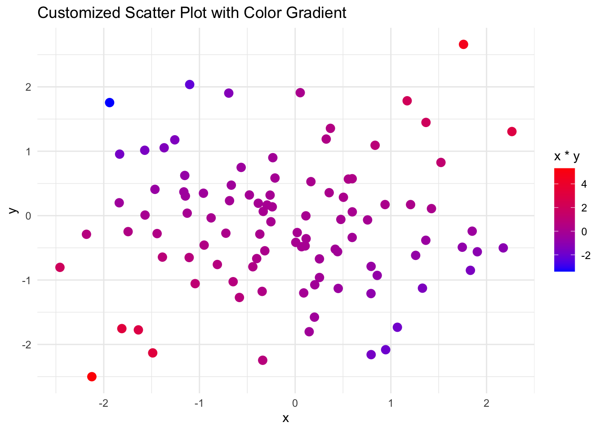

# Intermediate R II {-}

In this session , we will do some more advanced data visualization ,and  statistical analysis. 

If time permits, we will cover Dates and Times

# Part I: Advanced Data Visualization {-}

The aim of the `ggplot2` package is to create elegant data visualizations using the grammar of graphics.

Here are the basic steps:

- begin a plot with the function `ggplot()` creating a coordinate system that you can add layers to

-the first argument of `ggplot()` is the dataset to use in the graph


We will use the mpg dataset from `ggplot2`


```r
library(ggplot2)
head(mpg)
#> # A tibble: 6 × 11
#>   manufacturer model displ  year   cyl trans     drv     cty
#>   <chr>        <chr> <dbl> <int> <int> <chr>     <chr> <int>
#> 1 audi         a4      1.8  1999     4 auto(l5)  f        18
#> 2 audi         a4      1.8  1999     4 manual(m… f        21
#> 3 audi         a4      2    2008     4 manual(m… f        20
#> 4 audi         a4      2    2008     4 auto(av)  f        21
#> 5 audi         a4      2.8  1999     6 auto(l5)  f        16
#> 6 audi         a4      2.8  1999     6 manual(m… f        18
#> # ℹ 3 more variables: hwy <int>, fl <chr>, class <chr>
```

Run the following code, 

What do you obtain ?


```r

ggplot(data = mpg)
```


```r
ggplot(mpg)
```


You create an empty graph.

You complete the graph by adding one or more layers to ggplot()

for example:
- geom_point() adds a layer of points to your plot, which creates a scatterplot
- geom_smooth() adds a smooth line
- geom_bar a bar plot.

Each geom function in ggplot2 takes a mapping argument:
- how variables in your dataset are mapped to visual properties
- always paired with `aes()` and the and arguments of `aes()` specify which variables to map to the and axes.


```r
library(ggplot2)
ggplot(data = mpg) + 
  geom_point(mapping = aes(x = displ, y = hwy))
```


```r
ggplot(data = mpg) + geom_point(aes(x = displ, y = hwy, color = class))
```


Compare the following set of instructions: 

- inside of aesthetics


```r
ggplot(mpg) + geom_point(aes(x = displ, y = hwy, color = class))
```


- inside of aesthetics, not mapped to a variable

```r
ggplot(mpg) + geom_point(aes(x = displ, y = hwy, color = "blue"))
```


- outside of aesthetics


```r
ggplot(mpg) + geom_point(aes(x = displ, y = hwy), color = "blue")
```


- Scatterplot


```r
ggplot(mpg) + 
  geom_point(mapping = aes(x = class, y = hwy))
```


- boxplot


```r
ggplot(data = mpg) +
  geom_boxplot(mapping = aes(x = class, y = hwy))
```


- histogram 


```r
ggplot(data = mpg) +
  geom_histogram(mapping = aes(x = hwy))
#> `stat_bin()` using `bins = 30`. Pick better value with
#> `binwidth`.
```


```r
ggplot(data = mpg) +
  geom_density(mapping = aes(x = hwy))
```


Now you will add multiple geoms to the same plot. 
Predict what the following code does:


```r
ggplot(data = mpg) +
  geom_point(mapping = aes(x = displ, y = hwy)) +
  geom_smooth(mapping = aes(x = displ, y = hwy))
#> `geom_smooth()` using method = 'loess' and formula = 'y ~
#> x'
```


Mappings and data can be specified global (in `ggplot()`) or local.


```r
ggplot(data = mpg, mapping = aes(x = displ, y = hwy)) +
  geom_point() +
  geom_smooth() + theme_bw()       # adjust theme
#> `geom_smooth()` using method = 'loess' and formula = 'y ~
#> x'
```


**local.**

```r
ggplot(data = mpg, mapping = aes(x = displ, y = hwy)) +
  geom_point(mapping = aes(color = drv)) +
  geom_smooth() + theme_bw()
#> `geom_smooth()` using method = 'loess' and formula = 'y ~
#> x'
```


```r
library(dplyr)
#> 
#> Attaching package: 'dplyr'
#> The following objects are masked from 'package:stats':
#> 
#>     filter, lag
#> The following objects are masked from 'package:base':
#> 
#>     intersect, setdiff, setequal, union
ggplot(data = mpg, mapping = aes(x = displ, y = hwy)) +
  geom_point(mapping = aes(color = drv)) +
  geom_smooth(data = filter(mpg, drv == "f")) + theme_bw()
#> `geom_smooth()` using method = 'loess' and formula = 'y ~
#> x'
```


## Exercise 1 {-}

Use the Danish fire insurance losses. Plot the arrival of losses over time.

1. Use type= "l" for a line plot, label the and -axis, and give the plot a title using main.
2. Do the same with instructions from ggplot2. Use geom_line() to create the line plot.

## Exercise 2 {-}

1. Use the data set car_price.csv available in the documentation. Import the data in R.

2. Explore the data.

3. Make a scatterplot of price versus income, use basic plotting instructions
and use ggplot2.

4. Add a smooth line to each of the plots (using lines to add a line to an existing plot and lowess to do scatterplot smoothing and using geom_smooth in the ggplot2 grammar).


## Creating customized plots with ggplot2 {-}

```r

# Load ggplot2 package
library(ggplot2)

# Example: Customized scatter plot with ggplot2
data <- data.frame(x = rnorm(100), y = rnorm(100))
ggplot(data, aes(x = x, y = y)) +
  geom_point(aes(color = x*y), size = 3) +
  scale_color_gradient(low = "blue", high = "red") +
  ggtitle("Customized Scatter Plot with Color Gradient") +
  theme_minimal()
```




## Adding titles, labels, and themes to plots {-}


```r
# Example: Enhanced bar plot with titles, labels, and a custom theme
data <- data.frame(
  category = c("A", "B", "C", "D"),
  value = c(10, 15, 7, 12)
)
ggplot(data, aes(x = category, y = value, fill = category)) +
  geom_bar(stat = "identity") +
  labs(title = "Enhanced Bar Plot",
       subtitle = "Bar plot with custom labels and theme",
       x = "Category",
       y = "Value",
       fill = "Category") +
  theme_bw() +
  theme(plot.title = element_text(hjust = 0.5))
```


