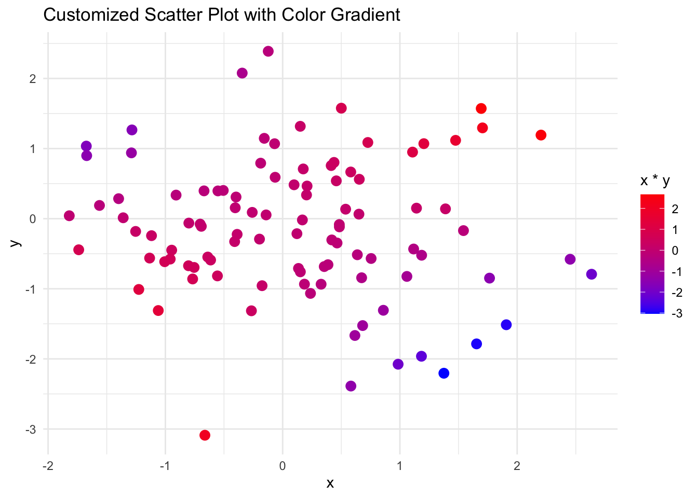

# Intermediate R II {-}

In this session , we will do some more advanced data visualization ,and  statistical analysis. 

If time permits, we will cover Dates and Times
# Part I: Advanced Data Visualization {-}


## Creating customized plots with ggplot2 {-}

```r

# Load ggplot2 package
library(ggplot2)

# Example: Customized scatter plot with ggplot2
data <- data.frame(x = rnorm(100), y = rnorm(100))
ggplot(data, aes(x = x, y = y)) +
  geom_point(aes(color = x*y), size = 3) +
  scale_color_gradient(low = "blue", high = "red") +
  ggtitle("Customized Scatter Plot with Color Gradient") +
  theme_minimal()
```




## Adding titles, labels, and themes to plots {-}


```r
# Example: Enhanced bar plot with titles, labels, and a custom theme
data <- data.frame(
  category = c("A", "B", "C", "D"),
  value = c(10, 15, 7, 12)
)
ggplot(data, aes(x = category, y = value, fill = category)) +
  geom_bar(stat = "identity") +
  labs(title = "Enhanced Bar Plot",
       subtitle = "Bar plot with custom labels and theme",
       x = "Category",
       y = "Value",
       fill = "Category") +
  theme_bw() +
  theme(plot.title = element_text(hjust = 0.5))
```


