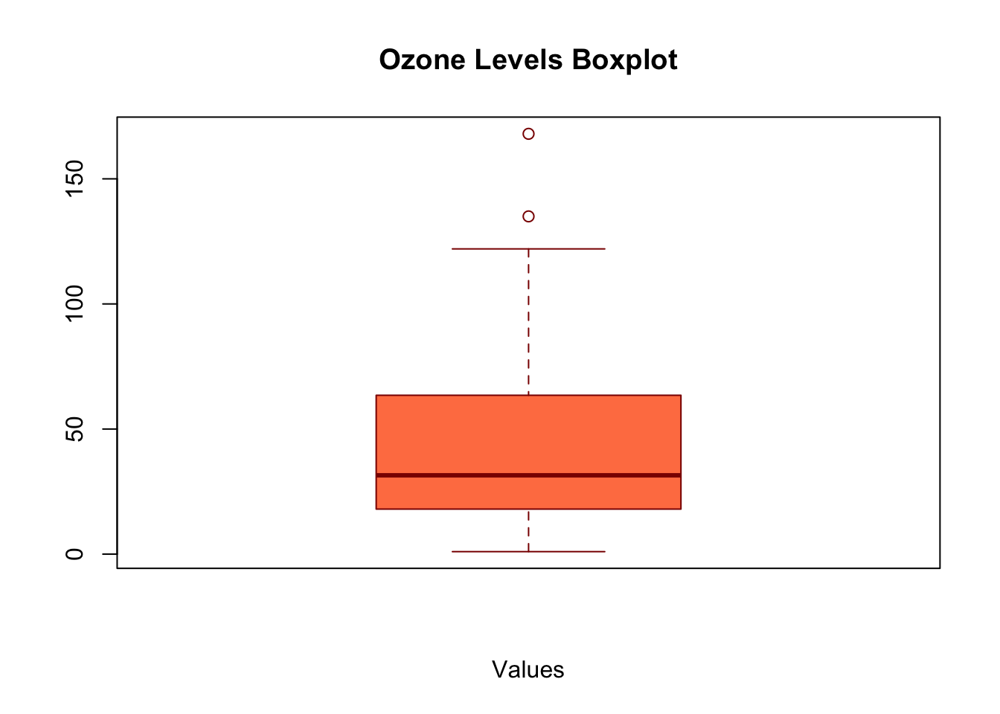
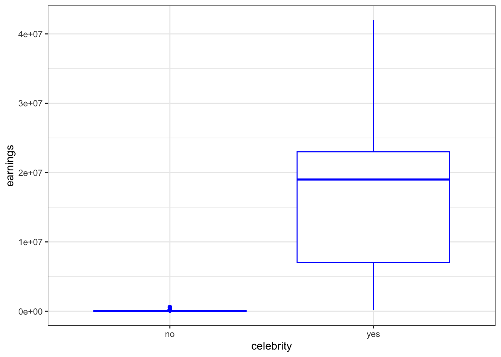
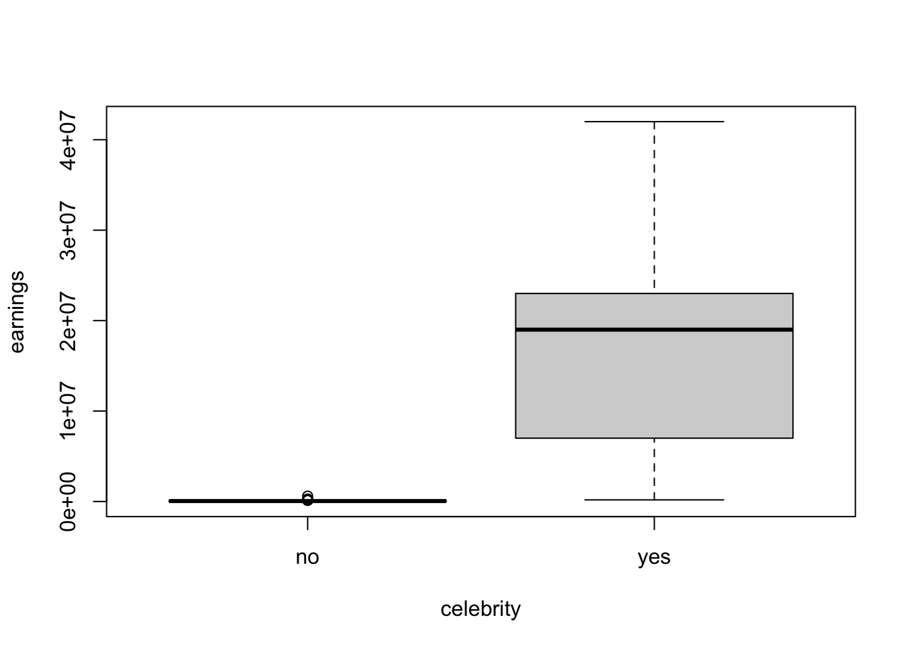
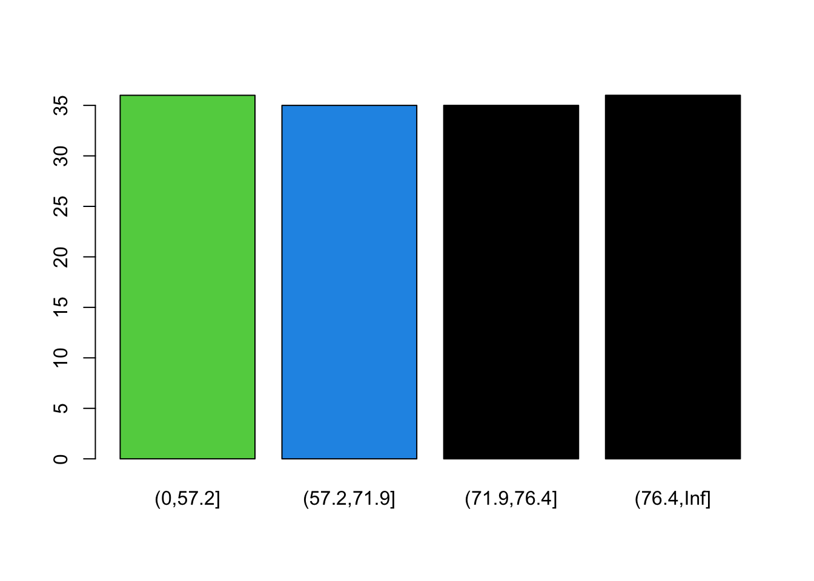
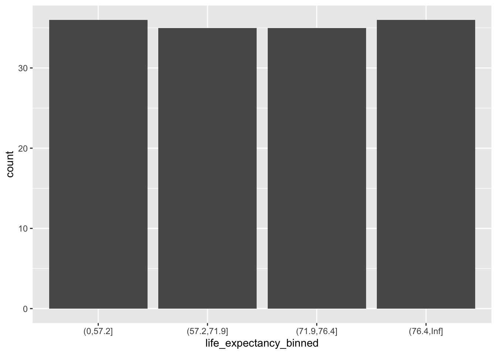
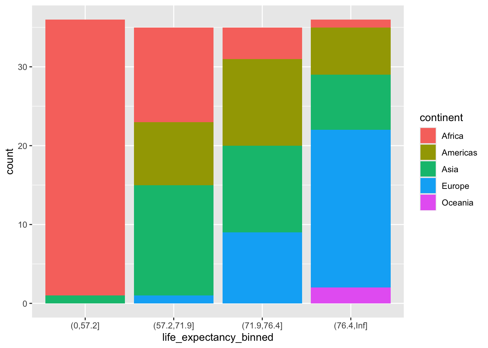
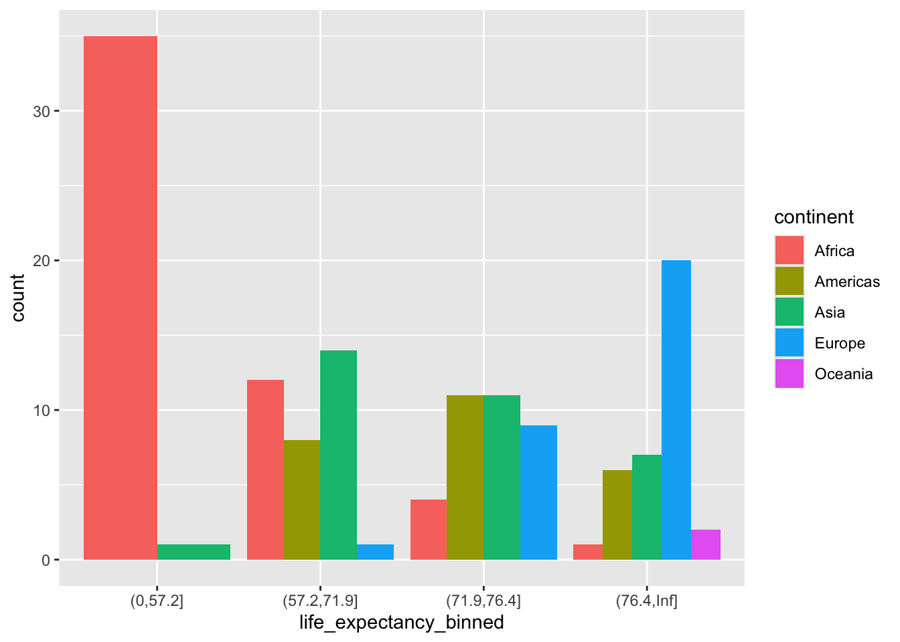
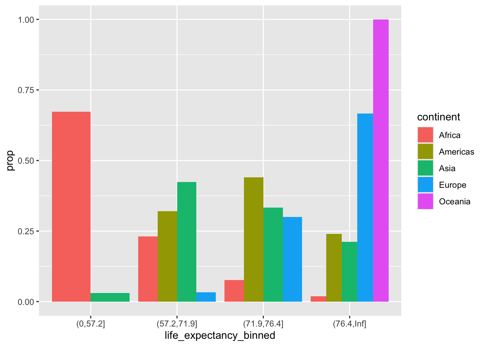

# Workshop 2 {-}


## Exercise solutions {-}


```r
library(tidyverse)
#> ── Attaching core tidyverse packages ──── tidyverse 2.0.0 ──
#> ✔ dplyr     1.1.4     ✔ readr     2.1.4
#> ✔ forcats   1.0.0     ✔ stringr   1.5.1
#> ✔ ggplot2   3.5.0     ✔ tibble    3.2.1
#> ✔ lubridate 1.9.3     ✔ tidyr     1.3.0
#> ✔ purrr     1.0.2     
#> ── Conflicts ────────────────────── tidyverse_conflicts() ──
#> ✖ dplyr::filter() masks stats::filter()
#> ✖ dplyr::lag()    masks stats::lag()
#> ℹ Use the conflicted package (<http://conflicted.r-lib.org/>) to force all conflicts to become errors
```
## Part I {-}

### Exercise 1{-}

**Task:** Write and Use a Function
**Objective:** Create a function that calculates the cube of a number and use this function to calculate the cube of 3.

**Hint:** Use the structure of the square_function as a template.


```r
cube_function <- function(x) {
  return(x^3)
}

# Using the function
result <- cube_function(3)
print(result)
#> [1] 27
```

### Exercise 2 {-}

**Task:** Analyze a Numeric Vector
**Objective:** Write a function named summarize_vector that takes a numeric vector as input and calculates the median, variance, and creates a boxplot. The function should print the median and variance, and return them as a list. Use the airquality$Ozone data for analysis.

**Hint:** Similar to analyze_vector, check if the input is numeric and use median, var, and `boxplot` functions.


```r
summarize_vector <- function(x, plot_title = "Boxplot") {
  if (!is.numeric(x)) {
    stop("Input must be a numeric vector")
  }
  
  median_value <- median(x, na.rm = TRUE)
  variance_value <- var(x, na.rm = TRUE)
  
  cat("Median:", median_value, "\n")
  cat("Variance:", variance_value, "\n")
  
  boxplot(x, main = plot_title, xlab = "Values", col = "coral", border = "darkred")
  
  return(list(median = median_value, variance = variance_value))
}

# Example usage with the airquality$Ozone vector
result <- summarize_vector(airquality$Ozone, "Ozone Levels Boxplot")
#> Median: 31.5 
#> Variance: 1088.201
```



### Exercise 3 {-}

**Task:** Using if Statements
**Objective:** Create an R script that checks if a number is negative, zero, or positive and prints an appropriate message. Test your script with the number -4.

**Hint:** Use an if statement followed by else if and else.


```r
number <- -4
if (number > 0) {
  print("Positive number")
} else if (number == 0) {
  print("Zero")
} else {
  print("Negative number")
}
#> [1] "Negative number"
```


### Exercise 4 {-}

**Task:** For Loop
**Objective:** Write a function using a for loop that calculates the sum of squares of numbers from 1 to n. Use this function to calculate the sum of squares for n=10.

**Hint:** Iterate from 1 to n, and keep adding the square of each number to a result variable.


```r
sum_of_squares <- function(n) {
  result <- 0
  for (i in 1:n) {
    result <- result + i^2
  }
  return(result)
}

sum_squares_of_10 <- sum_of_squares(10)
print(sum_squares_of_10)
#> [1] 385
```

### Exercise 5 {-}

**Task:** While Loop
**Objective:** Write a script using a while loop that finds the smallest number whose cube is greater than 100. Print the number and its cube.

**Hint:** Increment a number starting from 1, and check if its cube is greater than 100 in the while loop condition.


```r
number <- 1
while (number^3 <= 100) {
  number <- number + 1
}
print(paste("Smallest number whose cube is greater than 100 is:", number))
#> [1] "Smallest number whose cube is greater than 100 is: 5"
print(paste("Cube of", number, "is:", number^3))
#> [1] "Cube of 5 is: 125"
```


## Part II {-}

### Exercise 1 {-}

1. Load the data Parade2005.txt.
2. Determine the mean earnings in California.
3. Determine the number of individuals residing in Idaho.
4. Determine the mean and the median earnings of celebrities.


```r
Parade2005 <- read.table(file = '/Users/dilancaro/Library/Mobile Documents/com~apple~CloudDocs/Workshops/John Jay/R Workshop/R-workshop-John-Jay/John Jay Workshop Data/Parade2005.txt')
head(Parade2005)
#>   earnings age gender state celebrity
#> 1    10000  26   male    ND        no
#> 2 10000000  18 female    CA       yes
#> 3    85000  39   male    NE        no
#> 4    75000  50 female    NC        no
#> 5    91500  61   male    DE        no
#> 6    49500  39 female    SD        no
```


```r
Parade2005 %>% filter(state == "CA") %>%
              summarize(mean = mean(earnings))
#>      mean
#> 1 6241430
Parade2005 %>% group_by(state == "CA") %>%
              summarize(mean = mean(earnings))
#> # A tibble: 2 × 2
#>   `state == "CA"`     mean
#>   <lgl>              <dbl>
#> 1 FALSE           1108577.
#> 2 TRUE            6241430
```


```r
Parade2005 %>% 
      filter(state == "ID") %>% 
      summarize(number = n())
#>   number
#> 1      5
```

```r
Parade2005 %>% 
  group_by(celebrity) %>%
  summarize(mean = mean(earnings), median = median(earnings))
#> # A tibble: 2 × 3
#>   celebrity      mean   median
#>   <chr>         <dbl>    <dbl>
#> 1 no           61038.    49500
#> 2 yes       17107273. 19000000
```


```r
Parade2005 %>% 
  group_by(celebrity) %>%
  ggplot(aes(x = celebrity, y = earnings)) + theme_bw() +
  geom_boxplot(color = "blue")
```



```r
boxplot(earnings~ celebrity , data= Parade2005)
```




### Exercise 2 {-}

Use the skills you obtained in Part I.

1. Inspect the top rows of the data set.
2. How many observations does the data set contain?
3. Calculate the total exposure (exposition) in each region (type_territoire).


```r
policy_data <- read.csv(file = '/Users/dilancaro/Library/Mobile Documents/com~apple~CloudDocs/Workshops/John Jay/R Workshop/R-workshop-John-Jay/John Jay Workshop Data/PolicyData.csv', sep = ';')
```


```r
head(policy_data)
#>   numeropol  debut_pol    fin_pol freq_paiement langue
#> 1         3 14/09/1995 24/04/1996       mensuel      F
#> 2         3 25/04/1996 23/12/1996       mensuel      F
#> 3         6  1/03/1995 27/02/1996        annuel      A
#> 4         6  1/03/1996 14/01/1997        annuel      A
#> 5         6 15/01/1997 31/01/1997        annuel      A
#> 6         6  1/02/1997 28/02/1997        annuel      A
#>    type_prof     alimentation type_territoire
#> 1 Technicien V\xe9g\xe9tarien          Urbain
#> 2 Technicien V\xe9g\xe9tarien          Urbain
#> 3 Technicien        Carnivore          Urbain
#> 4 Technicien        Carnivore          Urbain
#> 5 Technicien        Carnivore          Urbain
#> 6 Technicien        Carnivore          Urbain
#>           utilisation presence_alarme marque_voiture sexe
#> 1   Travail-quotidien             non     VOLKSWAGEN    F
#> 2   Travail-quotidien             non     VOLKSWAGEN    F
#> 3 Travail-occasionnel             oui         NISSAN    M
#> 4 Travail-occasionnel             oui         NISSAN    M
#> 5 Travail-occasionnel             oui         NISSAN    M
#> 6 Travail-occasionnel             oui         NISSAN    M
#>      cout1 cout2 cout3 cout4 nbsin exposition   cout age
#> 1       NA    NA    NA    NA     0 0.61095890     NA  29
#> 2       NA    NA    NA    NA     0 0.66301370     NA  30
#> 3 279.5839    NA    NA    NA     1 0.99452055 279.58  42
#> 4       NA    NA    NA    NA     0 0.87397260     NA  43
#> 5       NA    NA    NA    NA     0 0.04383562     NA  44
#> 6       NA    NA    NA    NA     0 0.07397260     NA  44
#>   duree_permis annee_vehicule
#> 1           10           1989
#> 2           11           1989
#> 3           21           1994
#> 4           22           1994
#> 5           23           1994
#> 6           23           1994
nrow(policy_data)
#> [1] 39075
```


```r
policy_data %>%
  group_by(type_territoire) %>%
  summarize(exposure = sum(exposition))
#> # A tibble: 3 × 2
#>   type_territoire exposure
#>   <chr>              <dbl>
#> 1 Rural               684.
#> 2 Semi-urbain       16944.
#> 3 Urbain            11050.
```
###  Exercise 3 {-}

Use the skills obtained in Part I: 

1. Inspect the top rows of the data.
2. Select the data for countries in Asia.
3. Which type of variable is `country`?


```r
library(gapminder)
head(gapminder)
#> # A tibble: 6 × 6
#>   country     continent  year lifeExp      pop gdpPercap
#>   <fct>       <fct>     <int>   <dbl>    <int>     <dbl>
#> 1 Afghanistan Asia       1952    28.8  8425333      779.
#> 2 Afghanistan Asia       1957    30.3  9240934      821.
#> 3 Afghanistan Asia       1962    32.0 10267083      853.
#> 4 Afghanistan Asia       1967    34.0 11537966      836.
#> 5 Afghanistan Asia       1972    36.1 13079460      740.
#> 6 Afghanistan Asia       1977    38.4 14880372      786.
asia <-  filter(gapminder, continent == "Asia")
class(gapminder$country)
#> [1] "factor"
```

### Exercise 4 {-}

The variable country in the gapminder data set is a factor variable. 

1. What are the possible levels for country in the subset asia.
2. Is this the result you expected?


```r
library(gapminder)
gapminder
#> # A tibble: 1,704 × 6
#>    country     continent  year lifeExp      pop gdpPercap
#>    <fct>       <fct>     <int>   <dbl>    <int>     <dbl>
#>  1 Afghanistan Asia       1952    28.8  8425333      779.
#>  2 Afghanistan Asia       1957    30.3  9240934      821.
#>  3 Afghanistan Asia       1962    32.0 10267083      853.
#>  4 Afghanistan Asia       1967    34.0 11537966      836.
#>  5 Afghanistan Asia       1972    36.1 13079460      740.
#>  6 Afghanistan Asia       1977    38.4 14880372      786.
#>  7 Afghanistan Asia       1982    39.9 12881816      978.
#>  8 Afghanistan Asia       1987    40.8 13867957      852.
#>  9 Afghanistan Asia       1992    41.7 16317921      649.
#> 10 Afghanistan Asia       1997    41.8 22227415      635.
#> # ℹ 1,694 more rows
# Subset data for Asian countries
asia <- subset(gapminder, continent == "Asia")

levels(asia$country)
#>   [1] "Afghanistan"              "Albania"                 
#>   [3] "Algeria"                  "Angola"                  
#>   [5] "Argentina"                "Australia"               
#>   [7] "Austria"                  "Bahrain"                 
#>   [9] "Bangladesh"               "Belgium"                 
#>  [11] "Benin"                    "Bolivia"                 
#>  [13] "Bosnia and Herzegovina"   "Botswana"                
#>  [15] "Brazil"                   "Bulgaria"                
#>  [17] "Burkina Faso"             "Burundi"                 
#>  [19] "Cambodia"                 "Cameroon"                
#>  [21] "Canada"                   "Central African Republic"
#>  [23] "Chad"                     "Chile"                   
#>  [25] "China"                    "Colombia"                
#>  [27] "Comoros"                  "Congo, Dem. Rep."        
#>  [29] "Congo, Rep."              "Costa Rica"              
#>  [31] "Cote d'Ivoire"            "Croatia"                 
#>  [33] "Cuba"                     "Czech Republic"          
#>  [35] "Denmark"                  "Djibouti"                
#>  [37] "Dominican Republic"       "Ecuador"                 
#>  [39] "Egypt"                    "El Salvador"             
#>  [41] "Equatorial Guinea"        "Eritrea"                 
#>  [43] "Ethiopia"                 "Finland"                 
#>  [45] "France"                   "Gabon"                   
#>  [47] "Gambia"                   "Germany"                 
#>  [49] "Ghana"                    "Greece"                  
#>  [51] "Guatemala"                "Guinea"                  
#>  [53] "Guinea-Bissau"            "Haiti"                   
#>  [55] "Honduras"                 "Hong Kong, China"        
#>  [57] "Hungary"                  "Iceland"                 
#>  [59] "India"                    "Indonesia"               
#>  [61] "Iran"                     "Iraq"                    
#>  [63] "Ireland"                  "Israel"                  
#>  [65] "Italy"                    "Jamaica"                 
#>  [67] "Japan"                    "Jordan"                  
#>  [69] "Kenya"                    "Korea, Dem. Rep."        
#>  [71] "Korea, Rep."              "Kuwait"                  
#>  [73] "Lebanon"                  "Lesotho"                 
#>  [75] "Liberia"                  "Libya"                   
#>  [77] "Madagascar"               "Malawi"                  
#>  [79] "Malaysia"                 "Mali"                    
#>  [81] "Mauritania"               "Mauritius"               
#>  [83] "Mexico"                   "Mongolia"                
#>  [85] "Montenegro"               "Morocco"                 
#>  [87] "Mozambique"               "Myanmar"                 
#>  [89] "Namibia"                  "Nepal"                   
#>  [91] "Netherlands"              "New Zealand"             
#>  [93] "Nicaragua"                "Niger"                   
#>  [95] "Nigeria"                  "Norway"                  
#>  [97] "Oman"                     "Pakistan"                
#>  [99] "Panama"                   "Paraguay"                
#> [101] "Peru"                     "Philippines"             
#> [103] "Poland"                   "Portugal"                
#> [105] "Puerto Rico"              "Reunion"                 
#> [107] "Romania"                  "Rwanda"                  
#> [109] "Sao Tome and Principe"    "Saudi Arabia"            
#> [111] "Senegal"                  "Serbia"                  
#> [113] "Sierra Leone"             "Singapore"               
#> [115] "Slovak Republic"          "Slovenia"                
#> [117] "Somalia"                  "South Africa"            
#> [119] "Spain"                    "Sri Lanka"               
#> [121] "Sudan"                    "Swaziland"               
#> [123] "Sweden"                   "Switzerland"             
#> [125] "Syria"                    "Taiwan"                  
#> [127] "Tanzania"                 "Thailand"                
#> [129] "Togo"                     "Trinidad and Tobago"     
#> [131] "Tunisia"                  "Turkey"                  
#> [133] "Uganda"                   "United Kingdom"          
#> [135] "United States"            "Uruguay"                 
#> [137] "Venezuela"                "Vietnam"                 
#> [139] "West Bank and Gaza"       "Yemen, Rep."             
#> [141] "Zambia"                   "Zimbabwe"
```

```r
#alternative
library(dplyr)

asia <- gapminder %>% 
  filter(continent == "Asia")
levels(asia$country)
#>   [1] "Afghanistan"              "Albania"                 
#>   [3] "Algeria"                  "Angola"                  
#>   [5] "Argentina"                "Australia"               
#>   [7] "Austria"                  "Bahrain"                 
#>   [9] "Bangladesh"               "Belgium"                 
#>  [11] "Benin"                    "Bolivia"                 
#>  [13] "Bosnia and Herzegovina"   "Botswana"                
#>  [15] "Brazil"                   "Bulgaria"                
#>  [17] "Burkina Faso"             "Burundi"                 
#>  [19] "Cambodia"                 "Cameroon"                
#>  [21] "Canada"                   "Central African Republic"
#>  [23] "Chad"                     "Chile"                   
#>  [25] "China"                    "Colombia"                
#>  [27] "Comoros"                  "Congo, Dem. Rep."        
#>  [29] "Congo, Rep."              "Costa Rica"              
#>  [31] "Cote d'Ivoire"            "Croatia"                 
#>  [33] "Cuba"                     "Czech Republic"          
#>  [35] "Denmark"                  "Djibouti"                
#>  [37] "Dominican Republic"       "Ecuador"                 
#>  [39] "Egypt"                    "El Salvador"             
#>  [41] "Equatorial Guinea"        "Eritrea"                 
#>  [43] "Ethiopia"                 "Finland"                 
#>  [45] "France"                   "Gabon"                   
#>  [47] "Gambia"                   "Germany"                 
#>  [49] "Ghana"                    "Greece"                  
#>  [51] "Guatemala"                "Guinea"                  
#>  [53] "Guinea-Bissau"            "Haiti"                   
#>  [55] "Honduras"                 "Hong Kong, China"        
#>  [57] "Hungary"                  "Iceland"                 
#>  [59] "India"                    "Indonesia"               
#>  [61] "Iran"                     "Iraq"                    
#>  [63] "Ireland"                  "Israel"                  
#>  [65] "Italy"                    "Jamaica"                 
#>  [67] "Japan"                    "Jordan"                  
#>  [69] "Kenya"                    "Korea, Dem. Rep."        
#>  [71] "Korea, Rep."              "Kuwait"                  
#>  [73] "Lebanon"                  "Lesotho"                 
#>  [75] "Liberia"                  "Libya"                   
#>  [77] "Madagascar"               "Malawi"                  
#>  [79] "Malaysia"                 "Mali"                    
#>  [81] "Mauritania"               "Mauritius"               
#>  [83] "Mexico"                   "Mongolia"                
#>  [85] "Montenegro"               "Morocco"                 
#>  [87] "Mozambique"               "Myanmar"                 
#>  [89] "Namibia"                  "Nepal"                   
#>  [91] "Netherlands"              "New Zealand"             
#>  [93] "Nicaragua"                "Niger"                   
#>  [95] "Nigeria"                  "Norway"                  
#>  [97] "Oman"                     "Pakistan"                
#>  [99] "Panama"                   "Paraguay"                
#> [101] "Peru"                     "Philippines"             
#> [103] "Poland"                   "Portugal"                
#> [105] "Puerto Rico"              "Reunion"                 
#> [107] "Romania"                  "Rwanda"                  
#> [109] "Sao Tome and Principe"    "Saudi Arabia"            
#> [111] "Senegal"                  "Serbia"                  
#> [113] "Sierra Leone"             "Singapore"               
#> [115] "Slovak Republic"          "Slovenia"                
#> [117] "Somalia"                  "South Africa"            
#> [119] "Spain"                    "Sri Lanka"               
#> [121] "Sudan"                    "Swaziland"               
#> [123] "Sweden"                   "Switzerland"             
#> [125] "Syria"                    "Taiwan"                  
#> [127] "Tanzania"                 "Thailand"                
#> [129] "Togo"                     "Trinidad and Tobago"     
#> [131] "Tunisia"                  "Turkey"                  
#> [133] "Uganda"                   "United Kingdom"          
#> [135] "United States"            "Uruguay"                 
#> [137] "Venezuela"                "Vietnam"                 
#> [139] "West Bank and Gaza"       "Yemen, Rep."             
#> [141] "Zambia"                   "Zimbabwe"
```

`asia$country` allows the same outcomes as `gapminder$country`. This includes many countries outside of Asia.

In some cases, even after filtering a dataset, the factor levels of the subset might still include all levels present in the original dataset. This is because subsetting the rows does not automatically drop unused factor levels. To see only the levels that are present in the subset, you might need to use `droplevels()`:


```r
asia$country <- droplevels(asia$country)
```


```r
levels(asia$country)
#>  [1] "Afghanistan"        "Bahrain"           
#>  [3] "Bangladesh"         "Cambodia"          
#>  [5] "China"              "Hong Kong, China"  
#>  [7] "India"              "Indonesia"         
#>  [9] "Iran"               "Iraq"              
#> [11] "Israel"             "Japan"             
#> [13] "Jordan"             "Korea, Dem. Rep."  
#> [15] "Korea, Rep."        "Kuwait"            
#> [17] "Lebanon"            "Malaysia"          
#> [19] "Mongolia"           "Myanmar"           
#> [21] "Nepal"              "Oman"              
#> [23] "Pakistan"           "Philippines"       
#> [25] "Saudi Arabia"       "Singapore"         
#> [27] "Sri Lanka"          "Syria"             
#> [29] "Taiwan"             "Thailand"          
#> [31] "Vietnam"            "West Bank and Gaza"
#> [33] "Yemen, Rep."
```

## Exercise 5 {-}

Bin the life expectancy in 2007 in a factor variable.
1. Select the observations for year 2007.
2. Bin the life expectancy in four bins of roughly equal size (hint: quantile). 
3. How many observations are there in each bin?


```r
gapminder2007 <- filter(gapminder, year == 2007)
breaks <- c(0, quantile(gapminder2007$lifeExp, c(0.25, 0.5, 0.75)), Inf)
breaks
#>               25%      50%      75%          
#>  0.00000 57.16025 71.93550 76.41325      Inf
```


```r
gapminder2007 <- gapminder2007 %>%
                 mutate(life_expectancy_binned = cut(gapminder2007$lifeExp, breaks))
```


```r
gapminder2007 %>%
  group_by(life_expectancy_binned) %>%
  summarise(frequency = n())
#> # A tibble: 4 × 2
#>   life_expectancy_binned frequency
#>   <fct>                      <int>
#> 1 (0,57.2]                      36
#> 2 (57.2,71.9]                   35
#> 3 (71.9,76.4]                   35
#> 4 (76.4,Inf]                    36
```


```r
gapminder2007
#> # A tibble: 142 × 7
#>    country     continent  year lifeExp       pop gdpPercap
#>    <fct>       <fct>     <int>   <dbl>     <int>     <dbl>
#>  1 Afghanistan Asia       2007    43.8  31889923      975.
#>  2 Albania     Europe     2007    76.4   3600523     5937.
#>  3 Algeria     Africa     2007    72.3  33333216     6223.
#>  4 Angola      Africa     2007    42.7  12420476     4797.
#>  5 Argentina   Americas   2007    75.3  40301927    12779.
#>  6 Australia   Oceania    2007    81.2  20434176    34435.
#>  7 Austria     Europe     2007    79.8   8199783    36126.
#>  8 Bahrain     Asia       2007    75.6    708573    29796.
#>  9 Bangladesh  Asia       2007    64.1 150448339     1391.
#> 10 Belgium     Europe     2007    79.4  10392226    33693.
#> # ℹ 132 more rows
#> # ℹ 1 more variable: life_expectancy_binned <fct>
```


```r
plot(gapminder2007$life_expectancy_binned, col=c(gapminder2007$continent))
```




```r
ggplot(gapminder2007) +
  geom_bar(aes(life_expectancy_binned))
```




```r
ggplot(gapminder2007) +
  geom_bar(aes(life_expectancy_binned,
               fill = continent))
```




```r
ggplot(gapminder2007) +
  geom_bar(aes(life_expectancy_binned,
               fill = continent),
           position = position_dodge())
```




```r
ggplot(gapminder2007) +
  geom_bar(aes(life_expectancy_binned,
               fill = continent,
               y = after_stat(prop), group = continent),
           position = position_dodge())
```



y = `..prop..` and `group = continent` plot the proportion within each group instead of the absolute count.

## Handling Missing Data {-}

## Exercise 1: Explore Missingness {-}

**Dataset:** ChickWeight

**Task:** Determine if the ChickWeight dataset contains any missing values. Print a message stating whether the dataset has missing values or not.

*Hint* Use the any() function combined with is.na() applied to the dataset.

How to use any()


```r
e<- c(1,2,2,3,2,1,1)
any(e==1)
#> [1] TRUE
```


```r
data(ChickWeight)
# Check for missing values in the ChickWeight dataset
if (any(is.na(ChickWeight))) {
  print("The dataset contains missing values.")
} else {
  print("The dataset does not contain missing values.")
}
#> [1] "The dataset does not contain missing values."
```

## Exercise 2: Calculate Summary Statistics Before Handling NA {-}

**Dataset:** mtcars

**Task:** The mtcars dataset is almost complete but let's pretend some values are missing in the mpg (miles per gallon) column. First, artificially introduce missing values into the mpg column (e.g., set the first three values of mpg to NA). Then, calculate and print the mean and standard deviation of mpg without removing or imputing the missing values.


*Hint:* Modify the mtcars$mpg directly to introduce NAs. Use mean() and sd() functions with na.rm = FALSE to calculate statistics without handling NA.


```r
# Artificially introduce missing values into the mpg column of mtcars
mtcars$mpg[1:3] <- NA

# Calculate and print the mean and standard deviation without removing NA
mean_mpg <- mean(mtcars$mpg, na.rm = FALSE)
sd_mpg <- sd(mtcars$mpg, na.rm = FALSE)

print(paste("Mean of mpg without handling NA:", mean_mpg))
#> [1] "Mean of mpg without handling NA: NA"
print(paste("Standard deviation of mpg without handling NA:", sd_mpg))
#> [1] "Standard deviation of mpg without handling NA: NA"
```

## Exercise 3: Impute Missing Values with Column Median {-}

**Dataset:** mtcars with modified mpg

**Task:** First Calculate the mean and standard deviation handling the missing values. 

Then,Impute the artificially introduced missing values in the mpg column with the column's median (excluding the missing values). Print the first 6 rows of the modified mtcars dataset.

Now, calculate the mean and standard deviation with the imputed values. 

*Hint:* First, calculate the median of mpg excluding NAs. Then, use indexing to replace NAs with this median.


```r

mean_mpg <- mean(mtcars$mpg, na.rm = TRUE)
sd_mpg <- sd(mtcars$mpg, na.rm = TRUE)

print(paste("Mean of mpg  handling NA:", mean_mpg))
#> [1] "Mean of mpg  handling NA: 19.9344827586207"
print(paste("Standard deviation of mpg  handling NA:", sd_mpg))
#> [1] "Standard deviation of mpg  handling NA: 6.31422859568932"

# Calculate the median of mpg excluding NAs
median_mpg <- median(mtcars$mpg, na.rm = TRUE)
median_mpg
#> [1] 18.7
# Impute the missing values with the median
mtcars$mpg[is.na(mtcars$mpg)] <- median_mpg

# Print the first 6 rows of the modified mtcars dataset
head(mtcars)
#>                    mpg cyl disp  hp drat    wt  qsec vs am
#> Mazda RX4         18.7   6  160 110 3.90 2.620 16.46  0  1
#> Mazda RX4 Wag     18.7   6  160 110 3.90 2.875 17.02  0  1
#> Datsun 710        18.7   4  108  93 3.85 2.320 18.61  1  1
#> Hornet 4 Drive    21.4   6  258 110 3.08 3.215 19.44  1  0
#> Hornet Sportabout 18.7   8  360 175 3.15 3.440 17.02  0  0
#> Valiant           18.1   6  225 105 2.76 3.460 20.22  1  0
#>                   gear carb
#> Mazda RX4            4    4
#> Mazda RX4 Wag        4    4
#> Datsun 710           4    1
#> Hornet 4 Drive       3    1
#> Hornet Sportabout    3    2
#> Valiant              3    1
##
mean_mpg <- mean(mtcars$mpg)
sd_mpg <- sd(mtcars$mpg)

print(paste("Mean of mpg  imputed NA:", mean_mpg))
#> [1] "Mean of mpg  imputed NA: 19.81875"
print(paste("Standard deviation of mpg imputed NA:", sd_mpg))
#> [1] "Standard deviation of mpg imputed NA: 6.01205442316491"
```

## Exercise 4: Identifying Complete Rows {-}

**Dataset:** Airquality

**Task:** Before any analysis, you want to ensure that only complete cases are used. Create a new dataset from airquality that includes only the rows without any missing values. Print the number of rows in the original versus the cleaned dataset.


*Hint* Use complete.cases() on the dataset and then subset it.


```r
data("airquality")
# Create a new dataset from airquality that includes only rows without any missing values
complete_Airquality<- airquality[complete.cases(airquality), ]

# Print the number of rows in the original versus the cleaned dataset
print(paste("Original dataset rows:", nrow(airquality)))
#> [1] "Original dataset rows: 153"
print(paste("Cleaned dataset rows:", nrow(complete_Airquality)))
#> [1] "Cleaned dataset rows: 111"
```

## Exercise 5: Advanced Imputation on a Subset {-}

**Dataset:** mtcars

**Task:** Create a subset of mtcars containing only the mpg, hp (horsepower), and wt (weight) columns. Introduce missing values in hp and wt columns (e.g., set first two values of each to NA). Perform multiple imputation using the mice package on this subset with 3 imputations, and extract the third completed dataset. Print the first 6 rows of this completed dataset.

*Hint:* Subset mtcars first, then modify to add NAs. Use mice() for imputation and complete() to extract the desired imputed dataset.


```r
# Load the necessary package
library(mice)
#> 
#> Attaching package: 'mice'
#> The following object is masked from 'package:stats':
#> 
#>     filter
#> The following objects are masked from 'package:base':
#> 
#>     cbind, rbind

# Create a subset of mtcars
mtcars_subset <- mtcars[, c("mpg", "hp", "wt")]

# Introduce missing values
mtcars_subset$hp[1:2] <- NA
mtcars_subset$wt[1:2] <- NA

# Perform multiple imputation
imputed_data_subset <- mice(mtcars_subset, m=3, method='pmm', seed = 123)
#> 
#>  iter imp variable
#>   1   1  hp  wt
#>   1   2  hp  wt
#>   1   3  hp  wt
#>   2   1  hp  wt
#>   2   2  hp  wt
#>   2   3  hp  wt
#>   3   1  hp  wt
#>   3   2  hp  wt
#>   3   3  hp  wt
#>   4   1  hp  wt
#>   4   2  hp  wt
#>   4   3  hp  wt
#>   5   1  hp  wt
#>   5   2  hp  wt
#>   5   3  hp  wt

# Extract the third completed dataset
completed_data_subset <- complete(imputed_data_subset, 3)

# Print the first 6 rows of the completed data
head(completed_data_subset)
#>                    mpg  hp    wt
#> Mazda RX4         18.7 175 3.440
#> Mazda RX4 Wag     18.7 109 3.440
#> Datsun 710        18.7  93 2.320
#> Hornet 4 Drive    21.4 110 3.215
#> Hornet Sportabout 18.7 175 3.440
#> Valiant           18.1 105 3.460
```

